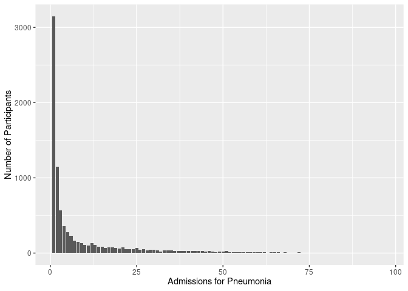
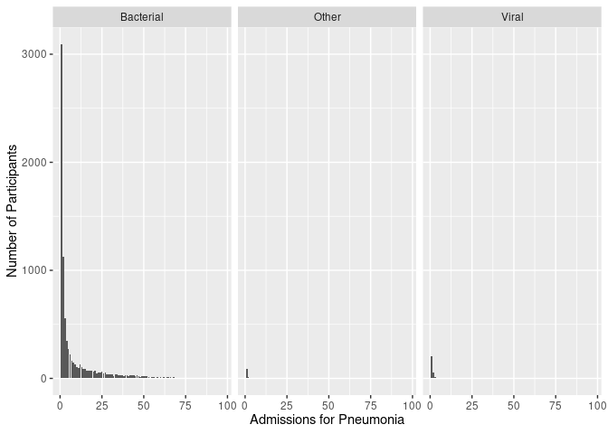

## Purpose

To analyse the subset of patients with viral or bacterial pneumonia.  This script is to idenitify the index cases and ranges for when we are interested in outcomes.  This script can be found in /nfs/turbo/precision-health/DataDirect/HUM00229632 - Genome-wide associations of bacteria/2024-06-12/cases and was most recently run on Fri Jun 14 11:23:36 2024.


``` r
library(knitr)
#figures made will go to directory called figures, will make them as both png and pdf files 
opts_chunk$set(fig.path='figures-index/',
               echo=TRUE, warning=FALSE, message=FALSE,dev=c('png','pdf'))
options(scipen = 2, digits = 3)

library(readr)
library(dplyr)
```

```
## 
## Attaching package: 'dplyr'
```

```
## The following objects are masked from 'package:stats':
## 
##     filter, lag
```

```
## The following objects are masked from 'package:base':
## 
##     intersect, setdiff, setequal, union
```

``` r
library(tidyr)
library(knitr)
library(lubridate)
```

```
## 
## Attaching package: 'lubridate'
```

```
## The following objects are masked from 'package:base':
## 
##     date, intersect, setdiff, union
```

``` r
diagnosis.datafile <- 'DiagnosesComprehensiveAll.csv'
encounter.datafile <- 'EncounterAll.csv'
encounter.anth.datafile <- "EncounterAnthropometricsBMI.csv"
```


``` r
library(readxl)
diagnosis.data <- read_csv(diagnosis.datafile) 
diagnosis.datasheet <- 'Pneumonia ICD9 and ICD10 Codes.xlsx'
mapped.diagnoses <- bind_rows(
  read_excel(diagnosis.datasheet, sheet="ICD9") %>% rename(ICD=1),
  read_excel(diagnosis.datasheet, sheet="ICD10", skip=1) %>% rename(ICD=1))%>% 
  select(ICD,Type)

bacterial.diagnoses <- filter(mapped.diagnoses, Type=="Bacterial") %>% pull(ICD)
viral.diagnoses <- filter(mapped.diagnoses, Type=="Viral") %>% pull(ICD)
other.diagnoses <- filter(mapped.diagnoses, Type=="Other") %>% pull(ICD)

pneumonia.diagnosis <- 
  diagnosis.data %>%
  filter(TermCodeSource %in% c(bacterial.diagnoses,viral.diagnoses,other.diagnoses)) %>% #there are also COPD diagnoses
  mutate(Type=case_when(TermCodeSource %in% bacterial.diagnoses ~ 'Bacterial',
                        TermCodeSource %in% viral.diagnoses ~ 'Viral',
                        TermCodeSource %in% other.diagnoses ~ 'Other',
                        .default=NA)) %>%
  filter(!is.na(Type)) #remove dignoses not in one of these categories

pneumonia.diagnosis %>%
  group_by(Type) %>%
  distinct(DeID_PatientID,.keep_all = T) %>%
  count %>%
  kable(caption="Diagnosis type by patient")
```


Table: Diagnosis type by patient

|Type      |    n|
|:---------|----:|
|Bacterial | 8352|
|Other     |  124|
|Viral     |  293|

# Merging with Encounter Data


``` r
encounter.data <- read_csv(encounter.datafile)
encounter.anthro.data <-read_csv(encounter.anth.datafile)

encounter.data.ano <- left_join(encounter.data,encounter.anthro.data,by=c("DeID_PatientID","DeID_EncounterID"))

#when was the encoutner for each pneumonia diagnosis
pneumonia.enc.data <-
  left_join(pneumonia.diagnosis,encounter.data.ano,by=c("DeID_PatientID","DeID_EncounterID")) %>%
  mutate(Duration=difftime(mdy_hm(DeID_DischargeDate),mdy_hm(DeID_AdmitDate),units="days")) #calculate duration between admit and discharge in days

patient.enc.data <- 
  pneumonia.enc.data %>%
  #select(DeID_PatientID,DeID_EncounterID,DeID_AdmitDate,DeID_DischargeDate,AgeInYears,EmergencyVisit,Duration,Type,BMI) %>%
  mutate(AdmitMonth=format_ISO8601(mdy_hm(DeID_AdmitDate),precision="ym")) %>% #calculated month and year of admit
  group_by(DeID_PatientID,AdmitMonth,Type) %>% #summarize encounters by patient,type and admit month, this is defined as one event, if its a different type of pneumonia its considered a new event
  summarize(AgeInYears=median(AgeInYears,na.rm=T), #year at the event
            BMI = median(BMI,na.rm=T), #bmi at the event
            EmergencyVisit=max(EmergencyVisit), # whether there was an emergency visit
            MaxStay=max(Duration), #the max of each duration within this event
            AdmitDate=min(format_ISO8601(mdy_hm(DeID_AdmitDate),precision="ymd")), #when they were admitted
            DischargeDate=max(format_ISO8601(mdy_hm(DeID_DischargeDate),precision="ymd"))) %>% #when they were discharged
  distinct(DeID_PatientID,AdmitMonth,Type,.keep_all = T) 

index.filename <- 'PneumoniaEncounterData.csv'
write_csv(patient.enc.data,index.filename)
```

After grouping multiple encounters into events there are 81470 encounters from 81050

This index encounter data is written out to PneumoniaEncounterData.csv which contains data about the indexed encounter.

## Summary of Patient Encounters


``` r
patient.enc.data %>% 
  ungroup %>%
  group_by(DeID_PatientID) %>%
  count(name="Admissions") %>%
  arrange(desc(Admissions)) ->
  patient.encounter.counts

kable(patient.encounter.counts %>% ungroup %>% count(Admissions,name="Number of Patients"))
```


| Admissions| Number of Patients|
|----------:|------------------:|
|          1|               3148|
|          2|               1144|
|          3|                568|
|          4|                362|
|          5|                280|
|          6|                227|
|          7|                167|
|          8|                149|
|          9|                133|
|         10|                110|
|         11|                 99|
|         12|                134|
|         13|                107|
|         14|                 88|
|         15|                 85|
|         16|                 72|
|         17|                 73|
|         18|                 75|
|         19|                 70|
|         20|                 63|
|         21|                 76|
|         22|                 50|
|         23|                 53|
|         24|                 52|
|         25|                 67|
|         26|                 47|
|         27|                 54|
|         28|                 39|
|         29|                 40|
|         30|                 41|
|         31|                 39|
|         32|                 21|
|         33|                 36|
|         34|                 35|
|         35|                 32|
|         36|                 30|
|         37|                 27|
|         38|                 25|
|         39|                 28|
|         40|                 29|
|         41|                 27|
|         42|                 25|
|         43|                 28|
|         44|                 26|
|         45|                 21|
|         46|                 30|
|         47|                 20|
|         48|                 15|
|         49|                 21|
|         50|                 18|
|         51|                 24|
|         52|                 14|
|         53|                 13|
|         54|                  9|
|         55|                 12|
|         56|                 15|
|         57|                  8|
|         58|                  9|
|         59|                  8|
|         60|                  9|
|         61|                  9|
|         62|                 13|
|         63|                  3|
|         64|                 14|
|         65|                 11|
|         66|                 11|
|         67|                  7|
|         68|                 12|
|         69|                  3|
|         70|                  2|
|         71|                  7|
|         72|                  9|
|         73|                  7|
|         74|                  4|
|         75|                  5|
|         76|                  3|
|         77|                  2|
|         78|                  2|
|         79|                  3|
|         80|                  4|
|         81|                  3|
|         82|                  4|
|         84|                  1|
|         85|                  4|
|         87|                  3|
|         88|                  3|
|         89|                  1|
|         90|                  2|
|         91|                  3|
|         92|                  3|
|         93|                  3|
|         94|                  1|
|         95|                  1|
|         97|                  1|

``` r
library(ggplot2)
ggplot(patient.encounter.counts,(aes(x=Admissions))) +
  geom_histogram(stat='count',binwidth = 1) +
  labs(x="Admissions for Pneumonia",
       y="Number of Participants")
```

<!-- -->

``` r
patient.enc.data %>% 
  ungroup %>%
  group_by(DeID_PatientID,Type) %>%
  count(name="Admissions") %>%
  arrange(desc(Admissions)) ->
  patient.encounter.type.counts

ggplot(patient.encounter.type.counts,(aes(x=Admissions))) +
  geom_histogram(stat='count',binwidth = 1) +
  facet_grid(~Type)+
  labs(x="Admissions for Pneumonia",
       y="Number of Participants")
```

<!-- -->


# Session Information


``` r
sessionInfo()
```

```
## R version 4.4.0 (2024-04-24)
## Platform: x86_64-pc-linux-gnu
## Running under: Red Hat Enterprise Linux 8.8 (Ootpa)
## 
## Matrix products: default
## BLAS:   /sw/pkgs/arc/stacks/gcc/13.2.0/R/4.4.0/lib64/R/lib/libRblas.so 
## LAPACK: /sw/pkgs/arc/stacks/gcc/13.2.0/R/4.4.0/lib64/R/lib/libRlapack.so;  LAPACK version 3.12.0
## 
## locale:
##  [1] LC_CTYPE=en_US.UTF-8       LC_NUMERIC=C              
##  [3] LC_TIME=en_US.UTF-8        LC_COLLATE=en_US.UTF-8    
##  [5] LC_MONETARY=en_US.UTF-8    LC_MESSAGES=en_US.UTF-8   
##  [7] LC_PAPER=en_US.UTF-8       LC_NAME=C                 
##  [9] LC_ADDRESS=C               LC_TELEPHONE=C            
## [11] LC_MEASUREMENT=en_US.UTF-8 LC_IDENTIFICATION=C       
## 
## time zone: America/Detroit
## tzcode source: system (glibc)
## 
## attached base packages:
## [1] stats     graphics  grDevices utils     datasets  methods   base     
## 
## other attached packages:
## [1] ggplot2_3.5.1   readxl_1.4.3    lubridate_1.9.3 tidyr_1.3.1    
## [5] dplyr_1.1.4     readr_2.1.5     knitr_1.47     
## 
## loaded via a namespace (and not attached):
##  [1] bit_4.0.5         gtable_0.3.5      jsonlite_1.8.8    highr_0.11       
##  [5] compiler_4.4.0    crayon_1.5.2      tidyselect_1.2.1  parallel_4.4.0   
##  [9] jquerylib_0.1.4   scales_1.3.0      yaml_2.3.8        fastmap_1.2.0    
## [13] R6_2.5.1          labeling_0.4.3    generics_0.1.3    tibble_3.2.1     
## [17] munsell_0.5.1     bslib_0.7.0       pillar_1.9.0      tzdb_0.4.0       
## [21] rlang_1.1.4       utf8_1.2.4        cachem_1.1.0      xfun_0.44        
## [25] sass_0.4.9        bit64_4.0.5       timechange_0.3.0  cli_3.6.2        
## [29] withr_3.0.0       magrittr_2.0.3    grid_4.4.0        digest_0.6.35    
## [33] vroom_1.6.5       hms_1.1.3         lifecycle_1.0.4   vctrs_0.6.5      
## [37] evaluate_0.24.0   glue_1.7.0        farver_2.1.2      cellranger_1.1.0 
## [41] colorspace_2.1-0  fansi_1.0.6       rmarkdown_2.27    purrr_1.0.2      
## [45] tools_4.4.0       pkgconfig_2.0.3   htmltools_0.5.8.1
```
