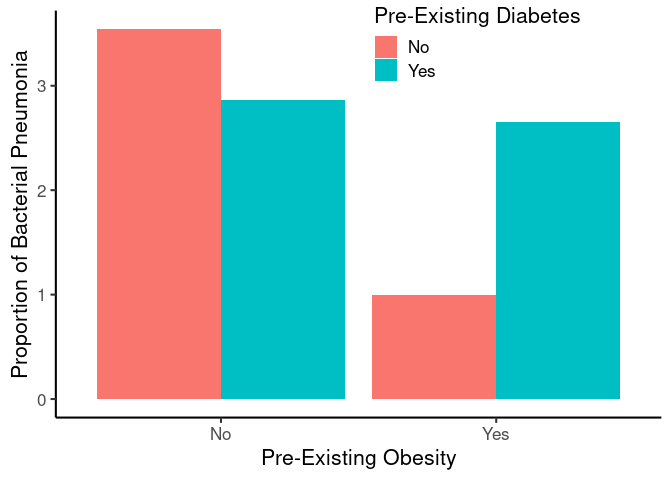

## Purpose

This script combines the cleaned datasets of cases of bactrial pneumonia and controls with no types of pneumonia and compares demographic characteristics.  This script can be found in /nfs/turbo/precision-health/DataDirect/HUM00229632 - Genome-wide associations of bacteria/2025-05-12/controls and was most recently run on Mon Dec  1 11:01:32 2025.


``` r
library(knitr)
#figures made will go to directory called figures, will make them as both png and pdf files 
opts_chunk$set(fig.path='figures-case-control/',
               echo=TRUE, warning=FALSE, message=FALSE,dev=c('png','pdf'))
options(scipen = 2, digits = 3)

library(readr)
library(dplyr)
```

```
## 
## Attaching package: 'dplyr'
```

```
## The following objects are masked from 'package:stats':
## 
##     filter, lag
```

```
## The following objects are masked from 'package:base':
## 
##     intersect, setdiff, setequal, union
```

``` r
library(tidyr)
library(knitr)
library(lubridate)
```

```
## 
## Attaching package: 'lubridate'
```

```
## The following objects are masked from 'package:base':
## 
##     date, intersect, setdiff, union
```

``` r
control.filename <- 'DatasetComplete.csv'
control.data <- read_csv(control.filename) %>%
  mutate(Class="Controls") %>%
  rename("PriorCardiacArrhythmias"="CardiacArrhythmias",
         "PriorCOPD"="COPD",
         "PriorDiabetes"="Diabetes",
         "PriorHypertension"="Hypertension",
         "PriorObesity"="Obesity")
```

```
## Rows: 93798 Columns: 49
```

```
## ── Column specification ────────────────────────────────────────────────────────
## Delimiter: ","
## chr  (17): DeID_PatientID, DeID_EncounterID, TermNameMapped, TermCodeSource,...
## dbl  (22): CerebrovascularDisease, DiabetesWithChronicComplication, Diabetes...
## dttm (10): CerebrovascularDiseaseFirst, DiabetesWithChronicComplicationFirst...
## 
## ℹ Use `spec()` to retrieve the full column specification for this data.
## ℹ Specify the column types or set `show_col_types = FALSE` to quiet this message.
```

``` r
case.filename <- '../cases/DatasetComplete.csv'
case.data <- read_csv(case.filename) %>%
  filter(Type=="Bacterial") %>%
  arrange(AdmitDate) %>%
  distinct(DeID_PatientID,.keep_all = T) %>%
  mutate(Class="Cases") %>%
  select(-ends_with('First')) %>%
  rename("AgeInYears"="AgeInYears.x") 
```

```
## Rows: 7604 Columns: 78
## ── Column specification ────────────────────────────────────────────────────────
## Delimiter: ","
## chr  (28): DeID_PatientID, DeID_EncounterID.x, TermNameMapped.x, TermCodeSou...
## dbl  (34): AgeInYears.x, EmergencyVisit.x, HeightCM, WeightKG, BMI, Duration...
## dttm  (2): DeID_AdmitDate.x, DeID_DischargeDate.x
## date (14): AdmitDate, DischargeDate, CerebrovascularDiseaseFirst, DiabetesWi...
## 
## ℹ Use `spec()` to retrieve the full column specification for this data.
## ℹ Specify the column types or set `show_col_types = FALSE` to quiet this message.
```

``` r
combined.data <-
  bind_rows(case.data,control.data)
```

# Case vs Control


``` r
quant.demo <- 
  combined.data %>%
  group_by(Class) %>%
  summarize(across(.cols=c('AgeInYears','BMI','MaxStay'),
                   .fns=list(mean = ~mean(.,na.rm=T),
                             sd = ~sd(.,na.rm=T),
                             #shapiro.p = ~shapiro.test(.)$p.value,
                             n = ~length(!(is.na(.)))))) %>%
  pivot_longer(cols=contains("_"), #fix this
               names_sep="_",names_to=c("Variable","Statistic")) %>%
  pivot_wider(names_from=Statistic,values_from=value) %>%
  arrange(Variable)

kable(quant.demo, caption="Summary of quantitative values")
```


Table: Summary of quantitative values

|Class    |Variable   | mean|    sd|     n|
|:--------|:----------|----:|-----:|-----:|
|Cases    |AgeInYears | 57.0|  16.9|  2646|
|Controls |AgeInYears | 62.9|  11.2| 93798|
|Cases    |BMI        | 32.5| 145.3|  2646|
|Controls |BMI        | 29.8|  17.4| 93798|
|Cases    |MaxStay    | 10.3|  20.6|  2646|
|Controls |MaxStay    |  NaN|    NA| 93798|

``` r
# wilcoxon tests, not normally distributed

# quant.t.tests <-
#    combined.data %>%
#   mutate(Class=as.factor(Class)) %>%
#   summarize(across(.cols=c('AgeInYears','BMI'), 
#                    .fns=list(Mann.Whitney=~wilcox.test(.~Class)$p.value)))
# 
# kable(quant.t.tests,caption="Mann-Whitney tests for 30 day survival",digits=c(99,99,99))

ances.demo.ql <- 
  combined.data %>%
  group_by(MajorityAncestry,Class) %>%
  mutate(Type="Ancestry") %>%
  rename("Group"="MajorityAncestry") %>%
  count %>%
  ungroup %>%
  mutate(Pct=n/sum(n)*100) %>%
  mutate(Type="Ancestry")

type.demo.ql <- 
  combined.data %>%
  group_by(Type,Class) %>%
  rename("Group"="Type") %>%
  count %>%
  ungroup %>%
  mutate(Pct=n/sum(n)*100) %>%
  mutate(Type="Pneumonia Type")

emerg.demo.ql <- 
  combined.data %>%
  group_by(EmergencyVisit.x,Class) %>%
  rename("Group"="EmergencyVisit.x") %>%
  count %>%
  mutate(Group=as.factor(Group)) %>%
  ungroup %>%
  mutate(Pct=n/sum(n)*100) %>%
  mutate(Type="Emergency Visit") %>%
  mutate(Group=case_when(Group==1~"Yes",
                         Group==2~"No"))

# coded as dates not yes/no
# cvd.demo.ql <- 
#   combined.data %>%
#   group_by(CerebrovascularDiseaseFirst) %>%
#   rename("Group"="CerebrovascularDiseaseFirst") %>%
#   count %>%
#   ungroup %>% 
#   mutate(Group=as.factor(Group)) %>%
#   mutate(Pct=n/sum(n)*100) %>%
#   mutate(Type="Cerebrovascular Disease")

gender.demo.ql <- 
  combined.data %>%
  group_by(GenderCode,Class) %>%
  rename("Group"="GenderCode") %>%
  count %>%
  ungroup %>%
  mutate(Pct=n/sum(n)*100) %>%
  mutate(Type="Gender")

race.demo.ql <- 
combined.data %>%
  group_by(RaceName,Class) %>%
  count %>%
  ungroup %>%
  rename("Group"="RaceName") %>%
  mutate(Pct=n/sum(n)*100) %>%
  mutate(Type="Race")

ethnicity.demo.ql <- 
combined.data %>%
  group_by(EthnicityName,Class) %>%
  count %>%
  ungroup %>%
  rename("Group"="EthnicityName") %>%
  mutate(Pct=n/sum(n)*100) %>%
  mutate(Type="Ethnicity")

diabetes.demo.ql <- 
  combined.data %>%
  group_by(PriorDiabetes,Class) %>%
  count %>%
  ungroup %>%
  rename("Group"="PriorDiabetes") %>%
  mutate(Pct=n/sum(n)*100) %>%
  mutate(Type="PriorDiabetes") %>%
  mutate(Group=case_when(Group==1~"Yes",
                         Group==2~"No"))

smoking.demo.ql <- 
  combined.data %>%
  group_by(SmokingStatusMapped,Class) %>%
  #mutate(Type="Smoking") %>%
  rename("Group"="SmokingStatusMapped") %>%
  count %>%
  ungroup %>%
  mutate(Pct=n/sum(n)*100) %>%
  mutate(Type="Smoking") 

#update to hypertension first
hypertension.demo.ql <- 
  combined.data %>%
  group_by(PriorHypertension,Class) %>%
  rename("Group"="PriorHypertension") %>%
  count %>%
  ungroup %>%
  mutate(Pct=n/sum(n)*100) %>%
  mutate(Type="PriorHypertension") %>%
  mutate(Group=case_when(Group==1~"Yes",
                         Group==2~"No"))

arrythmia.demo.ql <- 
  combined.data %>%
  group_by(PriorCardiacArrhythmias,Class) %>%
  rename("Group"="PriorCardiacArrhythmias") %>%
  count %>%
  ungroup %>%
  mutate(Pct=n/sum(n)*100) %>%
  mutate(Type="Prior Cardiac Arrhythmias") %>%
  mutate(Group=case_when(Group==1~"Yes",
                         Group==2~"No"))

obesity.demo.ql <- 
  combined.data %>%
  group_by(PriorObesity,Class) %>%
  rename("Group"="PriorObesity") %>%
  count %>%
  ungroup %>%
  mutate(Pct=n/sum(n)*100) %>%
  mutate(Type="Prior Obesity") %>%
  mutate(Group=case_when(Group==1~"Yes",
                         Group==2~"No"))

copd.demo.ql <- 
  combined.data %>%
  group_by(PriorCOPD,Class) %>%
  rename("Group"="PriorCOPD") %>%
  count %>%
  ungroup %>%
  mutate(Pct=n/sum(n)*100) %>%
  mutate(Type="Prior COPD") %>%
  mutate(Group=case_when(Group==1~"Yes",
                         Group==2~"No"))

death.demo.ql <- 
  combined.data %>%
  group_by(is.na(DeID_DeathIndexDeceasedDate),Class) %>%
  count() %>%
  rename("Group"=1) %>%
  ungroup %>%
  mutate(Pct=n/sum(n)*100) %>%
  mutate(Type="Death")  %>%
  mutate(Group=case_when(Group==TRUE~"Deceased",
                         Group==FALSE~"Alive"))

surv30d.demo.ql <- 
  combined.data %>%
  group_by(Survival.30day,Class) %>%
  count() %>%
  rename("Group"=1) %>%
  ungroup %>%
  mutate(Pct=n/sum(n)*100) %>%
  mutate(Type="30d Survival") 

surv60d.demo.ql <- 
  combined.data %>%
  group_by(Survival.60day,Class) %>%
  count() %>%
  rename("Group"=1) %>%
  ungroup %>%
  mutate(Pct=n/sum(n)*100) %>%
  mutate(Type="60d Survival") 

total.survival <- combined.data %>% group_by(Class) %>% count() %>% pull(n)

summary.discrete <-
  bind_rows(gender.demo.ql,
            race.demo.ql,
            ethnicity.demo.ql,
            ances.demo.ql,
            smoking.demo.ql,
            type.demo.ql,
            #emerg.demo.ql, 
            death.demo.ql,
            surv30d.demo.ql,
            surv60d.demo.ql,
            diabetes.demo.ql,
            hypertension.demo.ql,
            arrythmia.demo.ql,
            copd.demo.ql,
            obesity.demo.ql
            ) %>%
  select(Class,Type,Group,n,Pct) %>%
  ungroup %>%
  select(-Pct) %>%
  pivot_wider(names_from = Class,values_from = n, values_fn = sum) %>%
  arrange(Type,Group) %>%
  replace(.=="NULL", NA) %>%
  mutate(Cases = case_when(is.na(Cases)~0,
                            !(is.na(Cases))~Cases)) %>%
  mutate(Controls = case_when(is.na(Controls)~0,
                            !(is.na(Controls))~Controls)) %>%
  rowwise %>%
  mutate(Pct=Cases/(Cases+Controls)*100) %>%
  mutate(Chisq.p = chisq.test(x=c(Cases,Controls),p=total.survival,rescale.p = T)$p.value) %>%
  mutate(Sig = case_when(Chisq.p < 0.01 ~ '**',
                         Chisq.p < 0.05 ~ '*'))

kable(summary.discrete, 
      caption=paste("Summary of discrete variables for bacterial pneumonia cases, compared to controls.  Overall", round(total.survival[1]/(total.survival[2]+total.survival[1])*100,2),"% cases"),
      digits=c(0,0,0,0,1,99,0))
```


Table: Summary of discrete variables for bacterial pneumonia cases, compared to controls.  Overall 2.74 % cases

|Type                      |Group                                      | Cases| Controls|   Pct|  Chisq.p|Sig |
|:-------------------------|:------------------------------------------|-----:|--------:|-----:|--------:|:---|
|30d Survival              |Surival Past 30 Days                       |   845|        0| 100.0| 0.00e+00|**  |
|30d Survival              |Within 30 Days                             |   109|        0| 100.0| 0.00e+00|**  |
|30d Survival              |NA                                         |  1692|    93798|   1.8| 1.86e-75|**  |
|60d Survival              |Surival Past 60 Days                       |   773|        0| 100.0| 0.00e+00|**  |
|60d Survival              |Within 60 Days                             |   181|        0| 100.0| 0.00e+00|**  |
|60d Survival              |NA                                         |  1692|    93798|   1.8| 1.86e-75|**  |
|Ancestry                  |AFR                                        |   114|     2679|   4.1| 1.50e-05|**  |
|Ancestry                  |AMR                                        |     8|      274|   2.8| 9.24e-01|NA  |
|Ancestry                  |CSA                                        |    13|      598|   2.1| 3.51e-01|NA  |
|Ancestry                  |EAS                                        |    11|      853|   1.3| 8.15e-03|**  |
|Ancestry                  |EUR                                        |  1494|    43685|   3.3| 2.31e-13|**  |
|Ancestry                  |WAS                                        |    20|      589|   3.3| 4.14e-01|NA  |
|Ancestry                  |NA                                         |   986|    45120|   2.1| 1.82e-15|**  |
|Death                     |Alive                                      |   954|     8352|  10.3| 0.00e+00|**  |
|Death                     |Deceased                                   |  1692|    85446|   1.9| 1.41e-47|**  |
|Ethnicity                 |Hispanic or Latino                         |    63|     3582|   1.7| 1.75e-04|**  |
|Ethnicity                 |Non-Hispanic or Latino                     |  2531|    86648|   2.8| 8.39e-02|NA  |
|Ethnicity                 |Patient Refused                            |    13|      564|   2.3| 4.71e-01|NA  |
|Ethnicity                 |Unknown                                    |    38|     2027|   1.8| 1.20e-02|*   |
|Ethnicity                 |NA                                         |     1|      977|   0.1| 4.26e-07|**  |
|Gender                    |F                                          |  1246|    52297|   2.3| 3.65e-09|**  |
|Gender                    |M                                          |  1400|    41491|   3.3| 4.13e-11|**  |
|Gender                    |U                                          |     0|       10|   0.0| 5.95e-01|NA  |
|Pneumonia Type            |Bacterial                                  |  2646|        0| 100.0| 0.00e+00|**  |
|Pneumonia Type            |NA                                         |     0|    93798|   0.0| 0.00e+00|**  |
|Prior COPD                |Yes                                        |    81|     4596|   1.7| 2.28e-05|**  |
|Prior COPD                |NA                                         |  2565|    89202|   2.8| 3.39e-01|NA  |
|Prior Cardiac Arrhythmias |Yes                                        |   746|    29481|   2.5| 3.36e-03|**  |
|Prior Cardiac Arrhythmias |NA                                         |  1900|    64317|   2.9| 4.75e-02|*   |
|Prior Obesity             |Yes                                        |   527|    33418|   1.6| 3.83e-41|**  |
|Prior Obesity             |NA                                         |  2119|    60380|   3.4| 4.15e-23|**  |
|PriorDiabetes             |Yes                                        |   518|    18422|   2.7| 9.42e-01|NA  |
|PriorDiabetes             |NA                                         |  2128|    75376|   2.7| 9.71e-01|NA  |
|PriorHypertension         |Yes                                        |   868|    42239|   2.0| 1.72e-20|**  |
|PriorHypertension         |NA                                         |  1778|    51559|   3.3| 7.36e-17|**  |
|Race                      |African American                           |   242|     6959|   3.4| 1.35e-03|**  |
|Race                      |American Indian                            |    16|      611|   2.6| 7.69e-01|NA  |
|Race                      |Asian                                      |    37|     3962|   0.9| 1.93e-12|**  |
|Race                      |Caucasian                                  |  2292|    77131|   2.9| 1.41e-02|*   |
|Race                      |Native Hawaiian and Other Pacific Islander |     3|       92|   3.2| 8.05e-01|NA  |
|Race                      |Other                                      |    39|     2732|   1.4| 1.66e-05|**  |
|Race                      |Patient Refused                            |     4|      528|   0.8| 4.92e-03|**  |
|Race                      |Unknown                                    |    10|     1046|   0.9| 3.51e-04|**  |
|Race                      |NA                                         |     3|      737|   0.4| 9.87e-05|**  |
|Smoking                   |Current                                    |   161|     8989|   1.8| 8.30e-09|**  |
|Smoking                   |Former                                     |  1057|    27584|   3.7| 1.01e-22|**  |
|Smoking                   |Never                                      |  1019|    52079|   1.9| 2.89e-31|**  |
|Smoking                   |Unknown                                    |    43|     2472|   1.7| 1.50e-03|**  |
|Smoking                   |NA                                         |   366|     2674|  12.0| 0.00e+00|**  |

# Diabetes and Obesity Interaction


``` r
library(forcats)
combined.data %>%
  group_by(PriorDiabetes,PriorObesity,Class) %>%
  count() %>%
  ungroup %>%
  pivot_wider(names_from=Class,values_from=n) %>%
  filter(PriorObesity!=-Inf) %>%
  mutate(Pct=Cases/(Cases+Controls)*100) %>%
  mutate(PriorObesity = fct_recode(as.factor(PriorObesity),
                                   "Yes"="1",
                                   "No"="0")) %>%
    mutate(PriorDiabetes = fct_recode(as.factor(PriorDiabetes),
                                   "Yes"="1",
                                   "No"="0"))-> diab.obesity.summary

kable(diab.obesity.summary, caption="Bacterial pneumonia stratified by diabetes or obesity")
```


Table: Bacterial pneumonia stratified by diabetes or obesity

|PriorDiabetes |PriorObesity | Controls| Cases|  Pct|
|:-------------|:------------|--------:|-----:|----:|
|No            |No           |    51795|  1902| 3.54|
|No            |Yes          |    22367|   226| 1.00|
|Yes           |No           |     7371|   217| 2.86|
|Yes           |Yes          |    11051|   301| 2.65|

``` r
library(ggplot2)

ggplot(diab.obesity.summary,aes(y=Pct,x=as.factor(PriorObesity),fill=as.factor(PriorDiabetes))) +
  geom_bar(stat='identity', position='dodge') +
  labs(y="Proportion of Bacterial Pneumonia",
       x="Pre-Existing Obesity",
       fill="Pre-Existing Diabetes") +
  theme_classic(base_size=16) +
  theme(legend.position=c(0.7,0.92))
```

<!-- -->

# Output File for Genetic Analysis


``` r
genetics_outfile <- '../Case_Control_Pneumonia_Incidence.csv'

combined.data %>%
  mutate(CaCo_Incidence = if_else(Class=="Cases",1,0)) %>%
  mutate(Age = case_when(is.na(Age)~AgeInYears,.default=Age)) |>
  mutate(AgeOver65 = case_when(Age>=65~1,
                               Age<65~0)) %>%
  mutate(COPD.History = case_when(COPD==1~1,
                                  .default=0)) %>%
  select(DeID_PatientID,starts_with("CaCo"),Age,AgeOver65,GenderCode,BMI,SmokingStatusMapped,COPD.History,Diabetes,RaceName,EthnicityName) %>% 
  write_csv(genetics_outfile)


genetics_outfile <- '../Case_Control_Klebsiella_Pneumonia_Incidence.csv'

combined.data %>%
  mutate(CaCo_Incidence = if_else(Class=="Cases"&SubType =='Pneumococcal',1,0)) %>%
  mutate(Age = case_when(is.na(Age)~AgeInYears,.default=Age)) |>
  mutate(AgeOver65 = case_when(Age>=65~1,
                               Age<65~0)) %>%
  mutate(COPD.History = case_when(COPD==1~1,
                                  .default=0)) %>%
  select(DeID_PatientID,starts_with("CaCo"),Age,AgeOver65,GenderCode,BMI,SmokingStatusMapped,COPD.History,Diabetes,RaceName,EthnicityName) %>% 
  write_csv(genetics_outfile)

genetics_outfile <- '../Case_Control_Pneumococcal_Pneumonia_Incidence.csv'

combined.data %>%
  mutate(CaCo_Incidence = if_else(Class=="Cases"&SubType=="Klebsilla",1,0)) %>%
  mutate(Age = case_when(is.na(Age)~AgeInYears,.default=Age)) |>
  mutate(AgeOver65 = case_when(Age>=65~1,
                               Age<65~0)) %>%
  mutate(COPD.History = case_when(COPD==1~1,
                                  .default=0)) %>%
  select(DeID_PatientID,starts_with("CaCo"),Age,AgeOver65,GenderCode,BMI,SmokingStatusMapped,COPD.History,Diabetes,RaceName,EthnicityName) %>% 
  write_csv(genetics_outfile)
```

# Session Information


``` r
sessionInfo()
```

```
## R version 4.4.3 (2025-02-28)
## Platform: x86_64-pc-linux-gnu
## Running under: Red Hat Enterprise Linux 8.10 (Ootpa)
## 
## Matrix products: default
## BLAS:   /sw/pkgs/arc/stacks/gcc/13.2.0/R/4.4.3/lib64/R/lib/libRblas.so 
## LAPACK: /sw/pkgs/arc/stacks/gcc/13.2.0/R/4.4.3/lib64/R/lib/libRlapack.so;  LAPACK version 3.12.0
## 
## locale:
##  [1] LC_CTYPE=en_US.UTF-8       LC_NUMERIC=C              
##  [3] LC_TIME=en_US.UTF-8        LC_COLLATE=en_US.UTF-8    
##  [5] LC_MONETARY=en_US.UTF-8    LC_MESSAGES=en_US.UTF-8   
##  [7] LC_PAPER=en_US.UTF-8       LC_NAME=C                 
##  [9] LC_ADDRESS=C               LC_TELEPHONE=C            
## [11] LC_MEASUREMENT=en_US.UTF-8 LC_IDENTIFICATION=C       
## 
## time zone: America/Detroit
## tzcode source: system (glibc)
## 
## attached base packages:
## [1] stats     graphics  grDevices utils     datasets  methods   base     
## 
## other attached packages:
## [1] ggplot2_3.5.1   forcats_1.0.0   lubridate_1.9.3 tidyr_1.3.1    
## [5] dplyr_1.1.4     readr_2.1.5     knitr_1.48     
## 
## loaded via a namespace (and not attached):
##  [1] bit_4.0.5         gtable_0.3.6      jsonlite_1.8.8    highr_0.11       
##  [5] compiler_4.4.3    crayon_1.5.3      tidyselect_1.2.1  parallel_4.4.3   
##  [9] jquerylib_0.1.4   scales_1.3.0      yaml_2.3.9        fastmap_1.2.0    
## [13] R6_2.5.1          labeling_0.4.3    generics_0.1.3    tibble_3.2.1     
## [17] munsell_0.5.1     bslib_0.7.0       pillar_1.9.0      tzdb_0.4.0       
## [21] rlang_1.1.4       utf8_1.2.4        cachem_1.1.0      xfun_0.45        
## [25] sass_0.4.9        bit64_4.0.5       timechange_0.3.0  cli_3.6.3        
## [29] withr_3.0.0       magrittr_2.0.3    grid_4.4.3        digest_0.6.36    
## [33] vroom_1.6.5       rstudioapi_0.16.0 hms_1.1.3         lifecycle_1.0.4  
## [37] vctrs_0.6.5       evaluate_0.24.0   glue_1.8.0        farver_2.1.2     
## [41] colorspace_2.1-0  fansi_1.0.6       rmarkdown_2.27    purrr_1.0.2      
## [45] tools_4.4.3       pkgconfig_2.0.3   htmltools_0.5.8.1
```
