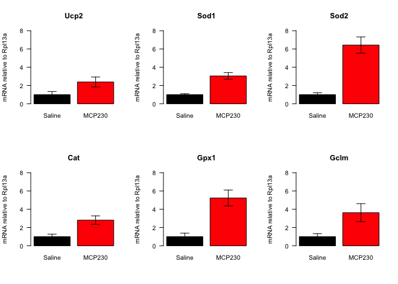

# Data Entry


This script uses the \verb+\Sexpr{sheet_name}+ from \verb+\Sexpr{input_file}+ and is located in the \verb+\Sexpr{getwd()}+ directory.  This analysis was most recently run on \Sexpr{date()}.  


# Statistics


<!-- -->

<!-- -->


<!-- -->


<!-- -->


<!-- -->

<!-- -->

<!-- -->

<!-- -->
# Session Information


```
## R version 3.6.2 (2019-12-12)
## Platform: x86_64-apple-darwin15.6.0 (64-bit)
## Running under: macOS Catalina 10.15.3
## 
## Matrix products: default
## BLAS:   /Library/Frameworks/R.framework/Versions/3.6/Resources/lib/libRblas.0.dylib
## LAPACK: /Library/Frameworks/R.framework/Versions/3.6/Resources/lib/libRlapack.dylib
## 
## locale:
## [1] en_US.UTF-8/en_US.UTF-8/en_US.UTF-8/C/en_US.UTF-8/en_US.UTF-8
## 
## attached base packages:
## [1] stats     graphics  grDevices utils     datasets  methods   base     
## 
## other attached packages:
## [1] car_3.0-6     carData_3.0-3 plyr_1.8.5    readxl_1.3.1  dplyr_0.8.3  
## [6] tidyr_1.0.2   knitr_1.27   
## 
## loaded via a namespace (and not attached):
##  [1] Rcpp_1.0.3        magrittr_1.5      hms_0.5.3         tidyselect_1.0.0 
##  [5] R6_2.4.1          rlang_0.4.4       stringr_1.4.0     tools_3.6.2      
##  [9] data.table_1.12.8 xfun_0.12         rio_0.5.16        htmltools_0.4.0  
## [13] abind_1.4-5       yaml_2.2.0        digest_0.6.23     assertthat_0.2.1 
## [17] tibble_2.1.3      lifecycle_0.1.0   crayon_1.3.4      zip_2.0.4        
## [21] purrr_0.3.3       vctrs_0.2.2       curl_4.3          glue_1.3.1       
## [25] evaluate_0.14     haven_2.2.0       rmarkdown_2.1     openxlsx_4.1.4   
## [29] stringi_1.4.5     compiler_3.6.2    pillar_1.4.3      cellranger_1.1.0 
## [33] forcats_0.4.0     foreign_0.8-75    pkgconfig_2.0.3
```
