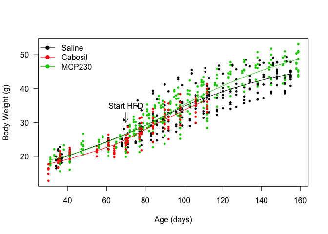
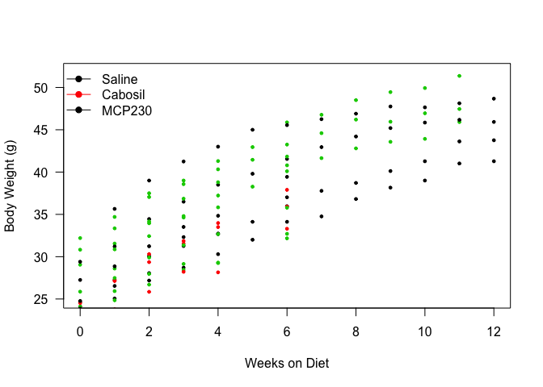
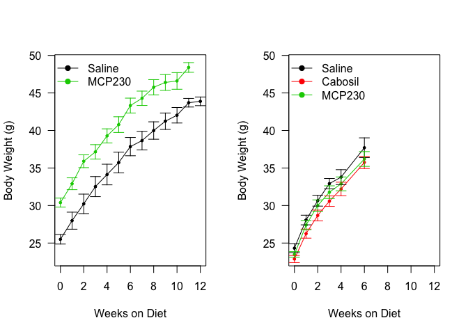
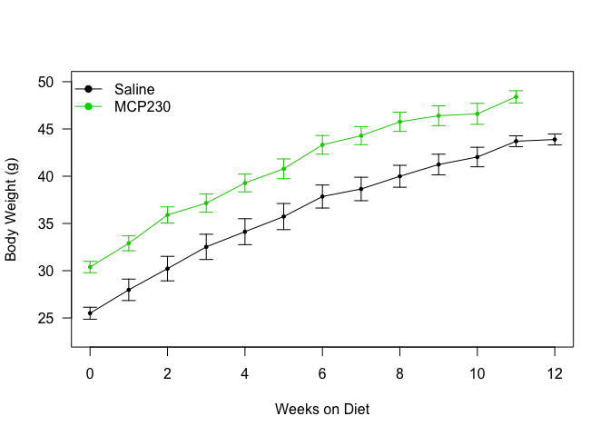

# Analysis of Body Weights for High Fat Diet Particulate Treatment Study
Alyse Ragauskas, Matt Peloquin, Jyothi Parvathareddy, Sridhar Jaligama, Stephania Cormier and Dave Bridges  
November 13, 2014  

---

This study involved two arms, animals treated as neonatal pups and animals treated *in utero*.  These analyses were most recently updated on Thu Nov 13 12:22:20 2014.


```r
output_file_maternal <- "../data/Raw Weights - Maternal.csv"

data.maternal <- subset(read.csv(output_file_maternal, row.names="X"), assay.assay=="Body Weight")
#removed sickly, weight losing mouse 206
data.maternal <- subset(data.maternal, animal.MouseID !=206)
data.maternal <- subset(data.maternal, experiment.feeding_state == 'fed')
data.maternal$animal.MouseID <- as.factor(data.maternal$animal.MouseID)
data.maternal$animal.Cage <- as.factor(data.maternal$animal.Cage)
data.maternal$Treatment <- relevel(data.maternal$Treatment, ref='Saline')
for (row in rownames(data.maternal)) {
  if (data.maternal[row,'animal.id'] < 6400)
    data.maternal[row,'Cohort'] <- "First Cohort"
  else
    data.maternal[row,'Cohort'] <- "Second Cohort"
}
data.maternal$Cohort <- as.factor(data.maternal$Cohort)
```

These data can be found in the file ../data/Raw Weights - Maternal.csv.

## Animals Reared from Particulate Treated Mothers


```r
#calculate weekly averages by Cage
library(plyr)
weekly.summary.maternal.cage <- ddply(subset(data.maternal, Week >= 0), .(animal.Cage, Treatment,Week), summarize,
     mean = mean(Weight),
     se = sd(Weight, na.rm=T)/sqrt(length(Weight)),
     sd = sd(Weight, na.rm=T),
     n = length(Weight))

max.week.maternal <- 11
library(lme4)
```

```
## Loading required package: Matrix
## Loading required package: Rcpp
```

```r
fit.lme.maternal <- lmer(mean~Week + Treatment + (1|animal.Cage), data=weekly.summary.maternal.cage, REML=T)
fit.lme.no.treatment.maternal <- lmer(mean~ Week + (1|animal.Cage), data=weekly.summary.maternal.cage, REML=T)

fit.lme.maternal.indiv <- lmer(Weight~Week + Treatment + (1|animal.MouseID), data=subset(data.maternal, Week >= 0), REML=T)
fit.lme.no.treatment.maternal.indiv <- lmer(Weight~ Week + (1|animal.MouseID), data=subset(data.maternal, Week >= 0), REML=T)
library(multcomp)
```

```
## Loading required package: mvtnorm
## Loading required package: survival
## Loading required package: splines
## Loading required package: TH.data
```

```r
#for post-hoc testing of the mixed effects model, if it was significant
#summary(glht(fit.lme, linfct=mcp(Genotype="Dunnett")))

#p-values at each week
library(car)
#weekly.pairwise.tests.maternal <- data.frame(row.names=as.factor(seq(0,max.week.maternal,1)))
#for (week in seq(0,max.week.maternal,1)){
#  weekly.pairwise.tests.maternal[as.character(week),'shapiro-saline'] <- with(weekly.summary.maternal.cage[weekly.summary.maternal.cage$Week==week&weekly.summary.maternal.cage$Treatment=='Saline',], shapiro.test(mean))$p.value
#  weekly.pairwise.tests.maternal[as.character(week),'shapiro-particulate'] <- with(weekly.summary.maternal.cage[weekly.summary.maternal.cage$Week==week&weekly.summary.maternal.cage$Treatment=='MCP230',], shapiro.test(mean))$p.value
 # weekly.pairwise.tests.maternal[as.character(week),'levene'] <- leveneTest(mean~Treatment, data=weekly.summary.maternal.cage[weekly.summary.maternal.cage$Week==week,])$`Pr(>F)`[1]
#  weekly.pairwise.tests.maternal[as.character(week),'student'] <- t.test(mean~Treatment, data=weekly.summary.maternal.cage[weekly.summary.maternal.cage$Week==week,], var.equal=T)$p.value
#    weekly.pairwise.tests.maternal[as.character(week),'n'] <- dim(weekly.summary.maternal.cage[weekly.summary.maternal.cage$Week==week,])[1]
#}
#weekly.pairwise.tests.maternal$padj <- p.adjust(weekly.pairwise.tests.maternal$student, method="BH")

#calculate weekly averages
weekly.summary.maternal <- ddply(subset(data.maternal, Week >= 0), .(Treatment,Week), summarize,
     mean = mean(Weight),
     se = sd(Weight, na.rm=T)/sqrt(length(Weight)),
     sd = sd(Weight, na.rm=T),
     n = length(Weight))
```

This study includes 64 animals, all put on a high fat diet.  This includes 0 animals in the control group and 0 animals in the particulate group.  


The weights of each mouse are shown in the Figure below. We aggregated the data by cage, which means we grouped mice together by the mother. By mixed linear effects modelling of body weights after the start of the diet, there was no significant effect of the Treatment (p = 0.3546) by F-test.   If we treat each mouse individually then the p-value is 0.035.

 

First we tested for normality with Shapiro-Wilk tests on each group and then, because in general all weeks in the untagged group tended to have a normal distributions with equal variance, we did Student's T-Tests.  These are shown in the table below:


```r
library(reshape2)
summary.data.maternal <- dcast(weekly.summary.maternal.cage, Week~Treatment, value.var="mean", mean)
se <- function(x) sd(x)/sqrt(length(x))
summary.error.maternal <- dcast(weekly.summary.maternal.cage, Week~Treatment, value.var="mean", se)
ymax <- max(weekly.summary.maternal.cage$mean + weekly.summary.maternal.cage$se, na.rm=T)
plot <- with(weekly.summary.maternal.cage, plot(Week, mean,
                   pch=19, las=1, cex=0.5,
                   ylab ="Body Weight (g)",
                   xlab ="Weeks on Diet",
                   col=Treatment,
                   ylim = c(25,ymax)))
lines(summary.data.maternal$Week, summary.data.maternal$Control, col=palette()[1])
lines(summary.data.maternal$Week, summary.data.maternal$Particulate, col=palette()[2])

legend("topleft", levels(data.maternal$Treatment), bty="n", pch=19, col=palette()[1:2], lty=1)

superpose.eb <- function (x, y, ebl, ebu = ebl, length = 0.08, ...)
  arrows(x, y + ebu, x, y - ebl, angle = 90, code = 3,
  length = length, ...)

with(weekly.summary.maternal.cage[weekly.summary.maternal.cage$Treatment=='Control',],
     superpose.eb(Week, mean, se, col=palette()[1]))
with(weekly.summary.maternal.cage[weekly.summary.maternal.cage$Treatment=='Particulate',],
     superpose.eb(Week, mean, se, col=palette()[2]))
```

 


```r
summary.data.maternal <- dcast(weekly.summary.maternal, Week~Treatment, value.var="mean")
summary.error.maternal <- dcast(weekly.summary.maternal, Week~Treatment, value.var="se")
ymax <- max(summary.data.maternal + summary.error.maternal, na.rm=T)
plot <- plot(summary.data.maternal$Week, summary.data.maternal$Saline,
                   pch=19, las=1, cex=0.5,
                   ylab ="Body Weight (g)",
                   xlab ="Weeks on Diet",
                   ylim = c(25,ymax))
lines(summary.data.maternal$Week, summary.data.maternal$Saline, col=palette()[1])
lines(summary.data.maternal$Week, summary.data.maternal$MCP230, col=palette()[2])
lines(summary.data.maternal$Week, summary.data.maternal$Cabosil, col=palette()[3])
points(summary.data.maternal$Week, summary.data.maternal$MCP230,pch=19, col=palette()[2], cex=0.5)
legend("topleft", levels(data.maternal$Treatment), bty="n", pch=19, col=palette()[1:3], lty=1)

superpose.eb(summary.data.maternal$Week, summary.data.maternal$Saline, summary.error.maternal$Saline, col=palette()[1])
superpose.eb(summary.data.maternal$Week, summary.data.maternal$MCP230, summary.error.maternal$MCP230, col=palette()[2])
superpose.eb(summary.data.maternal$Week, summary.data.maternal$Cabosil, summary.error.maternal$Cabosil, col=palette()[3])
```

 


```r
par(mfrow=c(1,2))
weekly.summary.maternal.cohort <- ddply(subset(data.maternal, Week >= 0), .(Cohort,Treatment,Week), summarize,
     mean = mean(Weight),
     se = sd(Weight, na.rm=T)/sqrt(length(Weight)),
     sd = sd(Weight, na.rm=T),
     n = length(Weight))

ymax <- max(summary.data.maternal + summary.error.maternal, na.rm=T)
summary.data.maternal <- dcast(subset(weekly.summary.maternal.cohort, Cohort=="First Cohort"), Week~Treatment, value.var="mean")
summary.error.maternal <- dcast(subset(weekly.summary.maternal.cohort, Cohort=="First Cohort"), Week~Treatment, value.var="se")
plot <- plot(summary.data.maternal$Week, summary.data.maternal$Saline,
                   pch=19, las=1, cex=0.5,
                   ylab ="Body Weight (g)",
                   xlab ="Weeks on Diet",
                   ylim = c(23,ymax))
lines(summary.data.maternal$Week, summary.data.maternal$Saline, col=palette()[1])
lines(summary.data.maternal$Week, summary.data.maternal$Cabosil, col=palette()[2])
points(summary.data.maternal$Week, summary.data.maternal$Cabosil,pch=19, col=palette()[2], cex=0.5)
lines(summary.data.maternal$Week, summary.data.maternal$MCP230, col=palette()[3])
points(summary.data.maternal$Week, summary.data.maternal$MCP230,pch=19, col=palette()[3], cex=0.5)
legend("topleft", levels(data.maternal$Treatment)[c(1,3)], bty="n", pch=19, col=palette()[c(1,3)], lty=1)

superpose.eb(summary.data.maternal$Week, summary.data.maternal$Saline, summary.error.maternal$Saline, col=palette()[1])
superpose.eb(summary.data.maternal$Week, summary.data.maternal$MCP230, summary.error.maternal$MCP230, col=palette()[3])

#second cohort
summary.data.maternal <- dcast(subset(weekly.summary.maternal.cohort, Cohort=="Second Cohort"), Week~Treatment, value.var="mean")
summary.error.maternal <- dcast(subset(weekly.summary.maternal.cohort, Cohort=="Second Cohort"), Week~Treatment, value.var="se")
plot <- plot(summary.data.maternal$Week, summary.data.maternal$Saline,
                   pch=19, las=1, cex=0.5,
                   ylab ="Body Weight (g)",
                   xlab ="Weeks on Diet",
                   ylim = c(23,ymax),
                   xlim = c(0,12))
lines(summary.data.maternal$Week, summary.data.maternal$Saline, col=palette()[1])
lines(summary.data.maternal$Week, summary.data.maternal$Cabosil, col=palette()[2])
points(summary.data.maternal$Week, summary.data.maternal$Cabosil,pch=19, col=palette()[2], cex=0.5)
lines(summary.data.maternal$Week, summary.data.maternal$MCP230, col=palette()[3])
points(summary.data.maternal$Week, summary.data.maternal$MCP230,pch=19, col=palette()[3], cex=0.5)
legend("topleft", levels(data.maternal$Treatment), bty="n", pch=19, col=palette()[1:3], lty=1)

superpose.eb(summary.data.maternal$Week, summary.data.maternal$Saline, summary.error.maternal$Saline, col=palette()[1])
superpose.eb(summary.data.maternal$Week, summary.data.maternal$Cabosil, summary.error.maternal$Cabosil, col=palette()[2])
superpose.eb(summary.data.maternal$Week, summary.data.maternal$MCP230, summary.error.maternal$MCP230, col=palette()[3])
```

 


```r
ymax <- max(summary.data.maternal + summary.error.maternal, na.rm=T)
summary.data.maternal <- dcast(subset(weekly.summary.maternal.cohort, Cohort=="First Cohort"), Week~Treatment, value.var="mean")
summary.error.maternal <- dcast(subset(weekly.summary.maternal.cohort, Cohort=="First Cohort"), Week~Treatment, value.var="se")
plot <- plot(summary.data.maternal$Week, summary.data.maternal$Saline,
                   pch=19, las=1, cex=0.5,
                   ylab ="Body Weight (g)",
                   xlab ="Weeks on Diet",
                   ylim = c(23,50))
lines(summary.data.maternal$Week, summary.data.maternal$Saline, col=palette()[1])
lines(summary.data.maternal$Week, summary.data.maternal$Cabosil, col=palette()[2])
points(summary.data.maternal$Week, summary.data.maternal$Cabosil,pch=19, col=palette()[2], cex=0.5)
lines(summary.data.maternal$Week, summary.data.maternal$MCP230, col=palette()[3])
points(summary.data.maternal$Week, summary.data.maternal$MCP230,pch=19, col=palette()[3], cex=0.5)
legend("topleft", levels(data.maternal$Treatment)[c(1,3)], bty="n", pch=19, col=palette()[c(1,3)], lty=1)

superpose.eb(summary.data.maternal$Week, summary.data.maternal$Saline, summary.error.maternal$Saline, col=palette()[1])
superpose.eb(summary.data.maternal$Week, summary.data.maternal$MCP230, summary.error.maternal$MCP230, col=palette()[3])
```

 


## Session Information

```r
sessionInfo()
```

```
## R version 3.1.1 (2014-07-10)
## Platform: x86_64-apple-darwin13.1.0 (64-bit)
## 
## locale:
## [1] en_US.UTF-8/en_US.UTF-8/en_US.UTF-8/C/en_US.UTF-8/en_US.UTF-8
## 
## attached base packages:
## [1] splines   stats     graphics  grDevices utils     datasets  methods  
## [8] base     
## 
## other attached packages:
##  [1] xtable_1.7-4    reshape2_1.4    car_2.0-21      multcomp_1.3-6 
##  [5] TH.data_1.0-3   survival_2.37-7 mvtnorm_1.0-0   lme4_1.1-7     
##  [9] Rcpp_0.11.2     Matrix_1.1-4    plyr_1.8.1     
## 
## loaded via a namespace (and not attached):
##  [1] digest_0.6.4     evaluate_0.5.5   formatR_1.0      grid_3.1.1      
##  [5] htmltools_0.2.6  knitr_1.6        lattice_0.20-29  MASS_7.3-33     
##  [9] minqa_1.2.3      nlme_3.1-117     nloptr_1.0.4     nnet_7.3-8      
## [13] rmarkdown_0.3.10 sandwich_2.3-2   stringr_0.6.2    tools_3.1.1     
## [17] yaml_2.1.13      zoo_1.7-11
```

