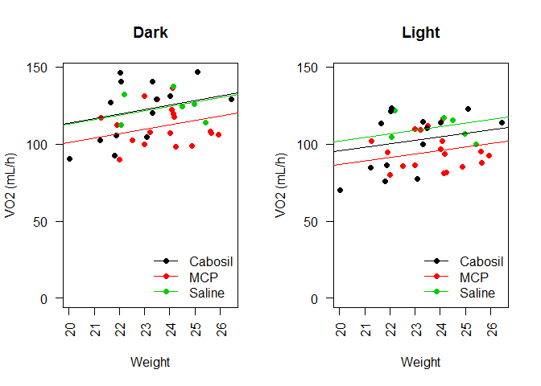
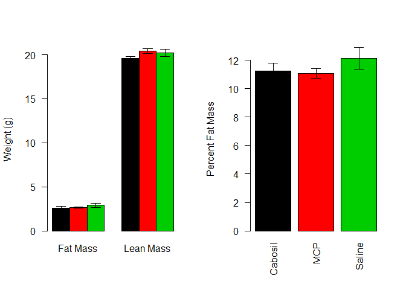
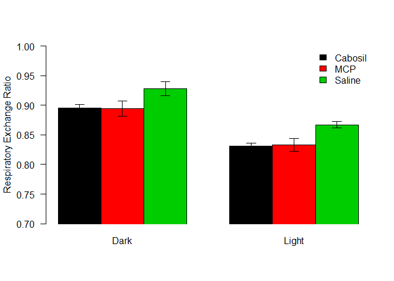
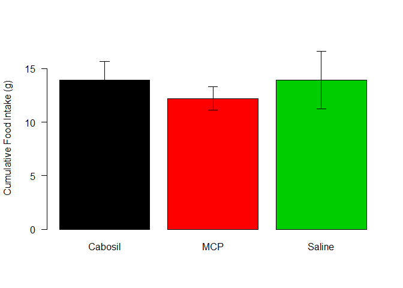

# Analysis of Pre-HFD CLAMS Data for High Fat Diet Particulate Treatment Study
Alyse Ragauskas, JeAnna Redd, Jyothi Parvathareddy, Sridhar Jaligama, Stephania Cormier and Dave Bridges  
November 13, 2014  
This was the data from the CLAMMS study performed on the 9 week old mice.  This script was most recently run on Sun Nov 16 14:06:29 2014.


```r
sample_key_file <- '../data/CLAMS/mouse_treatments.csv'
sample_key <- read.csv(sample_key_file)

mri_data_file <- '../data/CLAMS/2014-09-15 Maternal Particulate.xlsx'
library(xlsx)
```

```
## Loading required package: rJava
## Loading required package: xlsxjars
```

```r
mri_data <- read.xlsx2(mri_data_file, sheetIndex=1)
mri_data$Fat <- as.numeric(as.character(mri_data$Fat))
mri_data$Lean <- as.numeric(as.character(mri_data$Lean))
mri_data$Weight <- as.numeric(as.character(mri_data$Weight))

clams_data_file_first <- '../data/CLAMS/2014-09-15/2014-09-15 Maternal Particulate OXYMAX.csv'
clams_data_file_second <- '../data/CLAMS/2014-09-19/2014-09-19 Maternal Particulate OXYMAX.csv'

#load in the data
first_data <- read.csv(clams_data_file_first)
second_data <- read.csv(clams_data_file_second)
second_data$Event.Log <- rep(NA, dim(second_data)[1])

all.data <- rbind(first_data,second_data)
all.data$Subject <- as.factor(all.data$Subject)
remove.intervals <- 40
all.data.clean <- subset(all.data, Subject != '1119'&Interval>remove.intervals&Subject!='1096')
```

The input files were ../data/CLAMS/2014-09-15 Maternal Particulate.xlsx for the echoMRI data and ../data/CLAMS/2014-09-15/2014-09-15 Maternal Particulate OXYMAX.csv and ../data/CLAMS/2014-09-19/2014-09-19 Maternal Particulate OXYMAX.csv for the CLAMS data.  


```r
library(reshape2)
se <- function(x) sd(x)/sqrt(length(x))

summarized.data <- dcast(Subject~Light.Dark, data=all.data.clean, mean, value.var='Volume.O2')
summarized.data.err <- dcast(Subject~Light.Dark, data=all.data.clean, se, value.var='Volume.O2')

RER.data <- dcast(Subject~Light.Dark, data=all.data.clean, mean, value.var='RER')
RER.data.annotated <- merge(RER.data, sample_key, by.x='Subject', by.y='Mouse.ID')
Activity.data <- dcast(Subject~Light.Dark, data=all.data.clean, mean, value.var='X.Ambulatory')
Activity.data.annotated <- merge(Activity.data, sample_key, by.x='Subject', by.y='Mouse.ID')
Heat.data <- dcast(Subject~Light.Dark, data=all.data.clean, mean, value.var='Heat')

combined.data <- merge(summarized.data, mri_data[,c('Label','Lean','Fat','Weight')], by.x='Subject', by.y="Label")

combined.data$Dark.raw <- combined.data$Dark * combined.data$Weight/1000
combined.data$Light.raw <- combined.data$Light * combined.data$Weight/1000

combined.data.err <- merge(summarized.data.err, mri_data[,c('Label','Lean','Fat','Weight')], by.x='Subject', by.y="Label")

combined.data.err$Dark.raw <- combined.data.err$Dark * combined.data.err$Weight/1000
combined.data.err$Light.raw <- combined.data.err$Light * combined.data.err$Weight/1000
annotated.data.o2 <- merge(combined.data, sample_key, by.x='Subject', by.y='Mouse.ID')

#for linear mixed effects

#annotated all data with weights and groups
full.clean.data <- merge(all.data.clean, mri_data[,c('Label','Lean','Fat','Weight')], by.x='Subject', by.y="Label")
full.annotated.data <- merge(full.clean.data, sample_key, by.x='Subject', by.y='Mouse.ID')

library(lme4)
```

```
## Loading required package: Matrix
## Loading required package: Rcpp
```

```r
complete.lme <- lmer(Volume.O2 ~ Light.Dark + Weight + Particulate.Treatment + (1|Subject), data=full.annotated.data, REML=T)
no.treatment.lme <- lmer(Volume.O2 ~ Light.Dark + Weight + (1|Subject), data=full.annotated.data, REML=T)

library(multcomp)
```

```
## Loading required package: mvtnorm
```

```
## Warning: package 'mvtnorm' was built under R version 3.1.2
```

```
## Loading required package: survival
## Loading required package: splines
## Loading required package: TH.data
```

```
## Warning: package 'TH.data' was built under R version 3.1.2
```

```r
lme.ph <- glht(complete.lme, infct=mcp(Particulate.Treatment='Dunnett'))

complete.lme.lean <- lmer(Volume.O2 ~ Light.Dark + Lean + Particulate.Treatment + (1|Subject), data=full.annotated.data, REML=T)
no.treatment.lme.lean <- lmer(Volume.O2 ~ Light.Dark + Lean + (1|Subject), data=full.annotated.data, REML=T)

lme.ph.lean <- glht(complete.lme.lean, infct=mcp(Particulate.Treatment='Dunnett'))
```

## Resting Metabolic Rate

The VO2 levels were first merged to average over light and dark cycles, removing the first 40 measurements.  To analyse these data we performed an ANCOVA analysis using body weight as the primary covariate. 


```r
superpose.eb <- function (x, y, ebl, ebu = ebl, length = 0.08, ...)
  arrows(x, y + ebu, x, y - ebl, angle = 90, code = 3,
  length = length, ...)

par(mfrow=c(1,2))
with(annotated.data.o2, plot(Weight, Dark.raw, ylim=c(0,max(Dark.raw)),
                         pch=19, las=2, ylab="VO2", main='Dark', col=Particulate.Treatment))
legend("bottomright", levels(annotated.data.o2$Particulate.Treatment), pch=19, col=palette()[1:3], lty=1, bty='n')

dark.lm <- lm(Dark.raw~Weight+Particulate.Treatment, data=annotated.data.o2)
dark.aov <- aov(Dark.raw~Weight+Particulate.Treatment, data=annotated.data.o2)

abline(a=coefficients(dark.lm)[1],
       b=coefficients(dark.lm)[2], col=palette()[1])
abline(a=coefficients(dark.lm)[1]+coefficients(dark.lm)['Particulate.TreatmentMCP'],
       b=coefficients(dark.lm)[2], col=palette()[2])
abline(a=coefficients(dark.lm)[1]+coefficients(dark.lm)['Particulate.TreatmentSaline'],
       b=coefficients(dark.lm)[2], col=palette()[3])

with(annotated.data.o2, plot(Weight, Light.raw, ylim=c(0,max(Dark.raw)),
                         pch=19, las=2, ylab="VO2", main='Light',col=Particulate.Treatment))
legend("bottomright", levels(annotated.data.o2$Particulate.Treatment), pch=19, col=palette()[1:3], lty=1, bty='n')
light.lm <- lm(Light.raw~Weight+Particulate.Treatment, data=annotated.data.o2)
light.aov <- aov(Light.raw~Weight+Particulate.Treatment, data=annotated.data.o2)

abline(a=coefficients(light.lm)[1],
       b=coefficients(light.lm)[2], col=palette()[1])
abline(a=coefficients(light.lm)[1]+coefficients(light.lm)['Particulate.TreatmentMCP'],
       b=coefficients(light.lm)[2], col=palette()[2])
abline(a=coefficients(light.lm)[1]+coefficients(light.lm)['Particulate.TreatmentSaline'],
       b=coefficients(light.lm)[2], col=palette()[3])
```

 

```r
#superpose.eb(annotated.data.o2$Weight, annotated.data.o2$Light.raw, combined.data.err$Light.raw)
```

We first checked whether normality was maintained in the residuals from the ANCOVA.  The normality assumption was met for both Dark (p=0.3365549) and Light (p=0.1830645) via Shapiro-Wilk test.  

According to this analysis there was no significant effect of the treatment group on the body weight-adjusted VO2 levels under either Dark (p=0.05111) or Light (p=0.0544828) conditions.  There was also no significant effect of body weight in either Dark (p=0.2272615) or Light (p=0.233403) conditions.  We detected a -18.1114954% reduction in metabolic rate between MCP and Cabosil groups in the light and a -22.7307049% reduction in the dark.

Alternatively we used a mixed linear model, with non-interacting covariates for the Light cycle, the Weight and the Particulate treatment.  A F-test comparing a model with or without the Particulate treatment yielded a p-value of 0.0451512.  Post-hoc tests for the effects of particulate treatment are shown in the Table below.  According to this MCP treatment reduces VO2 by -6.2655659%, p=0.0525794.


```r
library(xtable)
tukey.table <- data.frame(
  Coefficient = summary(lme.ph, test=adjusted(type='BH'))$test$coefficients,
  p.value = summary(lme.ph,test=adjusted(type='none'))$test$pvalue[1:5])

print(xtable(tukey.table, caption="Post-hoc Dunnett's tests of mixed linear model correcting for effects of light cycle and total body mass on V02.  P-values are not corrected.", label='tab:vo2-lme-ph', digits=c(0,0,3)), type='html')
```

<!-- html table generated in R 3.1.1 by xtable 1.7-4 package -->
<!-- Sun Nov 16 14:06:34 2014 -->
<table border=1>
<caption align="bottom"> Post-hoc Dunnett's tests of mixed linear model correcting for effects of light cycle and total body mass on V02.  P-values are not corrected. </caption>
<tr> <th>  </th> <th> Coefficient </th> <th> p.value </th>  </tr>
  <tr> <td align="right"> (Intercept) </td> <td align="right"> 7111 </td> <td align="right"> 0.000 </td> </tr>
  <tr> <td align="right"> Light.DarkLight </td> <td align="right"> -742 </td> <td align="right"> 0.000 </td> </tr>
  <tr> <td align="right"> Weight </td> <td align="right"> -81 </td> <td align="right"> 0.256 </td> </tr>
  <tr> <td align="right"> Particulate.TreatmentMCP </td> <td align="right"> -446 </td> <td align="right"> 0.053 </td> </tr>
  <tr> <td align="right"> Particulate.TreatmentSaline </td> <td align="right"> 146 </td> <td align="right"> 0.640 </td> </tr>
   <a name=tab:vo2-lme-ph></a>
</table>

```r
tukey.table.lean <- data.frame(
  Coefficient = summary(lme.ph.lean, test=adjusted(type='BH'))$test$coefficients,
  p.value = summary(lme.ph.lean,test=adjusted(type='none'))$test$pvalue[1:5])

print(xtable(tukey.table.lean, caption="Post-hoc Dunnett's sests of mixed linear model correcting for effects of light cycle and lean body mass on V02.  P-values are not corrected.", label='tab:vo2-lme-lean-ph', digits=c(0,0,3)), type='html')
```

<!-- html table generated in R 3.1.1 by xtable 1.7-4 package -->
<!-- Sun Nov 16 14:06:34 2014 -->
<table border=1>
<caption align="bottom"> Post-hoc Dunnett's sests of mixed linear model correcting for effects of light cycle and lean body mass on V02.  P-values are not corrected. </caption>
<tr> <th>  </th> <th> Coefficient </th> <th> p.value </th>  </tr>
  <tr> <td align="right"> (Intercept) </td> <td align="right"> 8024 </td> <td align="right"> 0.000 </td> </tr>
  <tr> <td align="right"> Light.DarkLight </td> <td align="right"> -742 </td> <td align="right"> 0.000 </td> </tr>
  <tr> <td align="right"> Lean </td> <td align="right"> -141 </td> <td align="right"> 0.127 </td> </tr>
  <tr> <td align="right"> Particulate.TreatmentMCP </td> <td align="right"> -403 </td> <td align="right"> 0.080 </td> </tr>
  <tr> <td align="right"> Particulate.TreatmentSaline </td> <td align="right"> 152 </td> <td align="right"> 0.618 </td> </tr>
   <a name=tab:vo2-lme-lean-ph></a>
</table>
## Normalization by Lean Body Mass


```r
par(mfrow=c(1,2))
with(annotated.data.o2, plot(Lean, Dark.raw, ylim=c(0,max(Dark.raw)),
                         pch=19, las=2, ylab="VO2", main='Dark',col=Particulate.Treatment))
legend("bottomright", levels(annotated.data.o2$Particulate.Treatment), pch=19, col=palette()[1:3], lty=1, bty='n')

dark.lm.lean <- lm(Dark.raw~Lean+Particulate.Treatment, data=annotated.data.o2)
dark.aov.lean <- aov(Dark.raw~Lean+Particulate.Treatment, data=annotated.data.o2)

abline(a=coefficients(dark.lm.lean)[1],
       b=coefficients(dark.lm.lean)[2], col=palette()[1])
abline(a=coefficients(dark.lm.lean)[1]+coefficients(dark.lm.lean)['Particulate.TreatmentMCP'],
       b=coefficients(dark.lm.lean)[2], col=palette()[2])
abline(a=coefficients(dark.lm.lean)[1]+coefficients(dark.lm.lean)['Particulate.TreatmentSaline'],
       b=coefficients(dark.lm.lean)[2], col=palette()[3])
superpose.eb(combined.data$Lean, combined.data$Dark.raw, combined.data.err$Dark.raw)

with(annotated.data.o2, plot(Lean, Light.raw, ylim=c(0,max(Dark.raw)),
                         pch=19, las=2, ylab="VO2", main='Light',col=Particulate.Treatment))
legend("bottomright", levels(annotated.data.o2$Particulate.Treatment), pch=19, col=palette()[1:3], lty=1, bty='n')
light.lm.lean <- lm(Light.raw~Lean+Particulate.Treatment, data=annotated.data.o2)
light.aov.lean <- aov(Light.raw~Lean+Particulate.Treatment, data=annotated.data.o2)

abline(a=coefficients(light.lm.lean)[1],
       b=coefficients(light.lm.lean)[2], col=palette()[1])
abline(a=coefficients(light.lm.lean)[1]+coefficients(light.lm.lean)['Particulate.TreatmentMCP'],
       b=coefficients(light.lm.lean)[2], col=palette()[2])
abline(a=coefficients(light.lm.lean)[1]+coefficients(light.lm.lean)['Particulate.TreatmentSaline'],
       b=coefficients(light.lm.lean)[2], col=palette()[3])
superpose.eb(combined.data$Lean, combined.data$Light.raw, combined.data.err$Dark.raw)
```

 

Using the lean mass as the covariate, we checked whether normality was maintained in the residuals from the ANCOVA.  The normality assumption was met for both Dark (p=0.3594005) and Light (p=0.2121161) via Shapiro-Wilk test.  

According to this analysis there was no significant effect of the treatment group on the body weight-adjusted VO2 levels under either Dark (p=0.0681103) or Light (p=0.058354) conditions.  There was also no effect of body weight in either Dark (p=0.6657277) or Light (p=0.6296405) conditions.  Analysed this way, we detected a -13.0493475% reduction in metabolic rate between MCP and Cabosil groups in the light and a  -16.1924413% reduction in the dark.

Alternatively we used a mixed linear model, with non-interacting covariates for the Light cycle, the Lean Body Mass and the Particulate treatment.  A Chi-squared test comparing a model with or without the Particulate treatment yielded a p-value of 0.0702343.  Post-hoc tests for the effects of particulate treatment are shown in the table below.  According to this MCP treatment reduces VO2 by -5.0212268%, p=0.0802365.


```r
with(annotated.data.o2, plot(Light.raw, Dark.raw,
                         ylim=c(0,max(Light.raw)),
                         xlim=c(0,max(Dark.raw)),
                         pch=19, las=1, ylab="Light", xlab="Dark", main='VO2', col=Particulate.Treatment))
legend("bottomleft", levels(annotated.data.o2$Particulate.Treatment), pch=19, col=palette()[1:3], lty=1, bty='n')
dark.light.lm <- lm(Dark.raw~Light.raw, data=combined.data)
abline(dark.light.lm, lty=2, col='red')
```

 

# Body Weights and Composition


```r
library(plyr)
annotated.data.o2$Pct.Fat <- annotated.data.o2$Fat/annotated.data.o2$Weight*100
composition.summary <- ddply(annotated.data.o2, ~Particulate.Treatment, summarize,
                            Total.mean = mean(Weight),
                            Total.sd = sd(Weight),
                            Total.se = se(Weight),
                            Lean.mean = mean(Lean),
                            Lean.sd = sd(Lean),
                            Lean.se = se(Lean),
                            Fat.mean = mean(Fat),
                            Fat.sd = sd(Fat),
                            Fat.se = se(Fat),
                            Pct.Fat.mean = mean(Pct.Fat),
                            Pct.Fat.sd = sd(Pct.Fat),
                            Pct.Fat.se = se(Pct.Fat),
                            n = length(Fat))
par(mfrow=c(1,2))
ymax = max(composition.summary$Lean.mean) + max(composition.summary$Lean.se)
plot <- barplot(cbind(composition.summary$Fat.mean, composition.summary$Lean.mean), 
        beside=T, col=palette()[1:3], las=1,
        ylab="Weight (g)", ylim=c(0,ymax),
        names.arg=c("Fat Mass", "Lean Mass"))
superpose.eb(plot, cbind(composition.summary$Fat.mean, composition.summary$Lean.mean),
             cbind(composition.summary$Fat.se, composition.summary$Lean.se))

ymax = max(composition.summary$Pct.Fat.mean) + max(composition.summary$Pct.Fat.se)
plot <- barplot(composition.summary$Pct.Fat.mean, ylab="Percent Fat Mass",
                col=palette()[1:3], las=2, ylim=c(0,ymax),
                names.arg= composition.summary$Particulate.Treatment)
superpose.eb(plot, composition.summary$Pct.Fat.mean,
            composition.summary$Pct.Fat.se)
```

 

```r
total.mass.aov <- aov(Weight~Particulate.Treatment, data=annotated.data.o2)
fat.mass.aov <- aov(Fat~Particulate.Treatment, data=annotated.data.o2)
lean.mass.aov <- aov(Lean~Particulate.Treatment, data=annotated.data.o2)
pct.fat.mass.aov <- aov(Pct.Fat~Particulate.Treatment, data=annotated.data.o2)

library(car)
total.mass.levene <- leveneTest(Weight~Particulate.Treatment, data=annotated.data.o2)
fat.mass.levene <- leveneTest(Fat~Particulate.Treatment, data=annotated.data.o2)
lean.mass.levene <- leveneTest(Lean~Particulate.Treatment, data=annotated.data.o2)
pct.fat.mass.levene <- leveneTest(Pct.Fat~Particulate.Treatment, data=annotated.data.o2)

total.mass.kw <- kruskal.test(Weight~Particulate.Treatment, data=annotated.data.o2)
fat.mass.kw <- kruskal.test(Fat~Particulate.Treatment, data=annotated.data.o2)
lean.mass.kw <- kruskal.test(Lean~Particulate.Treatment, data=annotated.data.o2)
pct.fat.mass.kw <- kruskal.test(Pct.Fat~Particulate.Treatment, data=annotated.data.o2)
```

The assumptions of normality were met via a Shapiro-Wilk Test for Total Mass (p=0.7134565), and Lean Mass (p=0.9306069).  The assumptions of equal varaince were met for Total Mass (p=0.7127652), and Lean Mass (p=0.9622636.  Based on this there was no significant differentces in Total Mass (p=0.1642034) or Lean Mass (p=0.1195925) by ANOVA.

These assumptions or normality were not met for Fat Mass (p=0.0028073) or Percent Fat Mass (p=0.0448459), so we did Kruskal-Wallis tests instead.  According to these tests there was no significant differences in these groups either for Fat Mass (p=0.2595616) or Percent Fat Mass (p=0.4292551).

# Respiratory Exchange Rate


```r
rer.summary <- ddply(RER.data.annotated, ~Particulate.Treatment, summarize,
                     Dark.mean = mean(Dark),
                     Dark.sd = sd(Dark),
                     Dark.se = se(Dark),
                     Light.mean = mean(Light),
                     Light.sd = sd(Light),
                     Light.se = se(Light))

ymax = max(rer.summary$Dark.mean) + max(rer.summary$Dark.se)
plot <- barplot(cbind(rer.summary$Dark.mean, rer.summary$Light.mean), ylim=c(0.7,1),
        beside=T, col=palette()[1:3], las=1,xpd=FALSE,
        ylab="Respiratory Exchange Ratio",
        names.arg=c("Dark", "Light"))
axis(side=1,at=plot, labels=FALSE, tick=FALSE)

legend("topright", levels(rer.summary$Particulate.Treatment), fill=palette()[1:3], bty='n')
superpose.eb(plot,
             cbind(rer.summary$Dark.mean, rer.summary$Light.mean),
             cbind(rer.summary$Dark.se, rer.summary$Light.se))
```

 

```r
rer.light.aov <- aov(Light~Particulate.Treatment, data=RER.data.annotated)
rer.light.kw <- kruskal.test(Light~Particulate.Treatment, data=RER.data.annotated)
rer.light.levene <- leveneTest(Light~Particulate.Treatment, data=RER.data.annotated)

rer.dark.aov <- aov(Dark~Particulate.Treatment, data=RER.data.annotated)
rer.dark.kw <- kruskal.test(Dark~Particulate.Treatment, data=RER.data.annotated)
rer.dark.levene <- leveneTest(Dark~Particulate.Treatment, data=RER.data.annotated)
```

The assumptions of normality was not met for either Light (p=0.0175864) or Dark RER (p=0.0140537) levels via a Shapiro-Wilk test.  We therefore did a Kruskal-Wallis test and found that while Dark (p=0.102436) RER levels not were significantly different, Light RER levels were (p=0.02815).  Post-hoc tests for Light RER levels are shown in the Table below:


```r
print(xtable(with(RER.data.annotated, pairwise.wilcox.test(Light, Particulate.Treatment, p.adjust.method='BH'))$p.value, caption = "Pairwise Wilcoxon Rank-Sum Tests, corrected by Benjamini-Hochberg", label="tab:light-rer-ph", digits=4),type='html')
```

<!-- html table generated in R 3.1.1 by xtable 1.7-4 package -->
<!-- Sun Nov 16 14:06:35 2014 -->
<table border=1>
<caption align="bottom"> Pairwise Wilcoxon Rank-Sum Tests, corrected by Benjamini-Hochberg </caption>
<tr> <th>  </th> <th> Cabosil </th> <th> MCP </th>  </tr>
  <tr> <td align="right"> MCP </td> <td align="right"> 0.4876 </td> <td align="right">  </td> </tr>
  <tr> <td align="right"> Saline </td> <td align="right"> 0.0011 </td> <td align="right"> 0.2048 </td> </tr>
   <a name=tab:light-rer-ph></a>
</table>

# Activity Data


```r
activity.summary <- ddply(Activity.data.annotated, ~Particulate.Treatment, summarize,
                     Dark.mean = mean(Dark),
                     Dark.sd = sd(Dark),
                     Dark.se = se(Dark),
                     Light.mean = mean(Light),
                     Light.sd = sd(Light),
                     Light.se = se(Light))

ymax = max(activity.summary$Dark.mean) + max(activity.summary$Dark.se)
plot <- barplot(cbind(activity.summary$Dark.mean, activity.summary$Light.mean), ylim=c(0,ymax),
        beside=T, col=palette()[1:3], las=1,
        ylab="Activity",
        names.arg=c("Dark", "Light"))

legend("topright", levels(activity.summary$Particulate.Treatment), fill=palette()[1:3], bty='n')
superpose.eb(plot,
             cbind(activity.summary$Dark.mean, activity.summary$Light.mean),
             cbind(activity.summary$Dark.se, activity.summary$Light.se))
```

 

```r
activity.light.aov <- aov(Light~Particulate.Treatment, data=Activity.data.annotated)
activity.light.kw <- kruskal.test(Light~Particulate.Treatment, data=Activity.data.annotated)
activity.light.levene <- leveneTest(Light~Particulate.Treatment, data=Activity.data.annotated)

activity.dark.aov <- aov(Dark~Particulate.Treatment, data=Activity.data.annotated)
activity.dark.kw <- kruskal.test(Dark~Particulate.Treatment, data=Activity.data.annotated)
activity.dark.levene <- leveneTest(Dark~Particulate.Treatment, data=Activity.data.annotated)
```

The assumptions of normality was met for both Light (p=0.841364) or Dark activity (p=0.6164718) levels via a Shapiro-Wilk test.  As for the assumptions of equal variance, both Dark (p=0.2916937), and Light activity levels (p=0.6559766) met this assumption via Levene's test.  We therefore did an ANOVA and found that while Dark (p=0.1235839) activity levels not were significantly different, Light activity levels were (p=0.0048395).  Post-hoc tests for Light activity levels are shown in the table below:


```r
library(xtable)

print(xtable(with(Activity.data.annotated, pairwise.t.test(Light, Particulate.Treatment, p.adjust.method='BH', pool.sd=T, var.eq=T))$p.value, caption = "Pairwise Student's T-Tests, corrected by Benjamini-Hochberg", label="tab:light-activity-ph", digits=4), type='html')
```

<!-- html table generated in R 3.1.1 by xtable 1.7-4 package -->
<!-- Sun Nov 16 14:06:35 2014 -->
<table border=1>
<caption align="bottom"> Pairwise Student's T-Tests, corrected by Benjamini-Hochberg </caption>
<tr> <th>  </th> <th> Cabosil </th> <th> MCP </th>  </tr>
  <tr> <td align="right"> MCP </td> <td align="right"> 0.0911 </td> <td align="right">  </td> </tr>
  <tr> <td align="right"> Saline </td> <td align="right"> 0.0661 </td> <td align="right"> 0.0041 </td> </tr>
   <a name=tab:light-activity-ph></a>
</table>

# Food Intake


```r
food.max <- 25
food.summary <- ddply(all.data.clean, ~Subject, summarize,
      Total=max(Feed.Acc..1))
food.summary.clean <- food.summary[food.summary$Total < food.max,]


food.summary.annotated <- merge(food.summary.clean, sample_key, by.x='Subject', by.y='Mouse.ID')
ymax <- max(food.summary.annotated$Total)
plot <- barplot(with(food.summary.annotated, tapply(Total, Particulate.Treatment, mean)), col=palette()[1:3],
                ylab="Cumulative Food Intake (g)",
                las=1, ylim=c(0,17))
superpose.eb(plot,
             with(food.summary.annotated, tapply(Total, Particulate.Treatment, mean)),
             with(food.summary.annotated, tapply(Total, Particulate.Treatment, se)))
```

 

```r
food.aov <- aov(Total~Particulate.Treatment, data=food.summary.annotated)
food.kw <- kruskal.test(Total~Particulate.Treatment, data=food.summary.annotated)
food.levene <- leveneTest(Total~Particulate.Treatment, data=food.summary.annotated)
```

We next looked at cumulative food intake accross the groups, removing amy cages that looked to eat >25g as these were likely associated with a mouse manually removing a pellet rather than eating it.  We looked at whether these data were normally distributed by a Shapiro-Wilk test and found that they were (p=0.1833746).  The variances were also equally distributed, via a Levene's test  (p=0.9596503).  We therefore performed an ANOVA and found that these groups were not significantly different (p=0.4185288).

## Session Information

```r
sessionInfo()
```

```
## R version 3.1.1 (2014-07-10)
## Platform: x86_64-apple-darwin13.1.0 (64-bit)
## 
## locale:
## [1] en_US.UTF-8/en_US.UTF-8/en_US.UTF-8/C/en_US.UTF-8/en_US.UTF-8
## 
## attached base packages:
## [1] splines   stats     graphics  grDevices utils     datasets  methods  
## [8] base     
## 
## other attached packages:
##  [1] car_2.0-21      plyr_1.8.1      xtable_1.7-4    multcomp_1.3-7 
##  [5] TH.data_1.0-4   survival_2.37-7 mvtnorm_1.0-1   lme4_1.1-7     
##  [9] Rcpp_0.11.3     Matrix_1.1-4    reshape2_1.4    xlsx_0.5.7     
## [13] xlsxjars_0.6.1  rJava_0.9-6    
## 
## loaded via a namespace (and not attached):
##  [1] digest_0.6.4     evaluate_0.5.5   formatR_1.0      grid_3.1.1      
##  [5] htmltools_0.2.6  knitr_1.8        lattice_0.20-29  MASS_7.3-35     
##  [9] minqa_1.2.4      nlme_3.1-118     nloptr_1.0.4     nnet_7.3-8      
## [13] rmarkdown_0.3.10 sandwich_2.3-2   stringr_0.6.2    tools_3.1.1     
## [17] yaml_2.1.13      zoo_1.7-11
```
