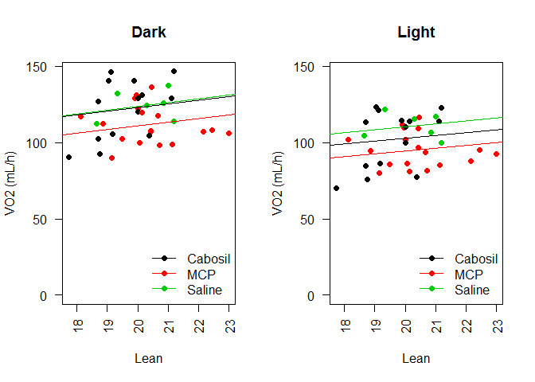
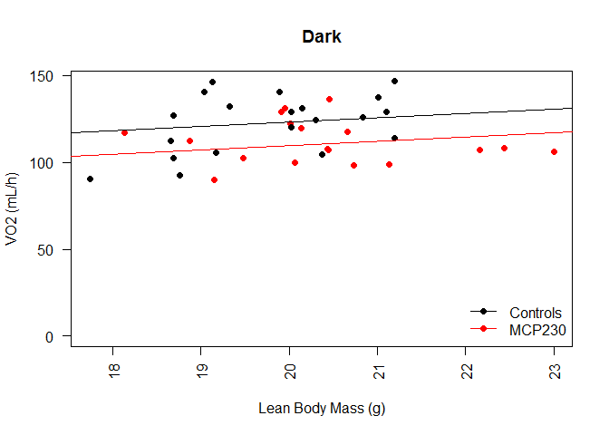
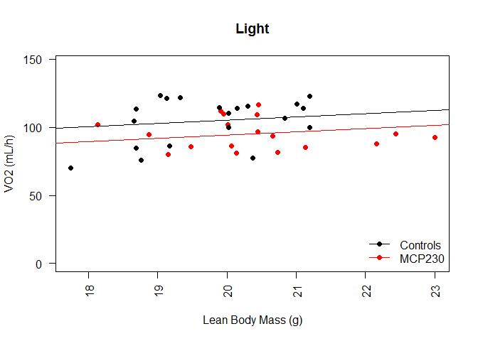
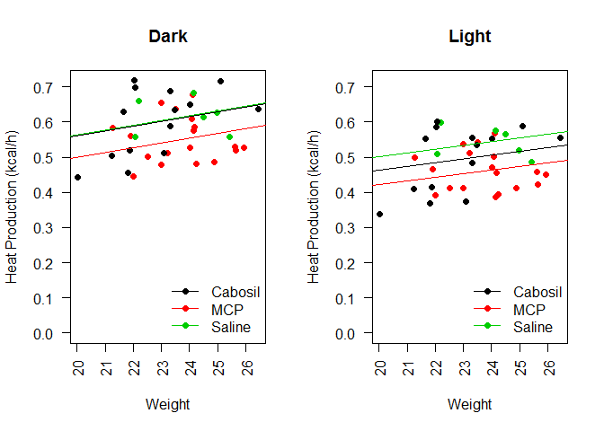
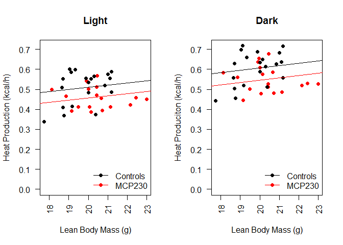
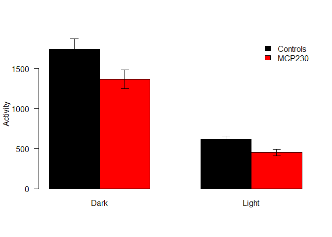
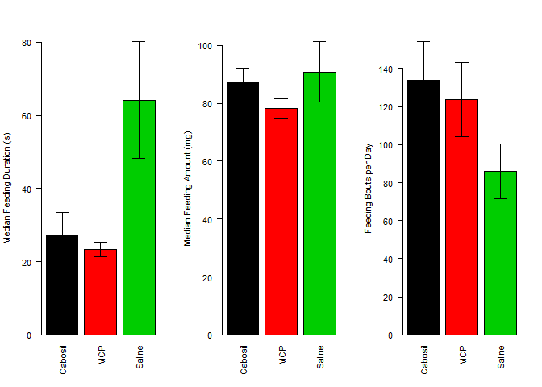

# Analysis of Pre-HFD CLAMS Data for High Fat Diet Particulate Treatment Study
Alyse Ragauskas, JeAnna Redd, Jyothi Parvathareddy, Sridhar Jaligama, Stephania Cormier and Dave Bridges  
November 13, 2014  
This was the data from the CLAMS study performed on the 9 week old mice.  This script was most recently run on Tue Feb  2 17:31:33 2016.


```r
sample_key_file <- '../data/CLAMS/mouse_treatments.csv'
sample_key <- read.csv(sample_key_file)

mri_data_file <- '../data/CLAMS/2014-09-15 Maternal Particulate.xlsx'
library(xlsx)
```

```
## Loading required package: rJava
## Loading required package: xlsxjars
```

```r
mri_data <- read.xlsx2(mri_data_file, sheetIndex=1)
mri_data$Fat <- as.numeric(as.character(mri_data$Fat))
mri_data$Lean <- as.numeric(as.character(mri_data$Lean))
mri_data$Weight <- as.numeric(as.character(mri_data$Weight))

clams_data_file_first <- '../data/CLAMS/2014-09-15/2014-09-15 Maternal Particulate OXYMAX.csv'
clams_data_file_second <- '../data/CLAMS/2014-09-19/2014-09-19 Maternal Particulate OXYMAX.csv'

#load in the data
first_data <- read.csv(clams_data_file_first)
second_data <- read.csv(clams_data_file_second)
second_data$Event.Log <- rep(NA, dim(second_data)[1])

all.data <- rbind(first_data,second_data)
all.data$Subject <- as.factor(all.data$Subject)
remove.intervals <- 40
all.data.clean <- subset(all.data, Subject != '1119'&Interval>remove.intervals&Subject!='1096')
```

The input files were ../data/CLAMS/2014-09-15 Maternal Particulate.xlsx for the echoMRI data and ../data/CLAMS/2014-09-15/2014-09-15 Maternal Particulate OXYMAX.csv and ../data/CLAMS/2014-09-19/2014-09-19 Maternal Particulate OXYMAX.csv for the CLAMS data.  


```r
library(reshape2)
se <- function(x) sd(x)/sqrt(length(x))

summarized.data <- dcast(Subject~Light.Dark, data=all.data.clean, mean, value.var='Volume.O2')
summarized.data.heat <- dcast(Subject~Light.Dark, data=all.data.clean, mean, value.var='Heat')
summarized.data.err <- dcast(Subject~Light.Dark, data=all.data.clean, se, value.var='Volume.O2')

RER.data <- dcast(Subject~Light.Dark, data=all.data.clean, mean, value.var='RER')
RER.data.annotated <- merge(RER.data, sample_key, by.x='Subject', by.y='Mouse.ID')
Activity.data <- dcast(Subject~Light.Dark, data=all.data.clean, mean, value.var='X.Ambulatory')
Activity.data.annotated <- merge(Activity.data, sample_key, by.x='Subject', by.y='Mouse.ID')
Heat.data <- dcast(Subject~Light.Dark, data=all.data.clean, mean, value.var='Heat')

combined.data <- merge(summarized.data, mri_data[,c('Label','Lean','Fat','Weight')], by.x='Subject', by.y="Label")
combined.data.heat <- merge(summarized.data.heat, mri_data[,c('Label','Lean','Fat','Weight')], by.x='Subject', by.y="Label")

combined.data$Dark.raw <- combined.data$Dark * combined.data$Weight/1000
combined.data$Light.raw <- combined.data$Light * combined.data$Weight/1000

combined.data.heat$Dark.raw <- combined.data.heat$Dark
combined.data.heat$Light.raw <- combined.data.heat$Light

combined.data.err <- merge(summarized.data.err, mri_data[,c('Label','Lean','Fat','Weight')], by.x='Subject', by.y="Label")

combined.data.err$Dark.raw <- combined.data.err$Dark * combined.data.err$Weight/1000
combined.data.err$Light.raw <- combined.data.err$Light * combined.data.err$Weight/1000
annotated.data.o2 <- merge(combined.data, sample_key, by.x='Subject', by.y='Mouse.ID')
annotated.data.heat <- merge(combined.data.heat, sample_key, by.x='Subject', by.y='Mouse.ID')

#for linear mixed effects

#annotated all data with weights and groups
full.clean.data <- merge(all.data.clean, mri_data[,c('Label','Lean','Fat','Weight')], by.x='Subject', by.y="Label")
full.annotated.data <- merge(full.clean.data, sample_key, by.x='Subject', by.y='Mouse.ID')

library(lme4)
```

```
## Loading required package: Matrix
```

```r
complete.lme <- lmer(Volume.O2 ~ Light.Dark + Weight + Particulate.Treatment + (1|Subject), data=full.annotated.data, REML=T)
no.treatment.lme <- lmer(Volume.O2 ~ Light.Dark + Weight + (1|Subject), data=full.annotated.data, REML=T)

library(multcomp)
```

```
## Loading required package: mvtnorm
## Loading required package: survival
## Loading required package: TH.data
```

```r
lme.ph <- glht(complete.lme, infct=mcp(Particulate.Treatment='Dunnett'))
complete.lme.lean <- lmer(Volume.O2 ~ Light.Dark + Lean + Particulate.Treatment + (1|Subject), data=full.annotated.data, REML=T)
no.treatment.lme.lean <- lmer(Volume.O2 ~ Light.Dark + Lean + (1|Subject), data=full.annotated.data, REML=T)
lme.ph.lean <- glht(complete.lme.lean, infct=mcp(Particulate.Treatment='Dunnett'))
```

## Resting Metabolic Rate

The VO2 levels were first merged to average over light and dark cycles, removing the first 40 measurements.  To analyse these data we performed an ANCOVA analysis using body weight as the primary covariate. 


```r
superpose.eb <- function (x, y, ebl, ebu = ebl, length = 0.08, ...)
  arrows(x, y + ebu, x, y - ebl, angle = 90, code = 3,
  length = length, ...)

par(mfrow=c(1,2))
with(annotated.data.o2, plot(Weight, Dark.raw, ylim=c(0,max(Dark.raw)),
                         pch=19, las=2, ylab="VO2", main='Dark', col=Particulate.Treatment))
legend("bottomright", levels(annotated.data.o2$Particulate.Treatment), pch=19, col=palette()[1:3], lty=1, bty='n')

dark.lm <- lm(Dark.raw~Weight+Particulate.Treatment, data=annotated.data.o2)
dark.aov <- aov(Dark.raw~Weight+Particulate.Treatment, data=annotated.data.o2)

abline(a=coefficients(dark.lm)[1],
       b=coefficients(dark.lm)[2], col=palette()[1])
abline(a=coefficients(dark.lm)[1]+coefficients(dark.lm)['Particulate.TreatmentMCP'],
       b=coefficients(dark.lm)[2], col=palette()[2])
abline(a=coefficients(dark.lm)[1]+coefficients(dark.lm)['Particulate.TreatmentSaline'],
       b=coefficients(dark.lm)[2], col=palette()[3])

with(annotated.data.o2, plot(Weight, Light.raw, ylim=c(0,max(Dark.raw)),
                         pch=19, las=2, ylab="VO2", main='Light',col=Particulate.Treatment))
legend("bottomright", levels(annotated.data.o2$Particulate.Treatment), pch=19, col=palette()[1:3], lty=1, bty='n')
light.lm <- lm(Light.raw~Weight+Particulate.Treatment, data=annotated.data.o2)
light.aov <- aov(Light.raw~Weight+Particulate.Treatment, data=annotated.data.o2)

abline(a=coefficients(light.lm)[1],
       b=coefficients(light.lm)[2], col=palette()[1])
abline(a=coefficients(light.lm)[1]+coefficients(light.lm)['Particulate.TreatmentMCP'],
       b=coefficients(light.lm)[2], col=palette()[2])
abline(a=coefficients(light.lm)[1]+coefficients(light.lm)['Particulate.TreatmentSaline'],
       b=coefficients(light.lm)[2], col=palette()[3])
```

 

```r
#superpose.eb(annotated.data.o2$Weight, annotated.data.o2$Light.raw, combined.data.err$Light.raw)
```

We first checked whether normality was maintained in the residuals from the ANCOVA.  The normality assumption was met for both Dark (p=0.3365549) and Light (p=0.1830645) via Shapiro-Wilk test.  

According to this analysis there was no significant effect of the treatment group on the body weight-adjusted VO2 levels under either Dark (p=0.05111) or Light (p=0.0544828) conditions.  There was also no significant effect of body weight in either Dark (p=0.2272615) or Light (p=0.233403) conditions.  We detected a -18.1114954% reduction in metabolic rate between MCP and Cabosil groups in the light and a -22.7307049% reduction in the dark.

Alternatively we used a mixed linear model, with non-interacting covariates for the Light cycle, the Weight and the Particulate treatment.  A F-test comparing a model with or without the Particulate treatment yielded a p-value of 0.0451512.  Post-hoc tests for the effects of particulate treatment are shown in the Table below.  According to this MCP treatment reduces VO2 by -6.2655659%, p=0.0525793.


```r
library(xtable)
tukey.table <- data.frame(
  Coefficient = summary(lme.ph, test=adjusted(type='BH'))$test$coefficients,
  p.value = summary(lme.ph,test=adjusted(type='none'))$test$pvalue[1:5])

print(xtable(tukey.table, caption="Post-hoc Dunnett's tests of mixed linear model correcting for effects of light cycle and total body mass on V02.  P-values are not corrected.", label='tab:vo2-lme-ph', digits=c(0,0,3)), type='html')
```

<!-- html table generated in R 3.2.2 by xtable 1.8-0 package -->
<!-- Tue Feb  2 17:31:37 2016 -->
<table border=1>
<caption align="bottom"> Post-hoc Dunnett's tests of mixed linear model correcting for effects of light cycle and total body mass on V02.  P-values are not corrected. </caption>
<tr> <th>  </th> <th> Coefficient </th> <th> p.value </th>  </tr>
  <tr> <td align="right"> (Intercept) </td> <td align="right"> 7111 </td> <td align="right"> 0.000 </td> </tr>
  <tr> <td align="right"> Light.DarkLight </td> <td align="right"> -742 </td> <td align="right"> 0.000 </td> </tr>
  <tr> <td align="right"> Weight </td> <td align="right"> -81 </td> <td align="right"> 0.256 </td> </tr>
  <tr> <td align="right"> Particulate.TreatmentMCP </td> <td align="right"> -446 </td> <td align="right"> 0.053 </td> </tr>
  <tr> <td align="right"> Particulate.TreatmentSaline </td> <td align="right"> 146 </td> <td align="right"> 0.640 </td> </tr>
   <a name=tab:vo2-lme-ph></a>
</table>

```r
tukey.table.lean <- data.frame(
  Coefficient = summary(lme.ph.lean, test=adjusted(type='BH'))$test$coefficients,
  p.value = summary(lme.ph.lean,test=adjusted(type='none'))$test$pvalue[1:5])

print(xtable(tukey.table.lean, caption="Post-hoc Dunnett's sests of mixed linear model correcting for effects of light cycle and lean body mass on V02.  P-values are not corrected.", label='tab:vo2-lme-lean-ph', digits=c(0,0,3)), type='html')
```

<!-- html table generated in R 3.2.2 by xtable 1.8-0 package -->
<!-- Tue Feb  2 17:31:37 2016 -->
<table border=1>
<caption align="bottom"> Post-hoc Dunnett's sests of mixed linear model correcting for effects of light cycle and lean body mass on V02.  P-values are not corrected. </caption>
<tr> <th>  </th> <th> Coefficient </th> <th> p.value </th>  </tr>
  <tr> <td align="right"> (Intercept) </td> <td align="right"> 8024 </td> <td align="right"> 0.000 </td> </tr>
  <tr> <td align="right"> Light.DarkLight </td> <td align="right"> -742 </td> <td align="right"> 0.000 </td> </tr>
  <tr> <td align="right"> Lean </td> <td align="right"> -141 </td> <td align="right"> 0.127 </td> </tr>
  <tr> <td align="right"> Particulate.TreatmentMCP </td> <td align="right"> -403 </td> <td align="right"> 0.080 </td> </tr>
  <tr> <td align="right"> Particulate.TreatmentSaline </td> <td align="right"> 152 </td> <td align="right"> 0.618 </td> </tr>
   <a name=tab:vo2-lme-lean-ph></a>
</table>
## Normalization by Lean Body Mass


```r
par(mfrow=c(1,2))
with(annotated.data.o2, plot(Lean, Dark.raw, ylim=c(0,max(Dark.raw)),
                         pch=19, las=2, ylab="VO2", main='Dark',col=Particulate.Treatment))
legend("bottomright", levels(annotated.data.o2$Particulate.Treatment), pch=19, col=palette()[1:3], lty=1, bty='n')

#anova
dark.lm.lean <- lm(Dark.raw~Lean+Particulate.Treatment, data=annotated.data.o2)
dark.aov.lean <- aov(Dark.raw~Lean+Particulate.Treatment, data=annotated.data.o2)

abline(a=coefficients(dark.lm.lean)[1],
       b=coefficients(dark.lm.lean)[2], col=palette()[1])
abline(a=coefficients(dark.lm.lean)[1]+coefficients(dark.lm.lean)['Particulate.TreatmentMCP'],
       b=coefficients(dark.lm.lean)[2], col=palette()[2])
abline(a=coefficients(dark.lm.lean)[1]+coefficients(dark.lm.lean)['Particulate.TreatmentSaline'],
       b=coefficients(dark.lm.lean)[2], col=palette()[3])
superpose.eb(combined.data$Lean, combined.data$Dark.raw, combined.data.err$Dark.raw)

with(annotated.data.o2, plot(Lean, Light.raw, ylim=c(0,max(Dark.raw)),
                         pch=19, las=2, ylab="VO2", main='Light',col=Particulate.Treatment))
legend("bottomright", levels(annotated.data.o2$Particulate.Treatment), pch=19, col=palette()[1:3], lty=1, bty='n')
light.lm.lean <- lm(Light.raw~Lean+Particulate.Treatment, data=annotated.data.o2)
light.aov.lean <- aov(Light.raw~Lean+Particulate.Treatment, data=annotated.data.o2)

abline(a=coefficients(light.lm.lean)[1],
       b=coefficients(light.lm.lean)[2], col=palette()[1])
abline(a=coefficients(light.lm.lean)[1]+coefficients(light.lm.lean)['Particulate.TreatmentMCP'],
       b=coefficients(light.lm.lean)[2], col=palette()[2])
abline(a=coefficients(light.lm.lean)[1]+coefficients(light.lm.lean)['Particulate.TreatmentSaline'],
       b=coefficients(light.lm.lean)[2], col=palette()[3])
superpose.eb(combined.data$Lean, combined.data$Light.raw, combined.data.err$Dark.raw)
```

 

Using the lean mass as the covariate, we checked whether normality was maintained in the residuals from the ANCOVA.  The normality assumption was met for both Dark (p=0.3594005) and Light (p=0.2121161) via Shapiro-Wilk test.  

According to this analysis there was no significant effect of the treatment group on the body weight-adjusted VO2 levels under either Dark (p=0.0681103) or Light (p=0.058354) conditions.  There was also no effect of body weight in either Dark (p=0.6657277) or Light (p=0.6296405) conditions.  Analysed this way, we detected a -13.0493475% reduction in metabolic rate between MCP and Cabosil groups in the light and a  -16.1924413% reduction in the dark.

There was no significant difference between Cabosil and Saline (p=0.9065775 from a *t* test between linear models).  We therefore repeated this analysis but combined Cabosil and Saline to get more statistical power.


```r
#combined the control groups
annotated.data.o2$ParticulateTF <- annotated.data.o2$Particulate.Treatment == 'MCP'

for (row in rownames(annotated.data.o2)) {
  if (annotated.data.o2[row,]$ParticulateTF == TRUE) {
    annotated.data.o2[row,'Particulate'] <- "MCP230"
  }
  else 
    annotated.data.o2[row,'Particulate'] <- "Controls"
}
annotated.data.o2$Particulate <- as.factor(annotated.data.o2$Particulate)

with(annotated.data.o2, plot(Lean, Dark.raw, ylim=c(0,max(Dark.raw)),
                         pch=19, las=2, ylab="VO2", xlab="Lean Body Mass (g)", main='Dark',col=Particulate))
legend("bottomright", levels(annotated.data.o2$Particulate), pch=19, col=palette()[1:2], lty=1, bty='n')

#anova
dark.lm.lean.ctl <- lm(Dark.raw~Lean+Particulate, data=annotated.data.o2)
dark.aov.lean.ctl <- aov(Dark.raw~Lean+Particulate, data=annotated.data.o2)

abline(a=coefficients(dark.lm.lean.ctl)['(Intercept)'],
       b=coefficients(dark.lm.lean.ctl)['Lean'], col=palette()[1])
abline(a=coefficients(dark.lm.lean.ctl)['(Intercept)']+coefficients(dark.lm.lean.ctl)['ParticulateMCP230'],
       b=coefficients(dark.lm.lean)['Lean'], col=palette()[2])
```

 

```r
with(annotated.data.o2, plot(Lean, Light.raw, ylim=c(0,max(Dark.raw)),
                         pch=19, las=2, ylab="VO2", xlab="Lean Body Mass (g)", main='Light',col=Particulate))
legend("bottomright", levels(annotated.data.o2$Particulate), pch=19, col=palette()[1:2], lty=1, bty='n')
light.lm.lean.ctl <- lm(Light.raw~Lean+Particulate, data=annotated.data.o2)
light.aov.lean.ctl <- aov(Light.raw~Lean+Particulate, data=annotated.data.o2)

abline(a=coefficients(light.lm.lean.ctl)['(Intercept)'],
       b=coefficients(light.lm.lean.ctl)['Lean'], col=palette()[1])
abline(a=coefficients(light.lm.lean.ctl)['(Intercept)']+coefficients(light.lm.lean.ctl)['ParticulateMCP230'],
       b=coefficients(light.lm.lean.ctl)['Lean'], col=palette()[2])
```

 

```r
#combined plots
par(mfrow=c(1,2))
with(annotated.data.o2, plot(Lean, Light.raw, ylim=c(0,max(Dark.raw)),
                         pch=19, las=2, ylab="VO2", xlab="Lean Body Mass (g)", main='Light',col=Particulate))
legend("bottomright", levels(annotated.data.o2$Particulate), pch=19, col=palette()[1:2], lty=1, bty='n')
abline(a=coefficients(light.lm.lean.ctl)['(Intercept)'],
       b=coefficients(light.lm.lean.ctl)['Lean'], col=palette()[1])
abline(a=coefficients(light.lm.lean.ctl)['(Intercept)']+coefficients(light.lm.lean.ctl)['ParticulateMCP230'],
       b=coefficients(light.lm.lean.ctl)['Lean'], col=palette()[2])

with(annotated.data.o2, plot(Lean, Dark.raw, ylim=c(0,max(Dark.raw)),
                         pch=19, las=2, ylab="VO2", xlab="Lean Body Mass (g)", main='Dark',col=Particulate))
legend("bottomright", levels(annotated.data.o2$Particulate), pch=19, col=palette()[1:2], lty=1, bty='n')
abline(a=coefficients(dark.lm.lean.ctl)['(Intercept)'],
       b=coefficients(dark.lm.lean.ctl)['Lean'], col=palette()[1])
abline(a=coefficients(dark.lm.lean.ctl)['(Intercept)']+coefficients(dark.lm.lean.ctl)['ParticulateMCP230'],
       b=coefficients(dark.lm.lean)['Lean'], col=palette()[2])
```

 


According to this analysis there was a significant effect of the treatment group on the body weight-adjusted VO2 levels under either Dark (p=0.0196841) or Light (p=0.0311206) conditions.  There was no effect of body weight in either Dark (p=0.6611484) or Light (p=0.6301495) conditions.  Analysed this way, we detected a -19.0935727% reduction in metabolic rate between MCP and Control groups in the light and a  -16.7802716% reduction in the dark.


Alternatively we used a mixed linear model, with non-interacting covariates for the Light cycle, the Lean Body Mass and the Particulate treatment.  A Chi-squared test comparing a model with or without the Particulate treatment yielded a p-value of 0.0702343.  Post-hoc tests for the effects of particulate treatment are shown in the table below.  According to this MCP treatment reduces VO2 by -5.0212268%, p=0.0802363.


```r
with(annotated.data.o2, plot(Light.raw, Dark.raw,
                         ylim=c(0,max(Light.raw)),
                         xlim=c(0,max(Dark.raw)),
                         pch=19, las=1, ylab="Light", xlab="Dark", main='VO2', col=Particulate.Treatment))
legend("bottomleft", levels(annotated.data.o2$Particulate.Treatment), pch=19, col=palette()[1:3], lty=1, bty='n')
dark.light.lm <- lm(Dark.raw~Light.raw, data=combined.data)
abline(dark.light.lm, lty=2, col='red')
```

 


```r
#add control column to sample key
all.data.clean.annotated <- merge(all.data.clean, sample_key, by.x='Subject', by.y='Mouse.ID')
#intervals are 25 mins
interval_time <- 41-16
interval_hours <- interval_time/60
all.data.clean.annotated$Hours <- round((all.data.clean.annotated$Interval-41) * interval_hours)

library(dplyr)
```

```
## 
## Attaching package: 'dplyr'
## 
## The following objects are masked from 'package:stats':
## 
##     filter, lag
## 
## The following objects are masked from 'package:base':
## 
##     intersect, setdiff, setequal, union
```

```r
time.course.data <-
  all.data.clean.annotated %>%
  group_by(Hours, Particulate.Treatment) %>%
  summarize(mean = mean(Volume.O2),
            se = sd(Volume.O2)/sqrt(length(Volume.O2)),
            n = length(Volume.O2))

time.course.data.heat <-
  all.data.clean.annotated %>%
  group_by(Hours, Particulate.Treatment) %>%
  summarize(mean = mean(Heat),
            se = sd(Heat)/sqrt(length(Heat)),
            n = length(Heat))

y.axis <- c(3500, max(time.course.data$mean))
with(subset(time.course.data, Particulate.Treatment!='MCP'), 
     plot(Hours, mean, type='l', 
          ylim=y.axis, las=1, xlim=c(0,53),
          xlab="Time (h)", ylab="Volume O2 Consumed/min/kg"))
#shaded in night times
first_dark_cycle = 7.55
rect(first_dark_cycle, y.axis[1], first_dark_cycle+12, y.axis[2], col=grey.colors(5)[5])
rect(first_dark_cycle+24, y.axis[1], first_dark_cycle+36, y.axis[2], col=grey.colors(5)[5])
rect(first_dark_cycle+48, y.axis[1], first_dark_cycle+60, y.axis[2], col=grey.colors(5)[5])

with(subset(time.course.data, Particulate.Treatment!='MCP'), lines(Hours, mean, col=palette()[1]))
with(subset(time.course.data, Particulate.Treatment=='MCP'), lines(Hours, mean, col=palette()[2]))
legend("topright", c("Controls","MCP230"), lty=1, col=palette()[1:2], bty='n')
```

 

## Calorimetry by Heat Production

Another way to present these data is to evaluate this by heat instead of VO2.  The equation for Heat production from the CLAMS is the Lusk Equation:

$$(3.815 + 1.232 * RER)*VO2$$

To analyse these data we performed an ANCOVA analysis using body weight as the primary covariate. 


```r
par(mfrow=c(1,2))
with(annotated.data.heat, plot(Weight, Dark.raw, ylim=c(0,max(Dark.raw)),
                         pch=19, las=2, ylab="Heat Production (kcal/h)", main='Dark', col=Particulate.Treatment))
legend("bottomright", levels(annotated.data.o2$Particulate.Treatment), pch=19, col=palette()[1:3], lty=1, bty='n')

dark.lm <- lm(Dark.raw~Weight+Particulate.Treatment, data=annotated.data.heat)
dark.aov <- aov(Dark.raw~Weight+Particulate.Treatment, data=annotated.data.heat)

abline(a=coefficients(dark.lm)[1],
       b=coefficients(dark.lm)[2], col=palette()[1])
abline(a=coefficients(dark.lm)[1]+coefficients(dark.lm)['Particulate.TreatmentMCP'],
       b=coefficients(dark.lm)[2], col=palette()[2])
abline(a=coefficients(dark.lm)[1]+coefficients(dark.lm)['Particulate.TreatmentSaline'],
       b=coefficients(dark.lm)[2], col=palette()[3])

with(annotated.data.heat, plot(Weight, Light.raw, ylim=c(0,max(Dark.raw)),
                         pch=19, las=2, ylab="Heat Production (kcal/h)", main='Light',col=Particulate.Treatment))
legend("bottomright", levels(annotated.data.o2$Particulate.Treatment), pch=19, col=palette()[1:3], lty=1, bty='n')
light.lm <- lm(Light.raw~Weight+Particulate.Treatment, data=annotated.data.heat)
light.aov <- aov(Light.raw~Weight+Particulate.Treatment, data=annotated.data.heat)

abline(a=coefficients(light.lm)[1],
       b=coefficients(light.lm)[2], col=palette()[1])
abline(a=coefficients(light.lm)[1]+coefficients(light.lm)['Particulate.TreatmentMCP'],
       b=coefficients(light.lm)[2], col=palette()[2])
abline(a=coefficients(light.lm)[1]+coefficients(light.lm)['Particulate.TreatmentSaline'],
       b=coefficients(light.lm)[2], col=palette()[3])
```

 

```r
#for heat production
complete.lme.heat <- lmer(Heat ~ Light.Dark + Weight + Particulate.Treatment + (1|Subject), data=full.annotated.data, REML=F)
no.treatment.lme.heat <- lmer(Heat ~ Light.Dark + Weight + (1|Subject), data=full.annotated.data, REML=F)
lme.ph.heat <- glht(complete.lme.heat, infct=mcp(Particulate.Treatment='Dunnett'))
complete.lme.lean.heat <- lmer(Heat ~ Light.Dark + Lean + Particulate.Treatment + (1|Subject), data=full.annotated.data, REML=F)
no.treatment.lme.lean.heat<- lmer(Heat ~ Light.Dark + Lean + (1|Subject), data=full.annotated.data, REML=F)
lme.ph.lean.heat <- glht(complete.lme.lean.heat, infct=mcp(Particulate.Treatment='Dunnett'))
```

We first checked whether normality was maintained in the residuals from the ANCOVA.  The normality assumption was met for both Dark (p=0.2175834) and Light (p=0.2533367) via Shapiro-Wilk test.  

According to this analysis there was no significant effect of the treatment group on the body weight-adjusted heat production levels under either Dark (p=0.0530584) or Light (p=0.0472109) conditions.  There was also no significant effect of body weight in either Dark (p=0.2547262) or Light (p=0.2570017) conditions.  We detected a -16.9555928% reduction in metabolic rate between MCP and Cabosil groups in the light and a -21.57765% reduction in the dark.

Alternatively we used a mixed linear model, with non-interacting covariates for the Light cycle, the Weight and the Particulate treatment.  A F-test comparing a model with or without the Particulate treatment yielded a p-value of 1.  Post-hoc tests for the effects of particulate treatment are shown in the Table below.  According to this MCP treatment reduces heat production by -16.2679288%, p=0.0374003.


```r
tukey.table.heat <- data.frame(
  Coefficient = summary(lme.ph.heat, test=adjusted(type='BH'))$test$coefficients,
  p.value = summary(lme.ph.heat,test=adjusted(type='none'))$test$pvalue[1:5])

print(xtable(tukey.table.heat, caption="Post-hoc Dunnett's tests of mixed linear model correcting for effects of light cycle and total body mass on heat production.  P-values are not corrected.", label='tab:heat-lme-ph', digits=c(0,0,3)), type='html')
```

<!-- html table generated in R 3.2.2 by xtable 1.8-0 package -->
<!-- Tue Feb  2 17:31:39 2016 -->
<table border=1>
<caption align="bottom"> Post-hoc Dunnett's tests of mixed linear model correcting for effects of light cycle and total body mass on heat production.  P-values are not corrected. </caption>
<tr> <th>  </th> <th> Coefficient </th> <th> p.value </th>  </tr>
  <tr> <td align="right"> (Intercept) </td> <td align="right"> 0 </td> <td align="right"> 0.072 </td> </tr>
  <tr> <td align="right"> Light.DarkLight </td> <td align="right"> -0 </td> <td align="right"> 0.000 </td> </tr>
  <tr> <td align="right"> Weight </td> <td align="right"> 0 </td> <td align="right"> 0.121 </td> </tr>
  <tr> <td align="right"> Particulate.TreatmentMCP </td> <td align="right"> -0 </td> <td align="right"> 0.037 </td> </tr>
  <tr> <td align="right"> Particulate.TreatmentSaline </td> <td align="right"> 0 </td> <td align="right"> 0.528 </td> </tr>
   <a name=tab:heat-lme-ph></a>
</table>

```r
tukey.table.lean.heat <- data.frame(
  Coefficient = summary(lme.ph.lean.heat, test=adjusted(type='BH'))$test$coefficients,
  p.value = summary(lme.ph.lean.heat,test=adjusted(type='none'))$test$pvalue[1:5])

print(xtable(tukey.table.lean.heat, caption="Post-hoc Dunnett's sests of mixed linear model correcting for effects of light cycle and lean body mass on heat production.  P-values are not corrected.", label='tab:heat-lme-lean-ph', digits=c(0,0,3)), type='html')
```

<!-- html table generated in R 3.2.2 by xtable 1.8-0 package -->
<!-- Tue Feb  2 17:31:39 2016 -->
<table border=1>
<caption align="bottom"> Post-hoc Dunnett's sests of mixed linear model correcting for effects of light cycle and lean body mass on heat production.  P-values are not corrected. </caption>
<tr> <th>  </th> <th> Coefficient </th> <th> p.value </th>  </tr>
  <tr> <td align="right"> (Intercept) </td> <td align="right"> 0 </td> <td align="right"> 0.045 </td> </tr>
  <tr> <td align="right"> Light.DarkLight </td> <td align="right"> -0 </td> <td align="right"> 0.000 </td> </tr>
  <tr> <td align="right"> Lean </td> <td align="right"> 0 </td> <td align="right"> 0.367 </td> </tr>
  <tr> <td align="right"> Particulate.TreatmentMCP </td> <td align="right"> -0 </td> <td align="right"> 0.060 </td> </tr>
  <tr> <td align="right"> Particulate.TreatmentSaline </td> <td align="right"> 0 </td> <td align="right"> 0.412 </td> </tr>
   <a name=tab:heat-lme-lean-ph></a>
</table>

## Normalization by Lean Body Mass


```r
par(mfrow=c(1,2))
with(annotated.data.heat, plot(Lean, Dark.raw, ylim=c(0,max(Dark.raw)),
                         pch=19, las=2, ylab="Heat Production (kcal/h)", main='Dark',col=Particulate.Treatment))
legend("bottomright", levels(annotated.data.heat$Particulate.Treatment), pch=19, col=palette()[1:3], lty=1, bty='n')

#anova
dark.lm.lean <- lm(Dark.raw~Lean+Particulate.Treatment, data=annotated.data.heat)
dark.aov.lean <- aov(Dark.raw~Lean+Particulate.Treatment, data=annotated.data.heat)

abline(a=coefficients(dark.lm.lean)[1],
       b=coefficients(dark.lm.lean)[2], col=palette()[1])
abline(a=coefficients(dark.lm.lean)[1]+coefficients(dark.lm.lean)['Particulate.TreatmentMCP'],
       b=coefficients(dark.lm.lean)[2], col=palette()[2])
abline(a=coefficients(dark.lm.lean)[1]+coefficients(dark.lm.lean)['Particulate.TreatmentSaline'],
       b=coefficients(dark.lm.lean)[2], col=palette()[3])
superpose.eb(combined.data$Lean, combined.data$Dark.raw, combined.data.err$Dark.raw)

with(annotated.data.heat, plot(Lean, Light.raw, ylim=c(0,max(Dark.raw)),
                         pch=19, las=2, ylab="Heat Production (kcal/h)", main='Light',col=Particulate.Treatment))
legend("bottomright", levels(annotated.data.heat$Particulate.Treatment), pch=19, col=palette()[1:3], lty=1, bty='n')
light.lm.lean <- lm(Light.raw~Lean+Particulate.Treatment, data=annotated.data.heat)
light.aov.lean <- aov(Light.raw~Lean+Particulate.Treatment, data=annotated.data.heat)

abline(a=coefficients(light.lm.lean)[1],
       b=coefficients(light.lm.lean)[2], col=palette()[1])
abline(a=coefficients(light.lm.lean)[1]+coefficients(light.lm.lean)['Particulate.TreatmentMCP'],
       b=coefficients(light.lm.lean)[2], col=palette()[2])
abline(a=coefficients(light.lm.lean)[1]+coefficients(light.lm.lean)['Particulate.TreatmentSaline'],
       b=coefficients(light.lm.lean)[2], col=palette()[3])
superpose.eb(combined.data$Lean, combined.data$Light.raw, combined.data.err$Dark.raw)
```

 

Using the lean mass as the covariate, we checked whether normality was maintained in the residuals from the ANCOVA.  The normality assumption was met for both Dark (p=0.2575001) and Light (p=0.2384855) via Shapiro-Wilk test.  

According to this analysis there was no significant effect of the treatment group on the body weight-adjusted heat produciton levels under either Dark (p=0.0695758) or Light (p=0.0506229) conditions.  There was also no effect of body weight in either Dark (p=0.7251683) or Light (p=0.6904664) conditions.  Analysed this way, we detected a -11.9637293% reduction in metabolic rate between MCP and Cabosil groups in the light and a  -15.1484627% reduction in the dark.

There was no significant difference between Cabosil and Saline (p=0.7906698 from a *t* test between linear models).  We therefore repeated this analysis but combined Cabosil and Saline to get more statistical power.


```r
#combined the control groups
annotated.data.heat$ParticulateTF <- annotated.data.heat$Particulate.Treatment == 'MCP'

for (row in rownames(annotated.data.heat)) {
  if (annotated.data.heat[row,]$ParticulateTF == TRUE) {
    annotated.data.heat[row,'Particulate'] <- "MCP230"
  }
  else 
    annotated.data.heat[row,'Particulate'] <- "Controls"
}
annotated.data.heat$Particulate <- as.factor(annotated.data.heat$Particulate)

with(annotated.data.heat, plot(Lean, Dark.raw, ylim=c(0,max(Dark.raw)),
                         pch=19, las=2, ylab="Heat Production (kcal/h)", xlab="Lean Body Mass (g)", main='Dark',col=Particulate))
legend("bottomright", levels(annotated.data.heat$Particulate), pch=19, col=palette()[1:2], lty=1, bty='n')

#anova
dark.lm.lean.ctl <- lm(Dark.raw~Lean+Particulate, data=annotated.data.heat)
dark.aov.lean.ctl <- aov(Dark.raw~Lean+Particulate, data=annotated.data.heat)

abline(a=coefficients(dark.lm.lean.ctl)['(Intercept)'],
       b=coefficients(dark.lm.lean.ctl)['Lean'], col=palette()[1])
abline(a=coefficients(dark.lm.lean.ctl)['(Intercept)']+coefficients(dark.lm.lean.ctl)['ParticulateMCP230'],
       b=coefficients(dark.lm.lean)['Lean'], col=palette()[2])
```

 

```r
with(annotated.data.heat, plot(Lean, Light.raw, ylim=c(0,max(Dark.raw)),
                         pch=19, las=2, ylab="Heat Production (kcal/h)", xlab="Lean Body Mass (g)", main='Light',col=Particulate))
legend("bottomright", levels(annotated.data.heat$Particulate), pch=19, col=palette()[1:2], lty=1, bty='n')
light.lm.lean.ctl <- lm(Light.raw~Lean+Particulate, data=annotated.data.heat)
light.aov.lean.ctl <- aov(Light.raw~Lean+Particulate, data=annotated.data.heat)

abline(a=coefficients(light.lm.lean.ctl)['(Intercept)'],
       b=coefficients(light.lm.lean.ctl)['Lean'], col=palette()[1])
abline(a=coefficients(light.lm.lean.ctl)['(Intercept)']+coefficients(light.lm.lean.ctl)['ParticulateMCP230'],
       b=coefficients(light.lm.lean.ctl)['Lean'], col=palette()[2])
```

 

```r
#combined plots
par(mfrow=c(1,2))
with(annotated.data.heat, plot(Lean, Light.raw, ylim=c(0,max(Dark.raw)),
                         pch=19, las=2, ylab="Heat Production (kcal/h)", xlab="Lean Body Mass (g)", main='Light',col=Particulate))
legend("bottomright", levels(annotated.data.o2$Particulate), pch=19, col=palette()[1:2], lty=1, bty='n')
abline(a=coefficients(light.lm.lean.ctl)['(Intercept)'],
       b=coefficients(light.lm.lean.ctl)['Lean'], col=palette()[1])
abline(a=coefficients(light.lm.lean.ctl)['(Intercept)']+coefficients(light.lm.lean.ctl)['ParticulateMCP230'],
       b=coefficients(light.lm.lean.ctl)['Lean'], col=palette()[2])

with(annotated.data.heat, plot(Lean, Dark.raw, ylim=c(0,max(Dark.raw)),
                         pch=19, las=2, ylab="Heat Produciton (kcal/h)", xlab="Lean Body Mass (g)", main='Dark',col=Particulate))
legend("bottomright", levels(annotated.data.heat$Particulate), pch=19, col=palette()[1:2], lty=1, bty='n')
abline(a=coefficients(dark.lm.lean.ctl)['(Intercept)'],
       b=coefficients(dark.lm.lean.ctl)['Lean'], col=palette()[1])
abline(a=coefficients(dark.lm.lean.ctl)['(Intercept)']+coefficients(dark.lm.lean.ctl)['ParticulateMCP230'],
       b=coefficients(dark.lm.lean)['Lean'], col=palette()[2])
```

 


According to this analysis there was a significant effect of the treatment group on the body weight-adjusted heat produciton levels under either Dark (p=0.0208645) or Light (p=0.0315519) conditions.  There was no effect of body weight in either Dark (p=0.7215461) or Light (p=0.6922278) conditions.  Analysed this way, we detected a -18.4166427% reduction in metabolic rate between MCP and Control groups in the light and a  -16.4380874% reduction in the dark.


Alternatively we used a mixed linear model, with non-interacting covariates for the Light cycle, the Lean Body Mass and the Particulate treatment.  A Chi-squared test comparing a model with or without the Particulate treatment yielded a p-value of 0.0408196.  Post-hoc tests for the effects of particulate treatment are shown in the table below.  According to this MCP treatment reduces heat production by -11.8799657%, p=0.0601864.


```r
y.axis <- c(min(time.course.data.heat$mean, na.rm=T), max(time.course.data.heat$mean, na.rm=T))
with(subset(time.course.data.heat, Particulate.Treatment!='MCP230'), 
     plot(Hours, mean, type='l', 
          ylim=y.axis, las=1, xlim=c(0,53),
          xlab="Time (h)", ylab="Heat Production (kcal/h)"))
#shaded in night times
first_dark_cycle = 7.55
rect(first_dark_cycle, y.axis[1], first_dark_cycle+12, y.axis[2], col=grey.colors(5)[5])
rect(first_dark_cycle+24, y.axis[1], first_dark_cycle+36, y.axis[2], col=grey.colors(5)[5])
rect(first_dark_cycle+48, y.axis[1], first_dark_cycle+60, y.axis[2], col=grey.colors(5)[5])
with(subset(time.course.data.heat, Particulate.Treatment!='MCP'), lines(Hours, mean, col=palette()[1]))
with(subset(time.course.data.heat, Particulate.Treatment=='MCP'), lines(Hours, mean, col=palette()[2]))
legend("topright", c("Controls","MCP230"), lty=1, col=palette()[1:2], bty='n')
```

 

# Body Weights and Composition


```r
library(plyr)
```

```
## -------------------------------------------------------------------------
## You have loaded plyr after dplyr - this is likely to cause problems.
## If you need functions from both plyr and dplyr, please load plyr first, then dplyr:
## library(plyr); library(dplyr)
## -------------------------------------------------------------------------
## 
## Attaching package: 'plyr'
## 
## The following objects are masked from 'package:dplyr':
## 
##     arrange, count, desc, failwith, id, mutate, rename, summarise,
##     summarize
```

```r
annotated.data.o2$Pct.Fat <- annotated.data.o2$Fat/annotated.data.o2$Weight*100
composition.summary <- ddply(annotated.data.o2, ~Particulate.Treatment, summarize,
                            Total.mean = mean(Weight),
                            Total.sd = sd(Weight),
                            Total.se = se(Weight),
                            Lean.mean = mean(Lean),
                            Lean.sd = sd(Lean),
                            Lean.se = se(Lean),
                            Fat.mean = mean(Fat),
                            Fat.sd = sd(Fat),
                            Fat.se = se(Fat),
                            Pct.Fat.mean = mean(Pct.Fat),
                            Pct.Fat.sd = sd(Pct.Fat),
                            Pct.Fat.se = se(Pct.Fat),
                            n = length(Fat))
par(mfrow=c(1,2))
ymax = max(composition.summary$Lean.mean) + max(composition.summary$Lean.se)
plot <- barplot(cbind(composition.summary$Fat.mean, composition.summary$Lean.mean), 
        beside=T, col=palette()[1:3], las=1,
        ylab="Weight (g)", ylim=c(0,ymax),
        names.arg=c("Fat Mass", "Lean Mass"))
superpose.eb(plot, cbind(composition.summary$Fat.mean, composition.summary$Lean.mean),
             cbind(composition.summary$Fat.se, composition.summary$Lean.se))

ymax = max(composition.summary$Pct.Fat.mean) + max(composition.summary$Pct.Fat.se)
plot <- barplot(composition.summary$Pct.Fat.mean, ylab="Percent Fat Mass",
                col=palette()[1:3], las=2, ylim=c(0,ymax),
                names.arg= composition.summary$Particulate.Treatment)
superpose.eb(plot, composition.summary$Pct.Fat.mean,
            composition.summary$Pct.Fat.se)
```

 

```r
total.mass.aov <- aov(Weight~Particulate.Treatment, data=annotated.data.o2)
fat.mass.aov <- aov(Fat~Particulate.Treatment, data=annotated.data.o2)
lean.mass.aov <- aov(Lean~Particulate.Treatment, data=annotated.data.o2)
pct.fat.mass.aov <- aov(Pct.Fat~Particulate.Treatment, data=annotated.data.o2)

library(car)
```

```
## Warning: package 'car' was built under R version 3.2.3
```

```r
total.mass.levene <- leveneTest(Weight~Particulate.Treatment, data=annotated.data.o2)
fat.mass.levene <- leveneTest(Fat~Particulate.Treatment, data=annotated.data.o2)
lean.mass.levene <- leveneTest(Lean~Particulate.Treatment, data=annotated.data.o2)
pct.fat.mass.levene <- leveneTest(Pct.Fat~Particulate.Treatment, data=annotated.data.o2)

total.mass.kw <- kruskal.test(Weight~Particulate.Treatment, data=annotated.data.o2)
fat.mass.kw <- kruskal.test(Fat~Particulate.Treatment, data=annotated.data.o2)
lean.mass.kw <- kruskal.test(Lean~Particulate.Treatment, data=annotated.data.o2)
pct.fat.mass.kw <- kruskal.test(Pct.Fat~Particulate.Treatment, data=annotated.data.o2)
```

The assumptions of normality were met via a Shapiro-Wilk Test for Total Mass (p=0.7134565), and Lean Mass (p=0.9306069).  The assumptions of equal varaince were met for Total Mass (p=0.7127652), and Lean Mass (p=0.9622636.  Based on this there was no significant differentces in Total Mass (p=0.1642034) or Lean Mass (p=0.1195925) by ANOVA.

These assumptions or normality were not met for Fat Mass (p=0.0028073) or Percent Fat Mass (p=0.0448459), so we did Kruskal-Wallis tests instead.  According to these tests there was no significant differences in these groups either for Fat Mass (p=0.2595616) or Percent Fat Mass (p=0.4292551).

# Respiratory Exchange Rate


```r
rer.summary <- ddply(RER.data.annotated, ~Particulate.Treatment, summarize,
                     Dark.mean = mean(Dark),
                     Dark.sd = sd(Dark),
                     Dark.se = se(Dark),
                     Light.mean = mean(Light),
                     Light.sd = sd(Light),
                     Light.se = se(Light))

ymax = max(rer.summary$Dark.mean) + max(rer.summary$Dark.se)
plot <- barplot(cbind(rer.summary$Dark.mean, rer.summary$Light.mean), ylim=c(0.7,1),
        beside=T, col=palette()[1:3], las=1,xpd=FALSE,
        ylab="Respiratory Exchange Ratio",
        names.arg=c("Dark", "Light"))
axis(side=1,at=plot, labels=FALSE, tick=FALSE)

legend("topright", levels(rer.summary$Particulate.Treatment), fill=palette()[1:3], bty='n')
superpose.eb(plot,
             cbind(rer.summary$Dark.mean, rer.summary$Light.mean),
             cbind(rer.summary$Dark.se, rer.summary$Light.se))
```

 

```r
rer.light.aov <- aov(Light~Particulate.Treatment, data=RER.data.annotated)
rer.light.kw <- kruskal.test(Light~Particulate.Treatment, data=RER.data.annotated)
rer.light.levene <- leveneTest(Light~Particulate.Treatment, data=RER.data.annotated)

rer.dark.aov <- aov(Dark~Particulate.Treatment, data=RER.data.annotated)
rer.dark.kw <- kruskal.test(Dark~Particulate.Treatment, data=RER.data.annotated)
rer.dark.levene <- leveneTest(Dark~Particulate.Treatment, data=RER.data.annotated)
```

The assumptions of normality was not met for either Light (p=0.0175864) or Dark RER (p=0.0140537) levels via a Shapiro-Wilk test.  We therefore did a Kruskal-Wallis test and found that while Dark (p=0.102436) RER levels not were significantly different, Light RER levels were (p=0.02815).  Post-hoc tests for Light RER levels are shown in the Table below:


```r
print(xtable(with(RER.data.annotated, pairwise.wilcox.test(Light, Particulate.Treatment, p.adjust.method='BH'))$p.value, caption = "Pairwise Wilcoxon Rank-Sum Tests, corrected by Benjamini-Hochberg", label="tab:light-rer-ph", digits=4),type='html')
```

<!-- html table generated in R 3.2.2 by xtable 1.8-0 package -->
<!-- Tue Feb  2 17:31:40 2016 -->
<table border=1>
<caption align="bottom"> Pairwise Wilcoxon Rank-Sum Tests, corrected by Benjamini-Hochberg </caption>
<tr> <th>  </th> <th> Cabosil </th> <th> MCP </th>  </tr>
  <tr> <td align="right"> MCP </td> <td align="right"> 0.4876 </td> <td align="right">  </td> </tr>
  <tr> <td align="right"> Saline </td> <td align="right"> 0.0011 </td> <td align="right"> 0.2048 </td> </tr>
   <a name=tab:light-rer-ph></a>
</table>

# Activity Data


```r
activity.summary <- ddply(Activity.data.annotated, ~Particulate.Treatment, summarize,
                     Dark.mean = mean(Dark),
                     Dark.sd = sd(Dark),
                     Dark.se = se(Dark),
                     Light.mean = mean(Light),
                     Light.sd = sd(Light),
                     Light.se = se(Light))

ymax = max(activity.summary$Dark.mean) + max(activity.summary$Dark.se)
plot <- barplot(cbind(activity.summary$Dark.mean, activity.summary$Light.mean), ylim=c(0,ymax),
        beside=T, col=palette()[1:3], las=1,
        ylab="Activity",
        names.arg=c("Dark", "Light"))

legend("topright", levels(activity.summary$Particulate.Treatment), fill=palette()[1:3], bty='n')
superpose.eb(plot,
             cbind(activity.summary$Dark.mean, activity.summary$Light.mean),
             cbind(activity.summary$Dark.se, activity.summary$Light.se))
```

 

```r
activity.light.aov <- aov(Light~Particulate.Treatment, data=Activity.data.annotated)
activity.light.kw <- kruskal.test(Light~Particulate.Treatment, data=Activity.data.annotated)
activity.light.levene <- leveneTest(Light~Particulate.Treatment, data=Activity.data.annotated)

activity.dark.aov <- aov(Dark~Particulate.Treatment, data=Activity.data.annotated)
activity.dark.kw <- kruskal.test(Dark~Particulate.Treatment, data=Activity.data.annotated)
activity.dark.levene <- leveneTest(Dark~Particulate.Treatment, data=Activity.data.annotated)
```

The assumptions of normality was met for both Light (p=0.841364) or Dark activity (p=0.6164718) levels via a Shapiro-Wilk test.  As for the assumptions of equal variance, both Dark (p=0.2916937), and Light activity levels (p=0.6559766) met this assumption via Levene's test.  We therefore did an ANOVA and found that while Dark (p=0.1235839) activity levels not were significantly different, Light activity levels were (p=0.0048395).  Post-hoc tests for Light activity levels are shown in the table below:


```r
library(xtable)

print(xtable(with(Activity.data.annotated, pairwise.t.test(Light, Particulate.Treatment, p.adjust.method='BH', pool.sd=T, var.eq=T))$p.value, caption = "Pairwise Student's T-Tests, corrected by Benjamini-Hochberg", label="tab:light-activity-ph", digits=4), type='html')
```

<!-- html table generated in R 3.2.2 by xtable 1.8-0 package -->
<!-- Tue Feb  2 17:31:40 2016 -->
<table border=1>
<caption align="bottom"> Pairwise Student's T-Tests, corrected by Benjamini-Hochberg </caption>
<tr> <th>  </th> <th> Cabosil </th> <th> MCP </th>  </tr>
  <tr> <td align="right"> MCP </td> <td align="right"> 0.0911 </td> <td align="right">  </td> </tr>
  <tr> <td align="right"> Saline </td> <td align="right"> 0.0661 </td> <td align="right"> 0.0041 </td> </tr>
   <a name=tab:light-activity-ph></a>
</table>

Since the cabosil and saline treated groups were not significantly different (p=0.1476566), we combined these groups.


```r
#combined the control groups
Activity.data.annotated$ParticulateTF <- Activity.data.annotated$Particulate.Treatment == 'MCP'

for (row in rownames(Activity.data.annotated)) {
  if (Activity.data.annotated[row,]$ParticulateTF == TRUE) {
    Activity.data.annotated[row,'Particulate'] <- "MCP230"
  }
  else 
    Activity.data.annotated[row,'Particulate'] <- "Controls"
}

activity.summary.ctl <- ddply(Activity.data.annotated, ~Particulate, summarize,
                     Dark.mean = mean(Dark),
                     Dark.sd = sd(Dark),
                     Dark.se = se(Dark),
                     Light.mean = mean(Light),
                     Light.sd = sd(Light),
                     Light.se = se(Light),
                     shapiro.light = shapiro.test(Dark)$p.value,
                     shapiro.dark = shapiro.test(Light)$p.value)

ymax = max(activity.summary.ctl$Dark.mean) + max(activity.summary.ctl$Dark.se)
plot <- barplot(cbind(activity.summary.ctl$Dark.mean, activity.summary.ctl$Light.mean), ylim=c(0,ymax),
        beside=T, col=palette()[1:2], las=1,
        ylab="Activity",
        names.arg=c("Dark", "Light"))

legend("topright", activity.summary.ctl$Particulate, fill=palette()[1:2], bty='n')
superpose.eb(plot,
             cbind(activity.summary.ctl$Dark.mean, activity.summary.ctl$Light.mean),
             cbind(activity.summary.ctl$Dark.se, activity.summary.ctl$Light.se))
```

 


After combining these groups, the assumptions of normality (Dark p > 0.5248028; Light 0.6252547) and equal variance were still (Dark p=0.8047055; Light p=0.4951072) met.

Based on these data, there was a -21.4592238 % reduction in activity in the dark phase (p=0.0398173) and a -26.2357835 % reduction in activity in the light phase (p=0.0099319).

# Food Intake


```r
food.max <- 25
food.summary <- ddply(all.data.clean, ~Subject, summarize,
      Total=max(Feed.Acc..1))
food.summary.clean <- food.summary[food.summary$Total < food.max,]


food.summary.annotated <- merge(food.summary.clean, sample_key, by.x='Subject', by.y='Mouse.ID')
ymax <- max(food.summary.annotated$Total)
plot <- barplot(with(food.summary.annotated, tapply(Total, Particulate.Treatment, mean)), col=palette()[1:3],
                ylab="Cumulative Food Intake (g)",
                las=1, ylim=c(0,17))
superpose.eb(plot,
             with(food.summary.annotated, tapply(Total, Particulate.Treatment, mean)),
             with(food.summary.annotated, tapply(Total, Particulate.Treatment, se)))
```

 

```r
food.aov <- aov(Total~Particulate.Treatment, data=food.summary.annotated)
food.kw <- kruskal.test(Total~Particulate.Treatment, data=food.summary.annotated)
food.levene <- leveneTest(Total~Particulate.Treatment, data=food.summary.annotated)
```

We next looked at cumulative food intake accross the groups, removing amy cages that looked to eat >25g as these were likely associated with a mouse manually removing a pellet rather than eating it.  We looked at whether these data were normally distributed by a Shapiro-Wilk test and found that they were (p=0.1833746).  The variances were also equally distributed, via a Levene's test  (p=0.9596503).  We therefore performed an ANOVA and found that these groups were not significantly different (p=0.4185288).

## Detailed Food Intake Analysis


```r
feeding_folder <- '../data/CLAMS/Feeding bouts/'
feeding_data <- data.frame(matrix(ncol = 10, nrow = 0))
####
##Make a function that read the food intake from each animal to a dataframe
##Parameters: directory - the directory contains all the food intake files
##           start_ID - the smallest animal ID 
##           stop_ID - the biggest animal ID. We assume that animal_IDs are
##all consecutive numbers.
##           eliminate_ID - IDs of non-existing animals
##           out_data - the data that save the combined food intake
####
read.input <- function(directory, start_ID, stop_ID, eliminate_ID, out_data){
  for (i in start_ID:stop_ID){
    if (!(i %in% eliminate_ID)){
      feeding_file <- paste(directory, i, ".csv", sep="")
      data <- read.csv(feeding_file)
      names(data)[2] <- "Sample"
      names(data)[4] <- "Light_Dark"
      names(data)[7] <- "Duration"
      names(data)[8] <- "Weight"
      names(data)[9] <- "Accumulated"
      names(data)[10] <- "Animal_ID"
      data$Animal_ID <- i
      names(out_data) <- names(data)
      out_data <- rbind(out_data, data)
    }
  }
  return(out_data)
}

#load in all the feeding bouts
feeding_data.1 <-read.input(feeding_folder, 1096, 1122, NA, feeding_data)
feeding_data.2 <-read.input(feeding_folder, 1208, 1220, NA, feeding_data)
feeding_data <- rbind(feeding_data.1, feeding_data.2)
feeding_max <- 0.5
duration_max <- 300
library(lubridate)
```

```
## Warning: package 'lubridate' was built under R version 3.2.3
```

```
## 
## Attaching package: 'lubridate'
## 
## The following object is masked from 'package:plyr':
## 
##     here
```

```r
feeding_data$Date.Time <- mdy_hms(feeding_data$Date.Time)

for (row in rownames(feeding_data)) {
  if (hour(feeding_data[row,]$Date.Time)>7&hour(feeding_data[row,]$Date.Time)<19){
    feeding_data[row,'Dark.Light'] <- 'Light'
  }
  else
    feeding_data[row,'Dark.Light'] <- 'Dark'
}
feeding_data$Dark.Light <- as.factor(feeding_data$Dark.Light)

feeding_bout_animal <-
  feeding_data %>%
  filter(Weight>0&Weight<feeding_max&Duration<duration_max) %>%
  group_by(Animal_ID) %>%
  dplyr::summarize(Average.Duration = mean(Duration),
            Average.Weight = mean(Weight),
            Bouts = length(Weight),
            Time = max(Date.Time)-min(Date.Time)) %>%
  mutate(Bouts.Time = Bouts/as.double(Time)) %>%
  inner_join(sample_key, by=c("Animal_ID" = "Mouse.ID"))

min_bouts <- 100
feeding_bout_summary <-
  subset(feeding_bout_animal, Bouts>min_bouts)%>%
  group_by(Particulate.Treatment) %>%
  dplyr::summarize(Duration = mean(Average.Duration),
                   Duration.se = se(Average.Duration),
                   Duration.shapiro = shapiro.test(Average.Duration)$p.value,
                   Weight = mean(Average.Weight)*1000,
                   Weight.se = se(Average.Weight)*1000,
                   Weight.shapiro = shapiro.test(Average.Weight)$p.value,
                   Feeding.Bouts = mean(Bouts.Time),
                   Feeding.Bouts.se = se(Bouts.Time),
                   Feeding.Bouts.shapiro = shapiro.test(Bouts.Time)$p.value)
par(mfrow=c(1,3))
ymax <- max(feeding_bout_summary$Duration + feeding_bout_summary$Duration.se)
plot <- with(feeding_bout_summary, barplot(Duration,
                                   names.arg=Particulate.Treatment,
                                   las=2, ylim=c(0,ymax),
                                   col=palette()[1:3],
                                   ylab="Average Feeding Duration (s)"))
superpose.eb(plot,feeding_bout_summary$Duration, feeding_bout_summary$Duration.se)

ymax <- max(feeding_bout_summary$Weight + feeding_bout_summary$Weight.se)
plot <- with(feeding_bout_summary, barplot(Weight,
                                   names.arg=Particulate.Treatment,
                                   las=2,ylim=c(0,ymax),
                                   col=palette()[1:3],
                                   ylab="Average Feeding Amount (mg)"))
superpose.eb(plot,feeding_bout_summary$Weight, feeding_bout_summary$Weight.se)

ymax <- max(feeding_bout_summary$Feeding.Bouts + feeding_bout_summary$Feeding.Bouts.se)
plot <- with(feeding_bout_summary, barplot(Feeding.Bouts,
                                   names.arg=Particulate.Treatment,
                                   las=2, ylim=c(0,ymax),
                                   col=palette()[1:3],
                                   ylab="Feeding Bouts per Day"))
superpose.eb(plot,feeding_bout_summary$Feeding.Bouts, feeding_bout_summary$Feeding.Bouts.se)
```

 

These data can be found in the folder ../data/CLAMS/Feeding bouts/.  We calculated an average duration and average feeding amount, after excluding feeding bouts >0.5g and feeding amounts >300s.  Greater than 100 feeding bouts had to be detected per animal.  

### Feeding Amount
Normality can be assumed for all feeding amounts (p>0.2662583) based on Shapiro-Wilk tests.  An ANOVA between the groups has a p-value of 0.2019674, so no significant differences are detected.  


### Feeding Duration
Normality can be assumed for feeding duration (p=0.042545).  An ANOVA shows significant difference between feeding durations (p=9.2500492\times 10^{-4}.  Equal variance can also be assumed (p=0.048568 via Levene's Test).  Pairwise Studen't *t*-tests are shown below:


```r
library(knitr)
kable(with(feeding_bout_animal, 
           pairwise.wilcox.test(Average.Duration,Particulate.Treatment, p.adjust.method = "BH", var.equal=T))$p.value, 
      caption="Pairwise Wilcox Rank Sum tests, adjusted by the method of Benjamini and Hochberg")
```


Table: Pairwise Wilcox Rank Sum tests, adjusted by the method of Benjamini and Hochberg

            Cabosil         MCP
-------  ----------  ----------
MCP       0.0470543          NA
Saline    0.0070765   0.0084359

## Feeding Bouts

Normality cannot be assumed for feeding duration (p=0.0054789).  An Kruskal-Wallis test shows no significant difference between feeding durations (p=0.4882613).  

## Separating Feeding Behavior by Day and Night


```r
feeding_bout_animal_dn <-
  feeding_data %>%
  filter(Weight>0&Weight<feeding_max&Duration<duration_max) %>%
  group_by(Animal_ID, Dark.Light) %>%
  dplyr::summarize(Average.Duration = mean(Duration),
            Average.Weight = mean(Weight),
            Bouts = length(Weight),
            Time = max(Date.Time)-min(Date.Time)) %>%
  mutate(Bouts.Time = Bouts/as.double(Time)) %>%
  inner_join(sample_key, by=c("Animal_ID" = "Mouse.ID"))

feeding_bout_summary_dn <-
  subset(feeding_bout_animal_dn, Bouts>min_bouts)%>%
  group_by(Particulate.Treatment, Dark.Light) %>%
  dplyr::summarize(Duration = mean(Average.Duration),
                   Duration.se = se(Average.Duration),
                   Weight = mean(Average.Weight)*1000,
                   Weight.se = se(Average.Weight)*1000,
                   Feeding.Bouts = mean(Bouts.Time),
                   Feeding.Bouts.se = se(Bouts.Time))

par(mfrow=c(2,3))
ymax <- max(feeding_bout_summary_dn$Duration + feeding_bout_summary_dn$Duration.se)
plot <- with(subset(feeding_bout_summary_dn, Dark.Light=="Dark"), barplot(Duration,
                                   names.arg=Particulate.Treatment,
                                   las=2, ylim=c(0,ymax),
                                   col=palette()[1:3],
                                   main="Dark Duration",
                                   ylab="Average Feeding Duration (s)"))
with(subset(feeding_bout_summary_dn, Dark.Light=="Dark"),
     superpose.eb(plot,Duration, Duration.se))

ymax <- max(feeding_bout_summary_dn$Weight + feeding_bout_summary_dn$Weight.se)
plot <- with(subset(feeding_bout_summary_dn, Dark.Light=="Dark"), barplot(Weight,
                                   names.arg=Particulate.Treatment,
                                   las=2,ylim=c(0,ymax),
                                   col=palette()[1:3],
                                   main="Dark Food per Meal",
                                   ylab="Average Feeding Amount (mg)"))
with(subset(feeding_bout_summary_dn, Dark.Light=="Dark"),
     superpose.eb(plot,Weight, Weight.se))

ymax <- max(feeding_bout_summary_dn$Feeding.Bouts + feeding_bout_summary_dn$Feeding.Bouts.se)
plot <- with(subset(feeding_bout_summary_dn, Dark.Light=="Dark"), barplot(Feeding.Bouts,
                                   names.arg=Particulate.Treatment,
                                   las=2, ylim=c(0,ymax),
                                   col=palette()[1:3],
                                   main="Dark Meals",
                                   ylab="Feeding Bouts per Day"))
with(subset(feeding_bout_summary_dn, Dark.Light=="Dark"),
     superpose.eb(plot,Feeding.Bouts, Feeding.Bouts.se))

ymax <- max(feeding_bout_summary_dn$Duration + feeding_bout_summary_dn$Duration.se)
plot <- with(subset(feeding_bout_summary_dn, Dark.Light=="Light"), barplot(Duration,
                                   names.arg=Particulate.Treatment,
                                   las=2, ylim=c(0,ymax),
                                   col=palette()[1:3],
                                   main="Light Duration",
                                   ylab="Average Feeding Duration (s)"))
with(subset(feeding_bout_summary_dn, Dark.Light=="Light"),
     superpose.eb(plot,Duration, Duration.se))

ymax <- max(feeding_bout_summary_dn$Weight + feeding_bout_summary_dn$Weight.se)
plot <- with(subset(feeding_bout_summary_dn, Dark.Light=="Light"), barplot(Weight,
                                   names.arg=Particulate.Treatment,
                                   las=2,ylim=c(0,ymax),
                                   col=palette()[1:3],
                                   main="Light Food per Meal",
                                   ylab="Average Feeding Amount (mg)"))
with(subset(feeding_bout_summary_dn, Dark.Light=="Light"),
     superpose.eb(plot,Weight, Weight.se))

ymax <- max(feeding_bout_summary_dn$Feeding.Bouts + feeding_bout_summary_dn$Feeding.Bouts.se)
plot <- with(subset(feeding_bout_summary_dn, Dark.Light=="Light"), barplot(Feeding.Bouts,
                                   names.arg=Particulate.Treatment,
                                   las=2, ylim=c(0,ymax),
                                   col=palette()[1:3],
                                   main="Light Meals",
                                   ylab="Feeding Bouts per Day"))
with(subset(feeding_bout_summary_dn, Dark.Light=="Light"),
     superpose.eb(plot,Feeding.Bouts, Feeding.Bouts.se))
```

 

## Session Information

```r
sessionInfo()
```

```
## R version 3.2.2 (2015-08-14)
## Platform: x86_64-apple-darwin13.4.0 (64-bit)
## Running under: OS X 10.11.3 (El Capitan)
## 
## locale:
## [1] en_US.UTF-8/en_US.UTF-8/en_US.UTF-8/C/en_US.UTF-8/en_US.UTF-8
## 
## attached base packages:
## [1] stats     graphics  grDevices utils     datasets  methods   base     
## 
## other attached packages:
##  [1] knitr_1.11      lubridate_1.5.0 car_2.1-1       plyr_1.8.3     
##  [5] dplyr_0.4.3     xtable_1.8-0    multcomp_1.4-1  TH.data_1.0-6  
##  [9] survival_2.38-3 mvtnorm_1.0-3   lme4_1.1-10     Matrix_1.2-3   
## [13] reshape2_1.4.1  xlsx_0.5.7      xlsxjars_0.6.1  rJava_0.9-7    
## 
## loaded via a namespace (and not attached):
##  [1] Rcpp_0.12.2        highr_0.5.1        formatR_1.2.1     
##  [4] nloptr_1.0.4       tools_3.2.2        digest_0.6.8      
##  [7] evaluate_0.8       nlme_3.1-122       lattice_0.20-33   
## [10] mgcv_1.8-10        DBI_0.3.1          yaml_2.1.13       
## [13] parallel_3.2.2     SparseM_1.7        stringr_1.0.0     
## [16] MatrixModels_0.4-1 nnet_7.3-11        grid_3.2.2        
## [19] R6_2.1.1           rmarkdown_0.8.1    minqa_1.2.4       
## [22] magrittr_1.5       codetools_0.2-14   htmltools_0.2.6   
## [25] MASS_7.3-45        splines_3.2.2      pbkrtest_0.4-4    
## [28] assertthat_0.1     quantreg_5.19      sandwich_2.3-4    
## [31] stringi_1.0-1      lazyeval_0.1.10    zoo_1.7-12
```
