# Analysis of Pre-HFD CLAMS Data for High Fat Diet Particulate Treatment Study
Dave Bridges, Alyse Ragauskas, Erin Stephenson, JeAnna Redd, Jyothi Parvathareddy, Sridhar Jaligama, Stephania Cormier and Joan Han  
November 13, 2014  
This was the data from the CLAMS study performed on the 9 week old mice.  This script was most recently run on Tue Mar 22 14:42:17 2016.


The input files were ../data/CLAMS/2014-09-15 Maternal Particulate.xlsx for the echoMRI data and ../data/CLAMS/2014-09-15/2014-09-15 Maternal Particulate OXYMAX.csv and ../data/CLAMS/2014-09-19/2014-09-19 Maternal Particulate OXYMAX.csv for the CLAMS data.  


## Resting Metabolic Rate

The VO2 levels were first merged to average over light and dark cycles, removing the first 40 measurements.  To analyse these data we performed an ANCOVA analysis using body weight as the primary covariate. 


We first checked whether normality was maintained in the residuals from the ANCOVA.  The normality assumption was met for both Dark (p=0.3366) and Light (p=0.1831) via Shapiro-Wilk test.  

According to this analysis there was no significant effect of the treatment group on the body weight-adjusted VO2 levels under either Dark (p=0.0511) or Light (p=0.0545) conditions.  There was also no significant effect of body weight in either Dark (p=0.2273) or Light (p=0.2334) conditions.  We detected a -18.1115% reduction in metabolic rate between MCP and Cabosil groups in the light and a -22.7307% reduction in the dark.

Alternatively we used a mixed linear model, with non-interacting covariates for the Light cycle, the Weight and the Particulate treatment.  A F-test comparing a model with or without the Particulate treatment yielded a p-value of 0.0452.  Post-hoc tests for the effects of particulate treatment are shown in the Table below.  According to this MCP treatment reduces VO2 by -6.2656%, p=0.0526.

<!-- html table generated in R 3.1.1 by xtable 1.8-2 package -->
<!-- Tue Mar 22 14:42:24 2016 -->
<table border=1>
<caption align="bottom"> Post-hoc Dunnett's tests of mixed linear model correcting for effects of light cycle and total body mass on V02.  P-values are not corrected. </caption>
<tr> <th>  </th> <th> Coefficient </th> <th> p.value </th>  </tr>
  <tr> <td align="right"> (Intercept) </td> <td align="right"> 7111 </td> <td align="right"> 0.000 </td> </tr>
  <tr> <td align="right"> Light.DarkLight </td> <td align="right"> -742 </td> <td align="right"> 0.000 </td> </tr>
  <tr> <td align="right"> Weight </td> <td align="right"> -81 </td> <td align="right"> 0.256 </td> </tr>
  <tr> <td align="right"> Particulate.TreatmentMCP </td> <td align="right"> -446 </td> <td align="right"> 0.053 </td> </tr>
  <tr> <td align="right"> Particulate.TreatmentSaline </td> <td align="right"> 146 </td> <td align="right"> 0.640 </td> </tr>
   <a name=tab:vo2-lme-ph></a>
</table>
<!-- html table generated in R 3.1.1 by xtable 1.8-2 package -->
<!-- Tue Mar 22 14:42:24 2016 -->
<table border=1>
<caption align="bottom"> Post-hoc Dunnett's sests of mixed linear model correcting for effects of light cycle and lean body mass on V02.  P-values are not corrected. </caption>
<tr> <th>  </th> <th> Coefficient </th> <th> p.value </th>  </tr>
  <tr> <td align="right"> (Intercept) </td> <td align="right"> 8024 </td> <td align="right"> 0.000 </td> </tr>
  <tr> <td align="right"> Light.DarkLight </td> <td align="right"> -742 </td> <td align="right"> 0.000 </td> </tr>
  <tr> <td align="right"> Lean </td> <td align="right"> -141 </td> <td align="right"> 0.127 </td> </tr>
  <tr> <td align="right"> Particulate.TreatmentMCP </td> <td align="right"> -403 </td> <td align="right"> 0.080 </td> </tr>
  <tr> <td align="right"> Particulate.TreatmentSaline </td> <td align="right"> 152 </td> <td align="right"> 0.618 </td> </tr>
   <a name=tab:vo2-lme-lean-ph></a>
</table>
## Normalization by Lean Body Mass


Using the lean mass as the covariate, we checked whether normality was maintained in the residuals from the ANCOVA.  The normality assumption was met for both Dark (p=0.3594) and Light (p=0.2121) via Shapiro-Wilk test.  

According to this analysis there was no significant effect of the treatment group on the body weight-adjusted VO2 levels under either Dark (p=0.0681) or Light (p=0.0584) conditions.  There was also no effect of body weight in either Dark (p=0.6657) or Light (p=0.6296) conditions.  Analysed this way, we detected a -13.0493% reduction in metabolic rate between MCP and Cabosil groups in the light and a  -16.1924% reduction in the dark.

There was no significant difference between Cabosil and Saline (p=0.9066 from a *t* test between linear models).  We therefore repeated this analysis but combined Cabosil and Saline to get more statistical power.

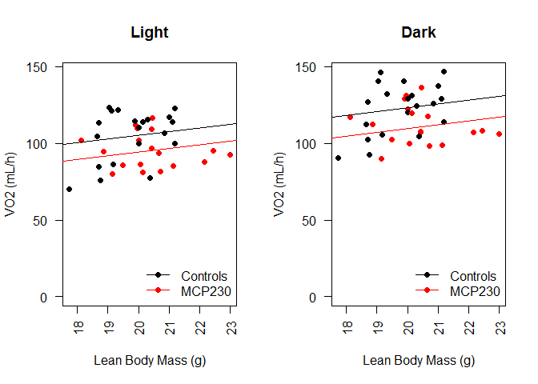


According to this analysis there was a significant effect of the treatment group on the body weight-adjusted VO2 levels under either Dark (p=0.0197) or Light (p=0.0311) conditions.  There was no effect of body weight in either Dark (p=0.6611) or Light (p=0.6301) conditions.  Analysed this way, we detected a -19.0936% reduction in metabolic rate between MCP and Control groups in the light and a  -16.7803% reduction in the dark.


Alternatively we used a mixed linear model, with non-interacting covariates for the Light cycle, the Lean Body Mass and the Particulate treatment.  A Chi-squared test comparing a model with or without the Particulate treatment yielded a p-value of 0.0702.  Post-hoc tests for the effects of particulate treatment are shown in the table below.  According to this MCP treatment reduces VO2 by -5.0212%, p=0.0802.


## Calorimetry by Heat Production

Another way to present these data is to evaluate this by heat instead of VO2.  The equation for Heat production from the CLAMS is the Lusk Equation:

$$(3.815 + 1.232 * RER)*VO2$$

To analyse these data we performed an ANCOVA analysis using body weight as the primary covariate. 


We first checked whether normality was maintained in the residuals from the ANCOVA.  The normality assumption was met for both Dark (p=0.2176) and Light (p=0.2533) via Shapiro-Wilk test.  

According to this analysis there was no significant effect of the treatment group on the body weight-adjusted heat production levels under either Dark (p=0.0531) or Light (p=0.0472) conditions.  There was also no significant effect of body weight in either Dark (p=0.2547) or Light (p=0.257) conditions.  We detected a -16.9556% reduction in metabolic rate between MCP and Cabosil groups in the light and a -21.5777% reduction in the dark.

Alternatively we used a mixed linear model, with non-interacting covariates for the Light cycle, the Weight and the Particulate treatment.  A F-test comparing a model with or without the Particulate treatment yielded a p-value of 1.  Post-hoc tests for the effects of particulate treatment are shown in the Table below.  According to this MCP treatment reduces heat production by -16.2679%, p=0.0374.

<!-- html table generated in R 3.1.1 by xtable 1.8-2 package -->
<!-- Tue Mar 22 14:42:54 2016 -->
<table border=1>
<caption align="bottom"> Post-hoc Dunnett's tests of mixed linear model correcting for effects of light cycle and total body mass on heat production.  P-values are not corrected. </caption>
<tr> <th>  </th> <th> Coefficient </th> <th> p.value </th>  </tr>
  <tr> <td align="right"> (Intercept) </td> <td align="right"> 0 </td> <td align="right"> 0.072 </td> </tr>
  <tr> <td align="right"> Light.DarkLight </td> <td align="right"> -0 </td> <td align="right"> 0.000 </td> </tr>
  <tr> <td align="right"> Weight </td> <td align="right"> 0 </td> <td align="right"> 0.121 </td> </tr>
  <tr> <td align="right"> Particulate.TreatmentMCP </td> <td align="right"> -0 </td> <td align="right"> 0.037 </td> </tr>
  <tr> <td align="right"> Particulate.TreatmentSaline </td> <td align="right"> 0 </td> <td align="right"> 0.528 </td> </tr>
   <a name=tab:heat-lme-ph></a>
</table>
<!-- html table generated in R 3.1.1 by xtable 1.8-2 package -->
<!-- Tue Mar 22 14:42:54 2016 -->
<table border=1>
<caption align="bottom"> Post-hoc Dunnett's sests of mixed linear model correcting for effects of light cycle and lean body mass on heat production.  P-values are not corrected. </caption>
<tr> <th>  </th> <th> Coefficient </th> <th> p.value </th>  </tr>
  <tr> <td align="right"> (Intercept) </td> <td align="right"> 0 </td> <td align="right"> 0.045 </td> </tr>
  <tr> <td align="right"> Light.DarkLight </td> <td align="right"> -0 </td> <td align="right"> 0.000 </td> </tr>
  <tr> <td align="right"> Lean </td> <td align="right"> 0 </td> <td align="right"> 0.367 </td> </tr>
  <tr> <td align="right"> Particulate.TreatmentMCP </td> <td align="right"> -0 </td> <td align="right"> 0.060 </td> </tr>
  <tr> <td align="right"> Particulate.TreatmentSaline </td> <td align="right"> 0 </td> <td align="right"> 0.412 </td> </tr>
   <a name=tab:heat-lme-lean-ph></a>
</table>

## Normalization by Lean Body Mass

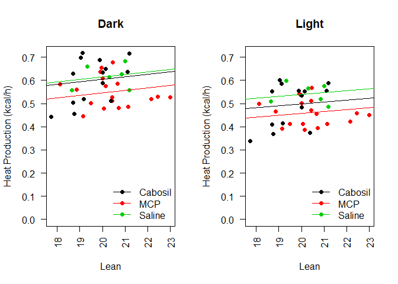

Using the lean mass as the covariate, we checked whether normality was maintained in the residuals from the ANCOVA.  The normality assumption was met for both Dark (p=0.2575) and Light (p=0.2385) via Shapiro-Wilk test.  

According to this analysis there was no significant effect of the treatment group on the body weight-adjusted heat produciton levels under either Dark (p=0.0696) or Light (p=0.0506) conditions.  There was also no effect of body weight in either Dark (p=0.7252) or Light (p=0.6905) conditions.  Analysed this way, we detected a -11.9637% reduction in metabolic rate between MCP and Cabosil groups in the light and a  -15.1485% reduction in the dark.

There was no significant difference between Cabosil and Saline (p=0.7907 from a *t* test between linear models).  We therefore repeated this analysis but combined Cabosil and Saline to get more statistical power.

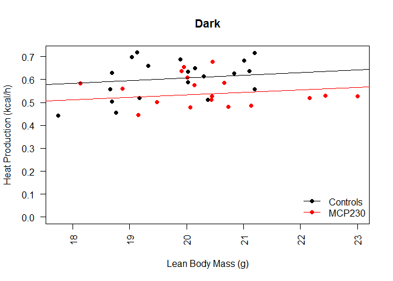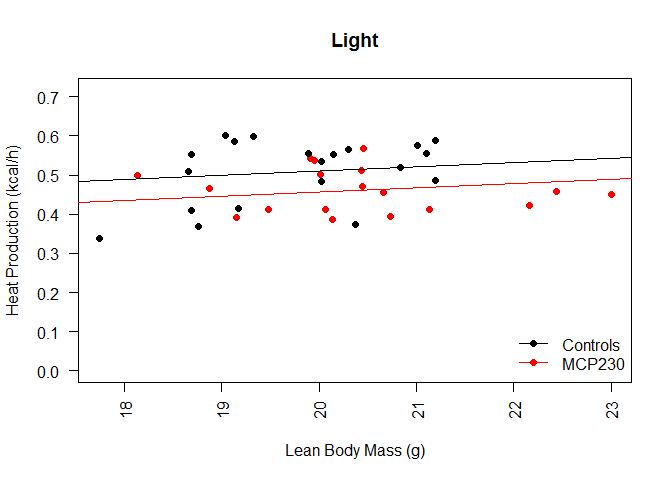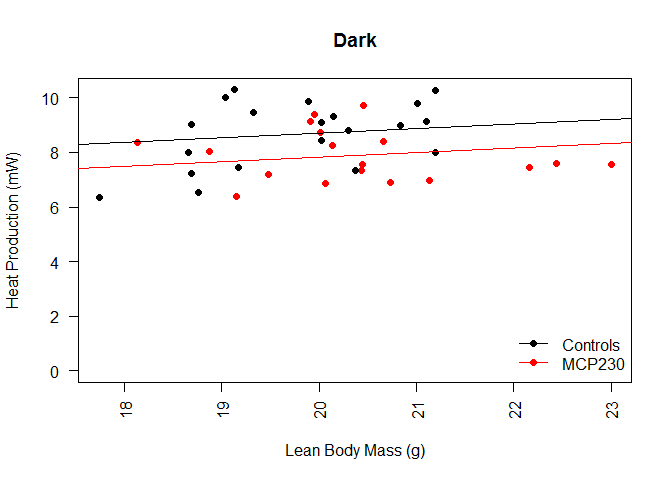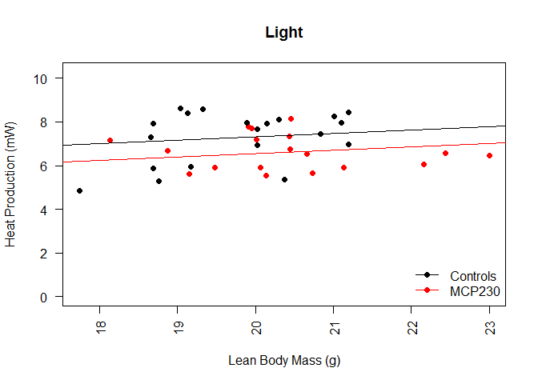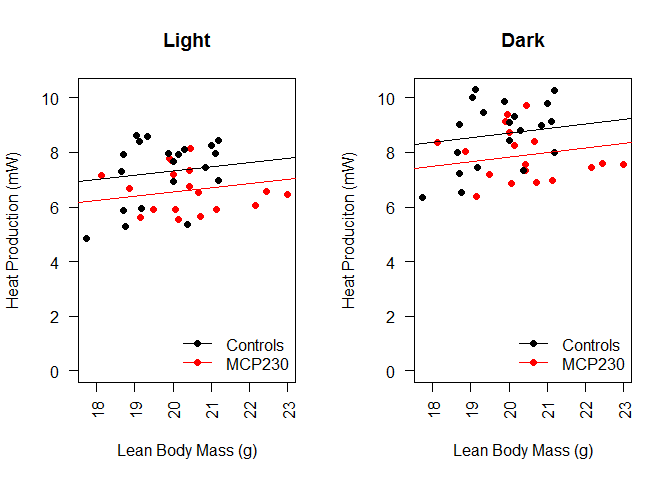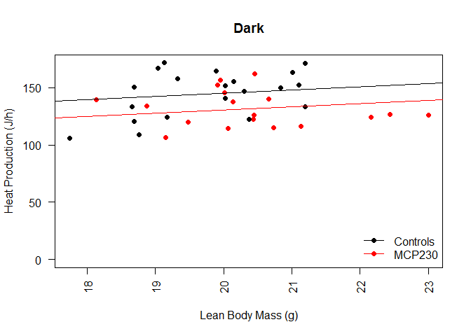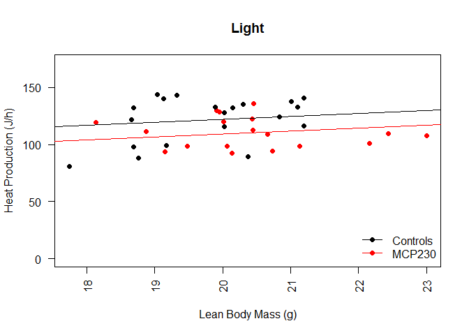


According to this analysis there was a significant effect of the treatment group on the body weight-adjusted heat produciton levels under either Dark (p=0.0209) or Light (p=0.0316) conditions.  There was no effect of body weight in either Dark (p=0.7215) or Light (p=0.6922) conditions.  Analysed this way, we detected a -18.4166% reduction in metabolic rate between MCP and Control groups in the light and a  -16.4381% reduction in the dark.


Alternatively we used a mixed linear model, with non-interacting covariates for the Light cycle, the Lean Body Mass and the Particulate treatment.  A Chi-squared test comparing a model with or without the Particulate treatment yielded a p-value of 0.0408.  Post-hoc tests for the effects of particulate treatment are shown in the table below.  According to this MCP treatment reduces heat production by -11.88%, p=0.0602.

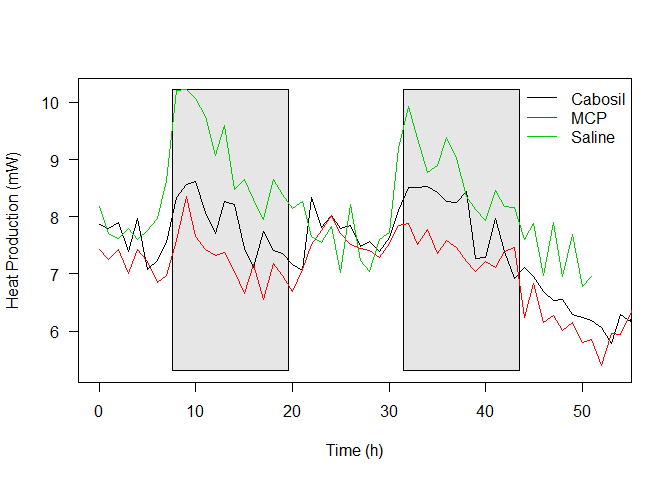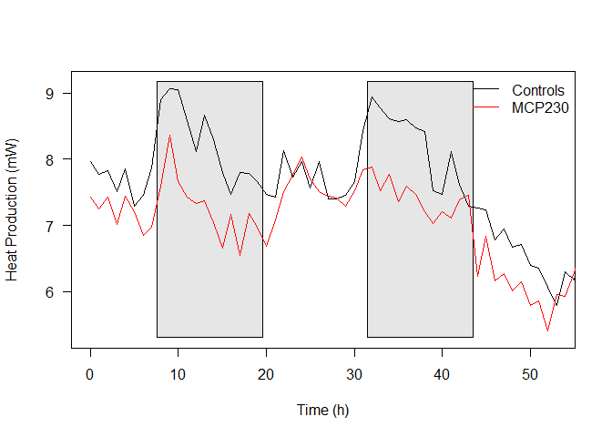

# Body Weights and Composition


The assumptions of normality were met via a Shapiro-Wilk Test for Total Mass (p=0.7135), and Lean Mass (p=0.9306).  The assumptions of equal varaince were met for Total Mass (p=0.7128), and Lean Mass (p=0.9623.  Based on this there was no significant differentces in Total Mass (p=0.1642) or Lean Mass (p=0.1196) by ANOVA.

These assumptions or normality were not met for Fat Mass (p=0.0028) or Percent Fat Mass (p=0.0448), so we did Kruskal-Wallis tests instead.  According to these tests there was no significant differences in these groups either for Fat Mass (p=0.2596) or Percent Fat Mass (p=0.4293).

# Respiratory Exchange Rate


The assumptions of normality was not met for either Light (p=0.0176) or Dark RER (p=0.0141) levels via a Shapiro-Wilk test.  We therefore did a Kruskal-Wallis test and found that while Dark (p=0.1024) RER levels not were significantly different, Light RER levels were (p=0.0282).  Post-hoc tests for Light RER levels are shown in the Table below:

<!-- html table generated in R 3.1.1 by xtable 1.8-2 package -->
<!-- Tue Mar 22 14:42:56 2016 -->
<table border=1>
<caption align="bottom"> Pairwise Wilcoxon Rank-Sum Tests, corrected by Benjamini-Hochberg </caption>
<tr> <th>  </th> <th> Cabosil </th> <th> MCP </th>  </tr>
  <tr> <td align="right"> MCP </td> <td align="right"> 0.4876 </td> <td align="right">  </td> </tr>
  <tr> <td align="right"> Saline </td> <td align="right"> 0.0011 </td> <td align="right"> 0.2048 </td> </tr>
   <a name=tab:light-rer-ph></a>
</table>

# Activity Data

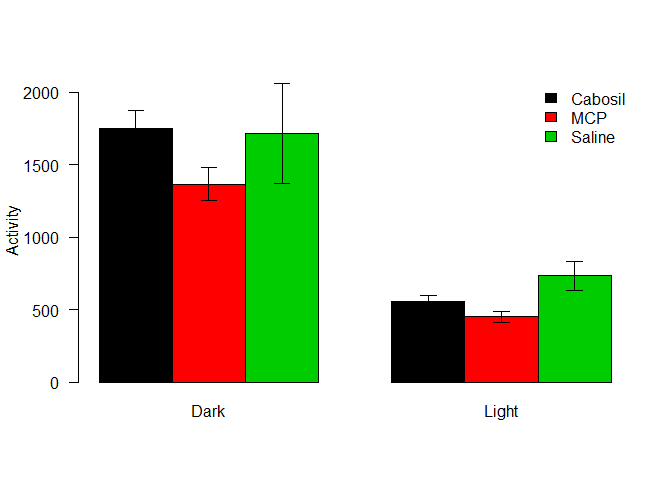

The assumptions of normality was met for both Light (p=0.8414) or Dark activity (p=0.6165) levels via a Shapiro-Wilk test.  As for the assumptions of equal variance, both Dark (p=0.2917), and Light activity levels (p=0.656) met this assumption via Levene's test.  We therefore did an ANOVA and found that while Dark (p=0.1236) activity levels not were significantly different, Light activity levels were (p=0.0048).  Post-hoc tests for Light activity levels are shown in the table below:

<!-- html table generated in R 3.1.1 by xtable 1.8-2 package -->
<!-- Tue Mar 22 14:42:56 2016 -->
<table border=1>
<caption align="bottom"> Pairwise Student's T-Tests, corrected by Benjamini-Hochberg </caption>
<tr> <th>  </th> <th> Cabosil </th> <th> MCP </th>  </tr>
  <tr> <td align="right"> MCP </td> <td align="right"> 0.0911 </td> <td align="right">  </td> </tr>
  <tr> <td align="right"> Saline </td> <td align="right"> 0.0661 </td> <td align="right"> 0.0041 </td> </tr>
   <a name=tab:light-activity-ph></a>
</table>

Since the cabosil and saline treated groups were not significantly different (p=0.1477), we combined these groups.


After combining these groups, the assumptions of normality (Dark p > 0.5248; Light 0.6253) and equal variance were still (Dark p=0.8047; Light p=0.4951) met.

Based on these data, there was a -21.4592 % reduction in activity in the dark phase (p=0.0398) and a -26.2358 % reduction in activity in the light phase (p=0.0099).

# Food Intake


We next looked at cumulative food intake accross the groups, removing amy cages that looked to eat >25g as these were likely associated with a mouse manually removing a pellet rather than eating it.  We looked at whether these data were normally distributed by a Shapiro-Wilk test and found that they were (p=0.0466).  The variances were also equally distributed, via a Levene's test  (p=0.6207).  We therefore performed an ANOVA and found that these groups were not significantly different (p=0.6497).

## Detailed Food Intake Analysis


These data can be found in the folder ../data/CLAMS/Feeding bouts/.  We calculated an median duration and median feeding amount, after excluding feeding bouts >0.5g and feeding amounts >300s.  Greater than 100 feeding bouts had to be detected per animal.  

### Feeding Amount
Normality can be assumed for all feeding amounts (p>0.0314) based on Shapiro-Wilk tests.  An ANOVA between the groups has a p-value of 0.3753, so no significant differences are detected.  


### Feeding Duration
Normality can be assumed for feeding duration (p=0.0002).  An ANOVA shows significant difference between feeding durations (p=0.0016.  Equal variance can also be assumed (p=0.0088 via Levene's Test).  Pairwise Studen't *t*-tests are shown below:


Table: Pairwise Wilcox Rank Sum tests, adjusted by the method of Benjamini and Hochberg

          Cabosil      MCP
-------  --------  -------
MCP        0.6025       NA
Saline     0.0212   0.0212

## Feeding Bouts

Normality cannot be assumed for feeding duration (p=0.0055).  An Kruskal-Wallis test shows no significant difference between feeding durations (p=0.4883).  

## Separating Feeding Behavior by Day and Night


### Individualized Feeding Behavior


## Session Information

```
## R version 3.1.1 (2014-07-10)
## Platform: x86_64-w64-mingw32/x64 (64-bit)
## 
## locale:
## [1] LC_COLLATE=English_United States.1252 
## [2] LC_CTYPE=English_United States.1252   
## [3] LC_MONETARY=English_United States.1252
## [4] LC_NUMERIC=C                          
## [5] LC_TIME=English_United States.1252    
## 
## attached base packages:
## [1] splines   stats     graphics  grDevices utils     datasets  methods  
## [8] base     
## 
## other attached packages:
##  [1] lubridate_1.5.0 car_2.0-25      plyr_1.8.3      dplyr_0.4.1    
##  [5] xtable_1.8-2    multcomp_1.4-4  TH.data_1.0-7   MASS_7.3-33    
##  [9] survival_2.37-7 mvtnorm_1.0-5   lme4_1.1-10     Matrix_1.2-4   
## [13] reshape2_1.4.1  xlsx_0.5.7      xlsxjars_0.6.1  rJava_0.9-8    
## [17] knitr_1.12.3   
## 
## loaded via a namespace (and not attached):
##  [1] assertthat_0.1     codetools_0.2-8    DBI_0.3.1         
##  [4] digest_0.6.9       evaluate_0.8.3     formatR_1.3       
##  [7] grid_3.1.1         highr_0.5.1        htmltools_0.3     
## [10] lattice_0.20-29    lazyeval_0.1.10    magrittr_1.5      
## [13] MatrixModels_0.4-1 mgcv_1.8-0         minqa_1.2.4       
## [16] nlme_3.1-117       nloptr_1.0.4       nnet_7.3-8        
## [19] parallel_3.1.1     pbkrtest_0.4-4     quantreg_5.21     
## [22] Rcpp_0.12.3        rmarkdown_0.9.5    sandwich_2.3-4    
## [25] SparseM_1.7        stringi_1.0-1      stringr_1.0.0     
## [28] tools_3.1.1        yaml_2.1.13        zoo_1.7-12
```
