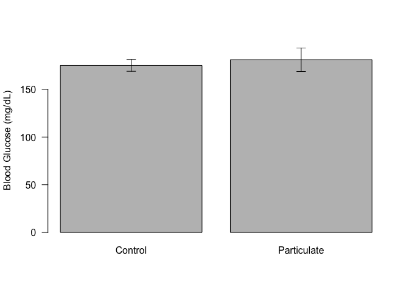

# Fasting Glucose Analysis for Particulate Treatment Study
Alyse Ragauskas, Matt Peloquin, Jyothi Parvathareddy, Sridhar Jaligama, Stephania Cormier and Dave Bridges  
November 13, 2014  

This only looks at animals treated *in utero*.  These data were most recently updated on Sun Nov 16 09:36:40 2014.


The data is located in the file../data/Blood Glucose - Maternal.csv.  These data are summarized in the Table below and graphed in the figure.  


<!-- html table generated in R 3.1.1 by xtable 1.7-4 package -->
<!-- Sun Nov 16 09:36:41 2014 -->
<table border=1>
<caption align="bottom"> Summary Data, based on treating mice individually.  Triglycerides are in mmoles/mg of tissue </caption>
<tr> <th> Treatment </th> <th> experiment.feeding_state </th> <th> mean </th> <th> sd </th> <th> se </th> <th> n </th> <th> shapiro </th>  </tr>
  <tr> <td> Control </td> <td> fasted </td> <td align="right"> 175.14 </td> <td align="right"> 23.97 </td> <td align="right"> 6.19 </td> <td align="right">  15 </td> <td align="right"> 0.69 </td> </tr>
  <tr> <td> Control </td> <td> fed </td> <td align="right"> 154.71 </td> <td align="right"> 23.20 </td> <td align="right"> 6.20 </td> <td align="right">  14 </td> <td align="right"> 0.34 </td> </tr>
  <tr> <td> Particulate </td> <td> fasted </td> <td align="right"> 177.00 </td> <td align="right"> 39.54 </td> <td align="right"> 11.92 </td> <td align="right">  11 </td> <td align="right"> 0.90 </td> </tr>
   <a name=tab:summary-statistics></a>
</table>

According to a Shapiro-Wilk Test, the data fit a normal distribution (p>0.3435928).  A Levene's test suggested that the variance can be presumed to be equal (p=0.1370976).  Based on this, a Student's T-test has a p-value of 0.8856322.

 

## Session Information

```
## R version 3.1.1 (2014-07-10)
## Platform: x86_64-apple-darwin13.1.0 (64-bit)
## 
## locale:
## [1] en_US.UTF-8/en_US.UTF-8/en_US.UTF-8/C/en_US.UTF-8/en_US.UTF-8
## 
## attached base packages:
## [1] stats     graphics  grDevices utils     datasets  methods   base     
## 
## other attached packages:
## [1] xtable_1.7-4 car_2.0-21   plyr_1.8.1  
## 
## loaded via a namespace (and not attached):
##  [1] digest_0.6.4     evaluate_0.5.5   formatR_1.0      htmltools_0.2.6 
##  [5] knitr_1.8        MASS_7.3-35      nnet_7.3-8       Rcpp_0.11.3     
##  [9] rmarkdown_0.3.10 stringr_0.6.2    tools_3.1.1      yaml_2.1.13
```
