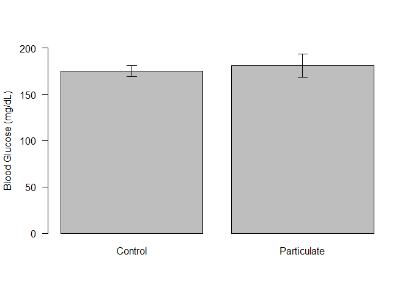

# Fasting Glucose Analysis for Particulate Treatment Study
Alyse Ragauskas, Matt Peloquin, Jyothi Parvathareddy, Sridhar Jaligama, Stephania Cormier and Dave Bridges  
November 13, 2014  

This only looks at animals treated *in utero*.  These data were most recently updated on Tue Feb 16 12:29:38 2016.


```r
filename <- '../data/Blood Glucose - Maternal.csv'
data <- read.csv(filename, row.names='X')
data <- subset(data, animal.MouseID!='206')

library(plyr)
```

```
## Warning: package 'plyr' was built under R version 3.1.3
```

```r
summary <- ddply(data, .(Treatment, experiment.feeding_state), summarize,
                 mean = mean(Glucose, na.rm=T),
                 sd = sd(Glucose, na.rm=T),
                 se = sd(Glucose, na.rm=T)/sqrt(length(Glucose)),
                 n = length(Glucose),
                 shapiro = shapiro.test(Glucose)$p.value)

library(car)
```

```
## Warning: package 'car' was built under R version 3.1.3
```

```r
levene.result <- leveneTest(Glucose~Treatment, data=subset(data, experiment.feeding_state=='fasted'))
```

The data is located in the file../data/Blood Glucose - Maternal.csv.  These data are summarized in the Table below and graphed in the figure.  


```r
library(xtable)
```

```
## Warning: package 'xtable' was built under R version 3.1.3
```

```r
print(xtable(summary, caption = "Summary Data, based on treating mice individually.  Triglycerides are in mmoles/mg of tissue", label="tab:summary-statistics"), include.rownames=F, type='html')
```

<!-- html table generated in R 3.1.1 by xtable 1.8-0 package -->
<!-- Tue Feb 16 12:29:42 2016 -->
<table border=1>
<caption align="bottom"> Summary Data, based on treating mice individually.  Triglycerides are in mmoles/mg of tissue </caption>
<tr> <th> Treatment </th> <th> experiment.feeding_state </th> <th> mean </th> <th> sd </th> <th> se </th> <th> n </th> <th> shapiro </th>  </tr>
  <tr> <td> Control </td> <td> fasted </td> <td align="right"> 175.14 </td> <td align="right"> 23.97 </td> <td align="right"> 6.19 </td> <td align="right">  15 </td> <td align="right"> 0.69 </td> </tr>
  <tr> <td> Control </td> <td> fed </td> <td align="right"> 154.71 </td> <td align="right"> 23.20 </td> <td align="right"> 6.20 </td> <td align="right">  14 </td> <td align="right"> 0.34 </td> </tr>
  <tr> <td> Particulate </td> <td> fasted </td> <td align="right"> 181.10 </td> <td align="right"> 39.14 </td> <td align="right"> 12.38 </td> <td align="right">  10 </td> <td align="right"> 0.92 </td> </tr>
   <a name=tab:summary-statistics></a>
</table>

According to a Shapiro-Wilk Test, the data fit a normal distribution (p>0.3435928).  A Levene's test suggested that the variance can be presumed to be equal (p=0.1963716).  Based on this, a Student's T-test has a p-value of 0.6479714.


```r
ymax <- max(summary$mean) + max(summary$se)

plot <- with(subset(summary, experiment.feeding_state == 'fasted'), plot <- barplot(mean,
                   beside=T,
                   las=1,
                   ylab ="Blood Glucose (mg/dL)",
                   names.arg = Treatment,
                   ylim = c(0,200)))

superpose.eb <- function (x, y, ebl, ebu = ebl, length = 0.08, ...)
  arrows(x, y + ebu, x, y - ebl, angle = 90, code = 3,
  length = length, ...)

superpose.eb(plot, subset(summary, 
            experiment.feeding_state == 'fasted')$mean, 
             subset(summary, experiment.feeding_state == 'fasted')$se)
```

 

## Session Information

```r
sessionInfo()
```

```
## R version 3.1.1 (2014-07-10)
## Platform: x86_64-w64-mingw32/x64 (64-bit)
## 
## locale:
## [1] LC_COLLATE=English_United States.1252 
## [2] LC_CTYPE=English_United States.1252   
## [3] LC_MONETARY=English_United States.1252
## [4] LC_NUMERIC=C                          
## [5] LC_TIME=English_United States.1252    
## 
## attached base packages:
## [1] stats     graphics  grDevices utils     datasets  methods   base     
## 
## other attached packages:
## [1] xtable_1.8-0 car_2.0-25   plyr_1.8.3  
## 
## loaded via a namespace (and not attached):
##  [1] digest_0.6.8       evaluate_0.8       formatR_1.2.1     
##  [4] grid_3.1.1         htmltools_0.2.6    knitr_1.11        
##  [7] lattice_0.20-29    lme4_1.1-10        magrittr_1.5      
## [10] MASS_7.3-33        Matrix_1.2-3       MatrixModels_0.4-1
## [13] mgcv_1.8-0         minqa_1.2.4        nlme_3.1-117      
## [16] nloptr_1.0.4       nnet_7.3-8         parallel_3.1.1    
## [19] pbkrtest_0.4-4     quantreg_5.19      Rcpp_0.12.2       
## [22] rmarkdown_0.8.1    SparseM_1.7        splines_3.1.1     
## [25] stringi_1.0-1      stringr_1.0.0      tools_3.1.1       
## [28] yaml_2.1.13
```
