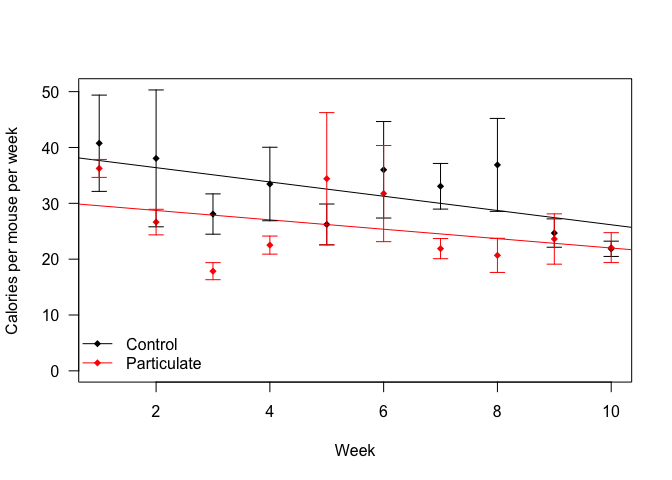
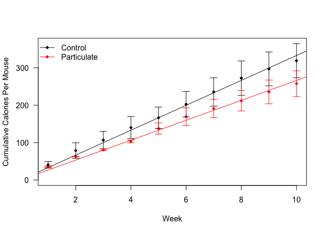

# Food Intake Analysis for Particulate Treatment Study
Alyse Ragauskas, Matt Peloquin, Jyothi Parvathareddy, Sridhar Jaligama, Stephania Cormier and Dave Bridges  
November 13, 2014  

This part of the study involved just one arm, animals treated *in utero*.  This file was most recently updated on Thu Nov 13 16:56:04 2014.


```
## Loading required package: rJava
## Loading required package: xlsxjars
```

This data comes from the file ../data/Food Worksheet.xlsx using the worksheet Maternal-Summary.  

## Animals Treated with Particulate Matter Gestationally


```r
ymax <- max(weekly.summary$se + weekly.summary$mean)
plot <- with(subset(weekly.summary, Treatment=="Control"), plot(Week, mean,
             pch=18, las=1, ylab="Calories per mouse per week", ylim=c(0,ymax)))

with(subset(weekly.summary, Treatment=="Particulate"), points(Week, mean, pch=18, col="red"))


superpose.eb <- function (x, y, ebl, ebu = ebl, length = 0.08, ...)
  arrows(x, y + ebu, x, y - ebl, angle = 90, code = 3,
  length = length, ...)

#lines
abline(lm(mean~Week, data=subset(weekly.summary, Treatment=="Control")), col="black")
abline(lm(mean~Week, data=subset(weekly.summary, Treatment=="Particulate")), col="red")

#error bars
superpose.eb(subset(weekly.summary, Treatment=="Control")$Week,
             subset(weekly.summary, Treatment=="Control")$mean,
             subset(weekly.summary, Treatment=="Control")$se)

superpose.eb(subset(weekly.summary, Treatment=="Particulate")$Week,
             subset(weekly.summary, Treatment=="Particulate")$mean,
             subset(weekly.summary, Treatment=="Particulate")$se, col="red")

legend("bottomleft", levels(raw.data$Treatment), col=c("black",'red'), pch=18, bty="n", lty=1)
```

 

 


```
## Loading required package: Matrix
## Loading required package: Rcpp
## fixed-effect model matrix is rank deficient so dropping 1 column / coefficient
```

We tested by &Chi;2-test whether there is a difference between mixed models considering the amount of food eaten and the treatment.  The residuals of this model fit a normal distribution (p=0.1067 from a Shapiro-Wilk Test).  The p-value for that test is &Chi;2 =1.58, p=0.4538 so there is no evidence of a difference between the treatments.

If we look at the cumulative food intake, the residuals are still normally distributed (p=0.9216 from Shapiro-Wilk Test).  Comparing mixed linear models with an interaction term, and the slope forced to zero there was a significant difference between the two groups by &Chi;2 = 11.1952 and **p=8.2007 &times; 10<sup>-4</sup>**.  Based on this, the control group ate 6.2864 kcal of food more per mouse per week, or a total of 75.4363, kcal throughout the diet.  This corresponds to a decrease of 19.886% of caloric intake

## Session Information

```
## R version 3.1.1 (2014-07-10)
## Platform: x86_64-apple-darwin13.1.0 (64-bit)
## 
## locale:
## [1] en_US.UTF-8/en_US.UTF-8/en_US.UTF-8/C/en_US.UTF-8/en_US.UTF-8
## 
## attached base packages:
## [1] stats     graphics  grDevices utils     datasets  methods   base     
## 
## other attached packages:
## [1] lme4_1.1-7     Rcpp_0.11.2    Matrix_1.1-4   plyr_1.8.1    
## [5] xlsx_0.5.7     xlsxjars_0.6.1 rJava_0.9-6   
## 
## loaded via a namespace (and not attached):
##  [1] digest_0.6.4     evaluate_0.5.5   formatR_1.0      grid_3.1.1      
##  [5] htmltools_0.2.6  knitr_1.6        lattice_0.20-29  MASS_7.3-33     
##  [9] minqa_1.2.3      nlme_3.1-117     nloptr_1.0.4     rmarkdown_0.3.10
## [13] splines_3.1.1    stringr_0.6.2    tools_3.1.1      yaml_2.1.13
```
