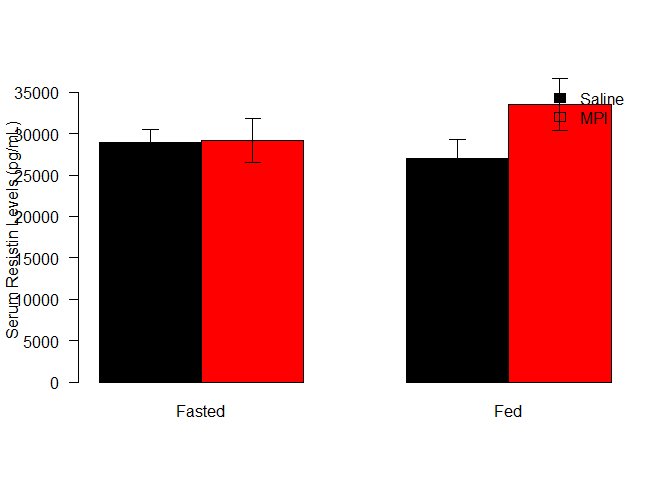
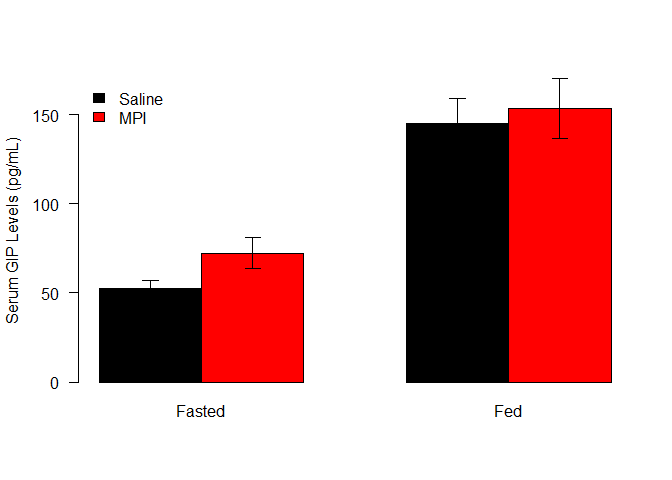
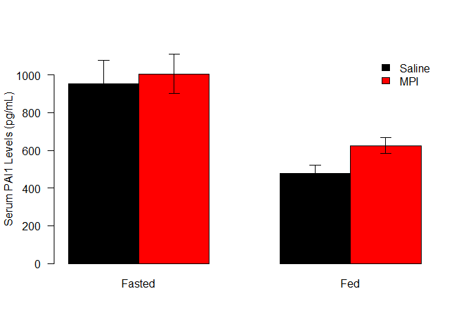
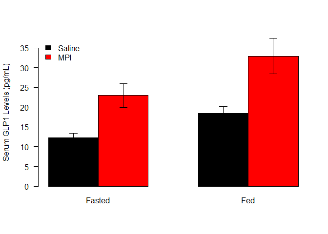
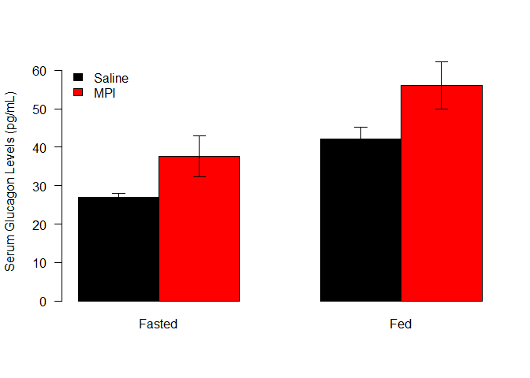
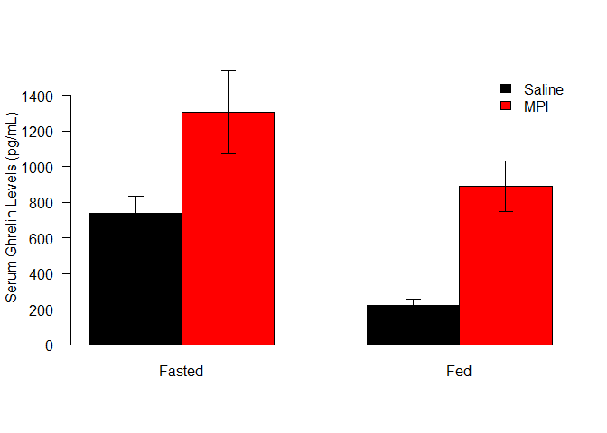
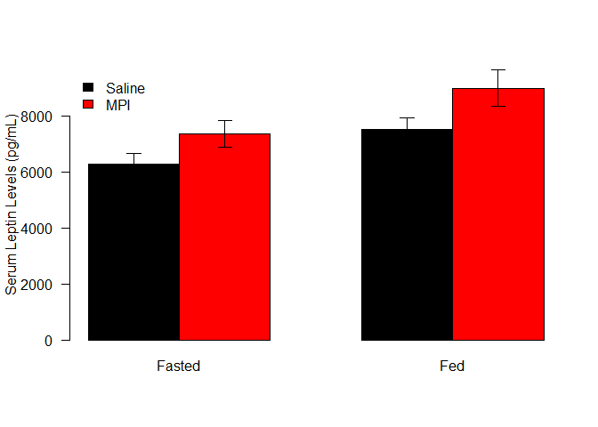
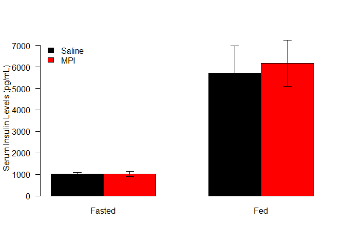
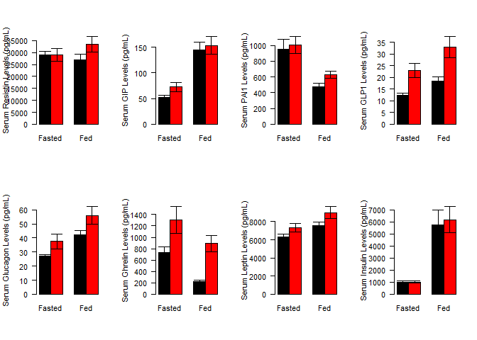

# Fasting Luminex Data for Particulate Treatment Study
Erin Stephenson, Alyse Ragauskas, Matt Peloquin, Jyothi Parvathareddy, Sridhar Jaligama, Stephania Cormier and Dave Bridges  
November 13, 2014  

# Summary

Pregnant mice were exposed to respiratory particulates or saline. The offspring of these mice were placed on a HFD at 10 wk of age for 12 wk. Blood was collected in heparinized tubes via retro orbital bleed both before and after a 16 hr fast. Samples were allowed to clot over ice before being separated via centrifugation and serum was collected. The values presented here are the results of serum analyses using the BioRad Bio-Plex Pro Mouse Diabetes Panel (8-plex, Cat. No.171-F7001M).This Assay was performed by Erin Stephenson, with the assistance of Alyse Ragauskas. Jordy Saravia calculated the concentrations of each hormone analyzed.     


```r
input_file <- "../data/Luminex Data.xlsx"
sheet_name <- "Sheet2"
library(xlsx)
```

```
## Warning: package 'xlsx' was built under R version 3.1.3
```

```
## Loading required package: rJava
```

```
## Warning: package 'rJava' was built under R version 3.1.3
```

```
## Loading required package: xlsxjars
```

```r
data <- read.xlsx2(input_file, sheetName=sheet_name)
#set Saline to be the reference treatment
data$Treatment <- relevel(data$Treatment, ref='Saline')
#remove sick mouse #206
data <- subset(data, Mouse !='206')
data$Resistin <- as.numeric(as.character(data$'Resistin'))
data$GIP <- as.numeric(as.character(data$'GIP'))
data$PAI1 <- as.numeric(as.character(data$'PAI1'))
data$GLP1 <- as.numeric(as.character(data$'GLP1'))
data$Glucagon <- as.numeric(as.character(data$'Glucagon'))
data$Ghrelin <- as.numeric(as.character(data$'Ghrelin'))
data$Leptin <- as.numeric(as.character(data$'Leptin'))
data$Insulin <- as.numeric(as.character(data$'Insulin'))
data$Insulin.pmol.L <- as.numeric(as.character(data$'Insulin.pmol.L'))
#set color palette
Treatment.colors <- rep(c('Black','Red'),2)
```


# Data Summary

```r
library(plyr)
```

```
## Warning: package 'plyr' was built under R version 3.1.3
```

```r
#define se
se <- function(x) sd(x, na.rm=T)/sqrt(length(x))

Resistin.summary <- ddply(data, .(FeedingState,Treatment), summarize,
                     mean = mean(Resistin, na.rm=T),
                     se = se(Resistin),
                     sd = sd(Resistin, na.rm=T),
                     rel.sd = sd(Resistin, na.rm=T)/mean(Resistin, na.rm=T)*100,
                     n = length(Resistin))


GIP.summary <- ddply(data, .(FeedingState,Treatment), summarize,
                     mean = mean(GIP, na.rm=T),
                     se = se(GIP),
                     sd = sd(GIP, na.rm=T),
                     rel.sd = sd(GIP, na.rm=T)/mean(GIP, na.rm=T)*100,
                     n = length(GIP))

PAI1.summary <- ddply(data, .(FeedingState,Treatment), summarize,
                     mean = mean(PAI1, na.rm=T),
                     se = se(PAI1),
                     sd = sd(PAI1, na.rm=T),
                     rel.sd = sd(PAI1, na.rm=T)/mean(PAI1, na.rm=T)*100,
                     n = length(PAI1))

GLP1.summary <- ddply(data, .(FeedingState,Treatment), summarize,
                     mean = mean(GLP1, na.rm=T),
                     se = se(GLP1),
                     sd = sd(GLP1, na.rm=T),
                     rel.sd = sd(GLP1, na.rm=T)/mean(GLP1, na.rm=T)*100,
                     n = length(GLP1))

Glucagon.summary <- ddply(data, .(FeedingState,Treatment), summarize,
                     mean = mean(Glucagon, na.rm=T),
                     se = se(Glucagon),
                     sd = sd(Glucagon, na.rm=T),
                     rel.sd = sd(Glucagon, na.rm=T)/mean(Glucagon, na.rm=T)*100,
                     n = length(Glucagon))

Ghrelin.summary <- ddply(data, .(FeedingState,Treatment), summarize,
                     mean = mean(Ghrelin, na.rm=T),
                     se = se(Ghrelin),
                     sd = sd(Ghrelin, na.rm=T),
                     rel.sd = sd(Ghrelin, na.rm=T)/mean(Ghrelin, na.rm=T)*100,
                     n = length(Ghrelin))

Leptin.summary <- ddply(data, .(FeedingState,Treatment), summarize,
                     mean = mean(Leptin, na.rm=T),
                     se = se(Leptin),
                     sd = sd(Leptin, na.rm=T),
                     rel.sd = sd(Leptin, na.rm=T)/mean(Leptin, na.rm=T)*100,
                     n = length(Leptin))

Insulin.summary <- ddply(data, .(FeedingState,Treatment), summarize,
                     mean = mean(Insulin, na.rm=T),
                     se = se(Insulin),
                     sd = sd(Insulin, na.rm=T),
                     rel.sd = sd(Insulin, na.rm=T)/mean(Insulin, na.rm=T)*100,
                     n = length(Insulin))
Insulin.pmol.L.summary <- ddply(data, .(FeedingState,Treatment), summarize,
                     mean = mean(Insulin.pmol.L, na.rm=T),
                     se = se(Insulin.pmol.L),
                     sd = sd(Insulin.pmol.L, na.rm=T),
                     rel.sd = sd(Insulin.pmol.L, na.rm=T)/mean(Insulin.pmol.L, na.rm=T)*100,
                     n = length(Insulin.pmol.L))
```

# Statistics

We first did two way ANOVA's for each of the hormones, with Feeding State and Treatment Group as the main effects and allowing for interactions.  


```r
library(xtable)
```

```
## Warning: package 'xtable' was built under R version 3.1.3
```

```r
Resistin.aov <- aov(Resistin~FeedingState*Treatment, data=data)
GIP.aov <- aov(GIP~FeedingState*Treatment, data=data)
PAI1.aov <- aov(PAI1~FeedingState*Treatment, data=data)
GLP1.aov <- aov(GLP1~FeedingState*Treatment, data=data)
Glucagon.aov <- aov(Glucagon~FeedingState*Treatment, data=data)
Ghrelin.aov <- aov(Ghrelin~FeedingState*Treatment, data=data)
Leptin.aov <- aov(Leptin~FeedingState*Treatment, data=data)
Insulin.aov <- aov(Insulin~FeedingState*Treatment, data=data)


library(car)
```

```
## Warning: package 'car' was built under R version 3.1.3
```

```r
Resistin.levene <- leveneTest(Resistin~FeedingState*Treatment, data=data)
GIP.levene <- leveneTest(GIP~FeedingState*Treatment, data=data)
PAI1.levene <- leveneTest(PAI1~FeedingState*Treatment, data=data)
GLP1.levene <- leveneTest(GLP1~FeedingState*Treatment, data=data)
Glucagon.levene <- leveneTest(Glucagon~FeedingState*Treatment, data=data)
Ghrelin.levene <- leveneTest(Ghrelin~FeedingState*Treatment, data=data)
Leptin.levene <- leveneTest(Leptin~FeedingState*Treatment, data=data)
Insulin.levene <- leveneTest(Insulin~FeedingState*Treatment, data=data)


anova.summary <- data.frame(row.names=colnames(data)[4:11])
for (hormone in rownames(anova.summary)){
  current.anova <- eval(as.symbol(paste(hormone,'aov',sep='.')))
  current.levene <- eval(as.symbol(paste(hormone,'levene',sep='.')))
anova.summary[hormone,'Shapiro'] <- shapiro.test(residuals(current.anova))$p.value
anova.summary[hormone,'Levene'] <- current.levene$`Pr(>F)`[1]
anova.summary[hormone,'FeedingState'] <- summary(current.anova)[[1]]$`Pr(>F)`[1]
anova.summary[hormone,'Treatment'] <- summary(current.anova)[[1]]$`Pr(>F)`[2]
anova.summary[hormone,'Interaction'] <- summary(current.anova)[[1]]$`Pr(>F)`[3]
}

anova.summary.verified <- anova.summary[anova.summary$Shapiro>0.05&anova.summary$Levene>0.05, ]

print(xtable(anova.summary.verified, caption = "Summaries for Two-Way ANOVA Analyses, for the genes under which the ANOVA assumptions were met", digits = 5, label="tab:anova-summary"), type='html')
```

<!-- html table generated in R 3.1.1 by xtable 1.8-0 package -->
<!-- Tue Feb 16 13:23:49 2016 -->
<table border=1>
<caption align="bottom"> Summaries for Two-Way ANOVA Analyses, for the genes under which the ANOVA assumptions were met </caption>
<tr> <th>  </th> <th> Shapiro </th> <th> Levene </th> <th> FeedingState </th> <th> Treatment </th> <th> Interaction </th>  </tr>
  <tr> <td align="right"> Resistin </td> <td align="right"> 0.78963 </td> <td align="right"> 0.31588 </td> <td align="right"> 0.68323 </td> <td align="right"> 0.13714 </td> <td align="right"> 0.21326 </td> </tr>
  <tr> <td align="right"> Leptin </td> <td align="right"> 0.88204 </td> <td align="right"> 0.13805 </td> <td align="right"> 0.00275 </td> <td align="right"> 0.01196 </td> <td align="right"> 0.69077 </td> </tr>
   <a name=tab:anova-summary></a>
</table>

Since the treatment term for the Leptin ANOVA was significant, and both the normality and equal variance assumptions were met, we performed pairwise t-tests for the effects of MCP230 treatment on leptin.  These results are 0.0589988 for the fed state and 0.0972266 for the fasted state.


The assumptions of normality were not met for GIP, PAI1, GLP1, Glucagon, Ghrelin, Insulin and the assumptions of equal variance were not met for PAI1, Glucagon, Ghrelin, Insulin.  We therefore did Wilcoxon Rank Sum tests comparing treatment groups, after separating into Fasted and Refed groups.  These are shown in the Table below:


```r
wilcoxon.summary <- data.frame(row.names=rownames( anova.summary[anova.summary$Shapiro<0.05,]))

for (hormone in rownames(wilcoxon.summary)){
  wilcoxon.summary[hormone,'Fasted'] <- wilcox.test(formula( paste( hormone, '~ Treatment'))  , data=subset(data, FeedingState=='Fasted'))$p.value
  wilcoxon.summary[hormone,'Fed'] <- wilcox.test(formula( paste( hormone, '~ Treatment')) , data=subset(data, FeedingState=='Fed'))$p.value
}
```

```
## Warning in wilcox.test.default(x = c(21.98739, 7.69321, 12.80541,
## 12.80541, : cannot compute exact p-value with ties
```

```
## Warning in wilcox.test.default(x = c(20.0961, 13.41406, 24.23752,
## 23.87031, : cannot compute exact p-value with ties
```

```
## Warning in wilcox.test.default(x = c(28.48867, 28.14309, 22.59119,
## 27.58883, : cannot compute exact p-value with ties
```

```r
print(xtable(wilcoxon.summary, caption = "Summaries of Wilcoxon Rank Sum tests, comparing treatment groups separately in fasted and refed states", digits = 5, label="tab:wilcoxon-summary"), type='html')
```

<!-- html table generated in R 3.1.1 by xtable 1.8-0 package -->
<!-- Tue Feb 16 13:23:49 2016 -->
<table border=1>
<caption align="bottom"> Summaries of Wilcoxon Rank Sum tests, comparing treatment groups separately in fasted and refed states </caption>
<tr> <th>  </th> <th> Fasted </th> <th> Fed </th>  </tr>
  <tr> <td align="right"> GIP </td> <td align="right"> 0.06983 </td> <td align="right"> 0.85962 </td> </tr>
  <tr> <td align="right"> PAI1 </td> <td align="right"> 0.66423 </td> <td align="right"> 0.03104 </td> </tr>
  <tr> <td align="right"> GLP1 </td> <td align="right"> 0.00148 </td> <td align="right"> 0.00170 </td> </tr>
  <tr> <td align="right"> Glucagon </td> <td align="right"> 0.00948 </td> <td align="right"> 0.05960 </td> </tr>
  <tr> <td align="right"> Ghrelin </td> <td align="right"> 0.02402 </td> <td align="right"> 0.00024 </td> </tr>
  <tr> <td align="right"> Insulin </td> <td align="right"> 0.86755 </td> <td align="right"> 0.56045 </td> </tr>
   <a name=tab:wilcoxon-summary></a>
</table>


```r
require(reshape2)
```

```
## Loading required package: reshape2
```

```
## Warning: package 'reshape2' was built under R version 3.1.3
```

```r
Resistin.summary.means <- as.matrix(dcast(Resistin.summary, Treatment~FeedingState, value.var="mean")[2:3])

Resistin.summary.se <- as.matrix(dcast(Resistin.summary, Treatment~FeedingState, value.var="se")[2:3])

ymax <- max(Resistin.summary$mean + Resistin.summary$se, na.rm=T)
superpose.eb <- function (x, y, ebl, ebu = ebl, length = 0.08, ...)
  arrows(x, y + ebu, x, y - ebl, angle = 90, code = 3,
  length = length, ...)

plot <- barplot(Resistin.summary.means,
                ylab="Serum Resistin Levels (pg/mL)", 
                las=1,
                col = Treatment.colors[1:4],
                ylim = c(0,ymax),
                beside=T)
legend("topright", levels(data$Treatment), fill=Treatment.colors, bty="n")
superpose.eb(plot, Resistin.summary.means, Resistin.summary.se)
```

 


```r
GIP.summary.means <- as.matrix(dcast(GIP.summary, Treatment~FeedingState, value.var="mean")[2:3])

GIP.summary.se <- as.matrix(dcast(GIP.summary, Treatment~FeedingState, value.var="se")[2:3])

ymax <- max(GIP.summary$mean + GIP.summary$se, na.rm=T)

plot <- barplot(GIP.summary.means,
                ylab="Serum GIP Levels (pg/mL)", 
                las=1,
                col = Treatment.colors[1:2],
                ylim = c(0,ymax),
                beside=T)
legend("topleft", levels(data$Treatment), fill=Treatment.colors, bty="n")
superpose.eb(plot, GIP.summary.means, GIP.summary.se)
```

 


```r
PAI1.summary.means <- as.matrix(dcast(PAI1.summary, Treatment~FeedingState, value.var="mean")[2:3])

PAI1.summary.se <- as.matrix(dcast(PAI1.summary, Treatment~FeedingState, value.var="se")[2:3])

ymax <- max(PAI1.summary$mean + PAI1.summary$se, na.rm=T)

plot <- barplot(PAI1.summary.means,
                ylab="Serum PAI1 Levels (pg/mL)", 
                las=1,
                col = Treatment.colors[1:2],
                ylim = c(0,ymax),
                beside=T)
legend("topright", levels(data$Treatment), fill=Treatment.colors, bty="n")
superpose.eb(plot, PAI1.summary.means, PAI1.summary.se)
```

 


```r
GLP1.summary.means <- as.matrix(dcast(GLP1.summary, Treatment~FeedingState, value.var="mean")[2:3])

GLP1.summary.se <- as.matrix(dcast(GLP1.summary, Treatment~FeedingState, value.var="se")[2:3])

ymax <- max(GLP1.summary$mean + GLP1.summary$se, na.rm=T)

plot <- barplot(GLP1.summary.means,
                ylab="Serum GLP1 Levels (pg/mL)", 
                las=1,
                col = Treatment.colors[1:2],
                ylim = c(0,ymax),
                beside=T)
legend("topleft", levels(data$Treatment), fill=Treatment.colors, bty="n")
superpose.eb(plot, GLP1.summary.means, GLP1.summary.se)
```

 


```r
Glucagon.summary.means <- as.matrix(dcast(Glucagon.summary, Treatment~FeedingState, value.var="mean")[2:3])

Glucagon.summary.se <- as.matrix(dcast(Glucagon.summary, Treatment~FeedingState, value.var="se")[2:3])

ymax <- max(Glucagon.summary$mean + Glucagon.summary$se, na.rm=T)

plot <- barplot(Glucagon.summary.means,
                ylab="Serum Glucagon Levels (pg/mL)", 
                las=1,
                col = Treatment.colors[1:2],
                ylim = c(0,ymax),
                beside=T)
legend("topleft", levels(data$Treatment), fill=Treatment.colors, bty="n")
superpose.eb(plot, Glucagon.summary.means, Glucagon.summary.se)
```

 


```r
Ghrelin.summary.means <- as.matrix(dcast(Ghrelin.summary, Treatment~FeedingState, value.var="mean")[2:3])

Ghrelin.summary.se <- as.matrix(dcast(Ghrelin.summary, Treatment~FeedingState, value.var="se")[2:3])

ymax <- max(Ghrelin.summary$mean + Ghrelin.summary$se, na.rm=T)

plot <- barplot(Ghrelin.summary.means,
                ylab="Serum Ghrelin Levels (pg/mL)", 
                las=1,
                col = Treatment.colors[1:2],
                ylim = c(0,ymax),
                beside=T)
legend("topright", levels(data$Treatment), fill=Treatment.colors, bty="n")
superpose.eb(plot, Ghrelin.summary.means, Ghrelin.summary.se)
```

 


```r
Leptin.summary.means <- as.matrix(dcast(Leptin.summary, Treatment~FeedingState, value.var="mean")[2:3])

Leptin.summary.se <- as.matrix(dcast(Leptin.summary, Treatment~FeedingState, value.var="se")[2:3])

ymax <- max(Leptin.summary$mean + Leptin.summary$se, na.rm=T)

plot <- barplot(Leptin.summary.means,
                ylab="Serum Leptin Levels (pg/mL)", 
                las=1,
                col = Treatment.colors[1:2],
                ylim = c(0,ymax),
                beside=T)
legend("topleft", levels(data$Treatment), fill=Treatment.colors, bty="n")
superpose.eb(plot, Leptin.summary.means, Leptin.summary.se)
```

 


```r
Insulin.summary.means <- as.matrix(dcast(Insulin.summary, Treatment~FeedingState, value.var="mean")[2:3])

Insulin.summary.se <- as.matrix(dcast(Insulin.summary, Treatment~FeedingState, value.var="se")[2:3])

ymax <- max(Insulin.summary$mean + Insulin.summary$se, na.rm=T)

plot <- barplot(Insulin.summary.means,
                ylab="Serum Insulin Levels (pg/mL)", 
                las=1,
                col = Treatment.colors[1:2],
                ylim = c(0,ymax),
                beside=T)
legend("topleft", levels(data$Treatment), fill=Treatment.colors, bty="n")
superpose.eb(plot, Insulin.summary.means, Insulin.summary.se)
```

 


```r
Insulin.pmol.L.summary.means <- as.matrix(dcast(Insulin.pmol.L.summary, Treatment~FeedingState, value.var="mean")[2:3])

Insulin.pmol.L.summary.se <- as.matrix(dcast(Insulin.pmol.L.summary, Treatment~FeedingState, value.var="se")[2:3])

ymax <- max(Insulin.pmol.L.summary$mean + Insulin.pmol.L.summary$se, na.rm=T)

plot <- barplot(Insulin.pmol.L.summary.means,
                ylab="Serum Insulin Levels (pmol/L)", 
                las=1,
                col = Treatment.colors[1:2],
                ylim = c(0,ymax),
                beside=T)
legend("topleft", levels(data$Treatment), fill=Treatment.colors, bty="n")
superpose.eb(plot, Insulin.pmol.L.summary.means, Insulin.pmol.L.summary.se)
```

 


```r
par(mfrow=c(2,4))
Resistin.summary.means <- as.matrix(dcast(Resistin.summary, Treatment~FeedingState, value.var="mean")[2:3])

Resistin.summary.se <- as.matrix(dcast(Resistin.summary, Treatment~FeedingState, value.var="se")[2:3])

ymax <- max(Resistin.summary$mean + Resistin.summary$se, na.rm=T)
superpose.eb <- function (x, y, ebl, ebu = ebl, length = 0.08, ...)
  arrows(x, y + ebu, x, y - ebl, angle = 90, code = 3,
  length = length, ...)

plot <- barplot(Resistin.summary.means,
                ylab="Serum Resistin Levels (pg/mL)", 
                las=1,
                col = Treatment.colors[1:4],
                ylim = c(0,ymax),
                beside=T)
superpose.eb(plot, Resistin.summary.means, Resistin.summary.se)

GIP.summary.means <- as.matrix(dcast(GIP.summary, Treatment~FeedingState, value.var="mean")[2:3])

GIP.summary.se <- as.matrix(dcast(GIP.summary, Treatment~FeedingState, value.var="se")[2:3])

ymax <- max(GIP.summary$mean + GIP.summary$se, na.rm=T)

plot <- barplot(GIP.summary.means,
                ylab="Serum GIP Levels (pg/mL)", 
                las=1,
                col = Treatment.colors[1:2],
                ylim = c(0,ymax),
                beside=T)
superpose.eb(plot, GIP.summary.means, GIP.summary.se)

PAI1.summary.means <- as.matrix(dcast(PAI1.summary, Treatment~FeedingState, value.var="mean")[2:3])

PAI1.summary.se <- as.matrix(dcast(PAI1.summary, Treatment~FeedingState, value.var="se")[2:3])

ymax <- max(PAI1.summary$mean + PAI1.summary$se, na.rm=T)

plot <- barplot(PAI1.summary.means,
                ylab="Serum PAI1 Levels (pg/mL)", 
                las=1,
                col = Treatment.colors[1:2],
                ylim = c(0,ymax),
                beside=T)
superpose.eb(plot, PAI1.summary.means, PAI1.summary.se)

GLP1.summary.means <- as.matrix(dcast(GLP1.summary, Treatment~FeedingState, value.var="mean")[2:3])

GLP1.summary.se <- as.matrix(dcast(GLP1.summary, Treatment~FeedingState, value.var="se")[2:3])

ymax <- max(GLP1.summary$mean + GLP1.summary$se, na.rm=T)

plot <- barplot(GLP1.summary.means,
                ylab="Serum GLP1 Levels (pg/mL)", 
                las=1,
                col = Treatment.colors[1:2],
                ylim = c(0,ymax),
                beside=T)
superpose.eb(plot, GLP1.summary.means, GLP1.summary.se)

Glucagon.summary.means <- as.matrix(dcast(Glucagon.summary, Treatment~FeedingState, value.var="mean")[2:3])

Glucagon.summary.se <- as.matrix(dcast(Glucagon.summary, Treatment~FeedingState, value.var="se")[2:3])

ymax <- max(Glucagon.summary$mean + Glucagon.summary$se, na.rm=T)

plot <- barplot(Glucagon.summary.means,
                ylab="Serum Glucagon Levels (pg/mL)", 
                las=1,
                col = Treatment.colors[1:2],
                ylim = c(0,ymax),
                beside=T)
superpose.eb(plot, Glucagon.summary.means, Glucagon.summary.se)

Ghrelin.summary.means <- as.matrix(dcast(Ghrelin.summary, Treatment~FeedingState, value.var="mean")[2:3])

Ghrelin.summary.se <- as.matrix(dcast(Ghrelin.summary, Treatment~FeedingState, value.var="se")[2:3])

ymax <- max(Ghrelin.summary$mean + Ghrelin.summary$se, na.rm=T)

plot <- barplot(Ghrelin.summary.means,
                ylab="Serum Ghrelin Levels (pg/mL)", 
                las=1,
                col = Treatment.colors[1:2],
                ylim = c(0,ymax),
                beside=T)
superpose.eb(plot, Ghrelin.summary.means, Ghrelin.summary.se)

Leptin.summary.means <- as.matrix(dcast(Leptin.summary, Treatment~FeedingState, value.var="mean")[2:3])

Leptin.summary.se <- as.matrix(dcast(Leptin.summary, Treatment~FeedingState, value.var="se")[2:3])

ymax <- max(Leptin.summary$mean + Leptin.summary$se, na.rm=T)

plot <- barplot(Leptin.summary.means,
                ylab="Serum Leptin Levels (pg/mL)", 
                las=1,
                col = Treatment.colors[1:2],
                ylim = c(0,ymax),
                beside=T)
superpose.eb(plot, Leptin.summary.means, Leptin.summary.se)

Insulin.summary.means <- as.matrix(dcast(Insulin.summary, Treatment~FeedingState, value.var="mean")[2:3])

Insulin.summary.se <- as.matrix(dcast(Insulin.summary, Treatment~FeedingState, value.var="se")[2:3])

ymax <- max(Insulin.summary$mean + Insulin.summary$se, na.rm=T)

plot <- barplot(Insulin.summary.means,
                ylab="Serum Insulin Levels (pg/mL)", 
                las=1,
                col = Treatment.colors[1:2],
                ylim = c(0,ymax),
                beside=T)
superpose.eb(plot, Insulin.summary.means, Insulin.summary.se)
```

 


# Session Information

```r
sessionInfo()
```

```
## R version 3.1.1 (2014-07-10)
## Platform: x86_64-w64-mingw32/x64 (64-bit)
## 
## locale:
## [1] LC_COLLATE=English_United States.1252 
## [2] LC_CTYPE=English_United States.1252   
## [3] LC_MONETARY=English_United States.1252
## [4] LC_NUMERIC=C                          
## [5] LC_TIME=English_United States.1252    
## 
## attached base packages:
## [1] stats     graphics  grDevices utils     datasets  methods   base     
## 
## other attached packages:
## [1] reshape2_1.4.1 car_2.0-25     xtable_1.8-0   plyr_1.8.3    
## [5] xlsx_0.5.7     xlsxjars_0.6.1 rJava_0.9-7   
## 
## loaded via a namespace (and not attached):
##  [1] digest_0.6.8       evaluate_0.8       formatR_1.2.1     
##  [4] grid_3.1.1         htmltools_0.2.6    knitr_1.11        
##  [7] lattice_0.20-29    lme4_1.1-10        magrittr_1.5      
## [10] MASS_7.3-33        Matrix_1.2-3       MatrixModels_0.4-1
## [13] mgcv_1.8-0         minqa_1.2.4        nlme_3.1-117      
## [16] nloptr_1.0.4       nnet_7.3-8         parallel_3.1.1    
## [19] pbkrtest_0.4-4     quantreg_5.19      Rcpp_0.12.2       
## [22] rmarkdown_0.8.1    SparseM_1.7        splines_3.1.1     
## [25] stringi_1.0-1      stringr_1.0.0      tools_3.1.1       
## [28] yaml_2.1.13
```
